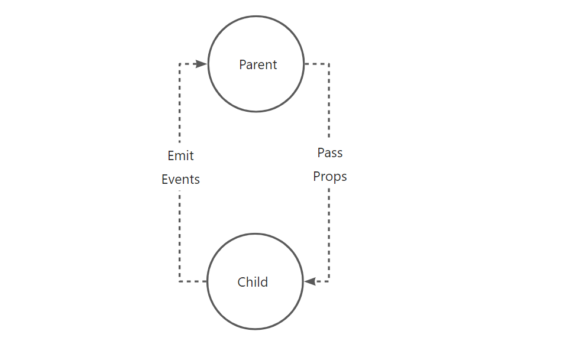

# 8.Vue组件


## 8.1 介绍


**组件**：一段独立的，能代表页面某一个部分的代码片段，拥有自己独立的数据、JavaScripe脚本、以及CSS样式。

组件是可复用的Vue实例，在开发过程中可以把经常重复的功能，封装成组件，达到快捷开发的目的。

**组件的好处：**

- 提高开发效率
- 方便重复使用
- 易于管理和维护

通常一个应用会以一颗嵌套的组件树的形式来组织，如图所示。


例如，你可能会有页头、侧边栏、内容区等组件，每个组件又包含了其他的像导航链接、博文之类的组件。


## 8.2 文件格式


Vue单文件格式（又名*.vue文件，缩写为SFC）是一种特殊的文件格式，它允许将Vue组件的模板、逻辑与样式封装在单个文件中。

正如所见，Vue SFC是经典的HTML、CSS与JavaScript三个经典组合的自然延伸。每个*.vue文件由三种类型的顶层代码块组成：`<template>`、`<script>`与`<style>`:

- `<template>`部分定义了组件的模板
- `<script>`部分是一个标准的JavaScript模块。它应该导出一个Vue组件定义作为其默认导出。
- `<style>`部分定义了与此组件关联的CSS


## 8.3 使用

使用具体流程：
1. 在src/components目录里开发一个组件文件（首字母大写）
2. 在父组件里引用子组件`import xxx from 'xxx'`
3. 在默认导出里注册组件
4. 在template模板里使用组件


开发组件->注册组件->使用组件


`src/components/TestDemo.vue`


```html
<template>
  <p class="greeting">{{ greeting }}</p>
</template>

<script>
export default {
  name: "TestDemo",
  data() {
    return {
      greeting: 'Hello TestDemo!'
    }
  }
}
</script>

<style scoped>
.greeting {
  color: red;
  font-weight: bold;
}
</style>
```

`src/App.vue`

```html
<template>
  
  <HelloWorld msg="Welcome to Your Vue.js App" />
  <!--使用组件-->
  <TestDemo></TestDemo>
</template>

<script>
import HelloWorld from "./components/HelloWorld.vue";
import TestDemo from "@/components/TestDemo.vue";//导入组件
export default {
  name: "App",
  components: {
    HelloWorld,
    TestDemo,//注册组件
  },
};
</script>

<style>
#app {
  font-family: Avenir, Helvetica, Arial, sans-serif;
  -webkit-font-smoothing: antialiased;
  -moz-osx-font-smoothing: grayscale;
  text-align: center;
  color: #2c3e50;
  margin-top: 60px;
}
</style>

```


### 关闭语法检测 (eslint) 的两种方法


1. 在vue.config.js中添加`lintOnSave: false`,

`vue.config.js`

```js
const {defineConfig} = require("@vue/cli-service");
module.exports = defineConfig({
    transpileDependencies: true,
    lintOnSave: false,
});
```

2. 禁用文件级别的 ESLint 检测：在需要禁用语法检测的文件的顶部添加注释 /* eslint-disable */。这将告诉 ESLint 忽略该文件中的所有语法错误和警告。例如：

```js
/* eslint-disable */

// 在这里编写您的代码，不会被 ESLint 检测

/* eslint-enable */
```


## 8.4 注册


为了能在模板中使用，这些组件必须先注册以便Vue能够识别。这里有两种组件的注册类型：全局注册和局部注册。

上述是局部注册，只能在当前模板中使用。

- 全局注册：声明一次，在任何vue文件模板中使用，一般使用该组件的地方多时使用
- 局部注册：在使用组件的vue文件中声明和使用，一般只需要解耦代码时使用


### 全局注册

`src/main.js`

```js
import { createApp } from "vue";

import HelloWorld from "./components/HelloWorld.vue";
import TestDemo from "./components/TestDemo.vue";
import App from "./App.vue";

const app = createApp(App);
app.mount("#app");
//App.vue不能用全局注册组件的问题，在main.js或main.ts中先app.use(router);后app.mount("#app");即可解决
app.component("HelloWorld", HelloWorld);
app.component("TestDemo", TestDemo);

```


### 局部注册

```html
<template>
  
  <HelloWorld msg="Welcome to Your Vue.js App" />
  <!--使用组件-->
  <TestDemo :greeting="msg" @childMsg="btn"></TestDemo>
</template>

<script>
import HelloWorld from "./components/HelloWorld.vue";
import TestDemo from "./components/TestDemo.vue";
export default {
  name: "App",
  data(){
    return{
      msg:"你好！这是父组件的消息。"
    }
  },
  components:{
    HelloWorld,
    TestDemo,
  },
  methods:{
    btn(data){
      //data就是子组件传递过来的数据
      console.log(data)
      // console.log(data.childMsg)
    }
  },
};
</script>

<style>
#app {
  font-family: Avenir, Helvetica, Arial, sans-serif;
  -webkit-font-smoothing: antialiased;
  -moz-osx-font-smoothing: grayscale;
  text-align: center;
  color: #2c3e50;
  margin-top: 60px;
}
</style>
```


## 8.5 传参

学习了组件用法，就像一种嵌套引用关系，在这个关系中，经常会涉及相互传数据的需求，即父组件传子组件，子组件传父组件。

父子组建的关系可以总结为：**prop向下传递，事件向上传递。**


父组件通过prop给子组件下发数据，子组件通过事件给父组件发送信息，如下图所示：




### 父传子

在默认页面中，也用到了父传子，在父组件Home.vue中给引用的组件传入一个静态的值，子组件通过props属性接收，并在模板中使用。

父组件：

`src/App.vue`


```html
<template>
  
  <HelloWorld msg="Welcome to Your Vue.js App"/>
  <!--使用组件-->
</template>

<script>
import HelloWorld from "./components/HelloWorld.vue";

export default {
  name: "App",
  data() {
    return {
      msg: "你好！这是父组件的消息。"
    }
  },
  components: {
    HelloWorld
  },
  methods: {
    btn(data) {
      //data就是子组件传递过来的数据
      console.log(data)
      // console.log(data.childMsg)
    }
  },
};
</script>
```

子组件：

`src/components/HelloWorld.vue`

```html
<template>
  <div class="hello">
    <h1>{{ msg }}</h1>
  </div>
</template>

<script>
export default {
  name: 'HelloWorld',
  props: {
    msg: String
  }
}
</script>
```

还可以传递数字，数组或对象


### 子传父


子组件：

`src/components/TestDemo.vue`

```html
<template>
  <p class="greeting">{{greeting}}</p>
  <button type="button" @click="btn">传递数据到父组件</button>
</template>

<script>
export default {
  name: "TestDemo",
  props:{
    greeting:String,
  },
  data(){
    return{
      childMsg:"你好，这是子组件的数据。",
    }
  },
  methods:{
    btn(){
      this.$emit("childMsg",this.childMsg);
    },
  },
}
</script>

<style scoped>
  .greeting{
    color:red;
    font-weight:bold;
  }
</style>
```


父组件：


`src/App.vue`

```html
<template>
  
  <HelloWorld msg="Welcome to Your Vue.js App" />
  <!--使用组件-->
  <TestDemo :greeting="msg" @childMsg="btn"></TestDemo>
</template>

<script>
import HelloWorld from "./components/HelloWorld.vue";
import TestDemo from "./components/TestDemo.vue";
export default {
  name: "App",
  data(){
    return{
      msg:"你好！这是父组件的消息。"
    }
  },
  components:{
    HelloWorld,
    TestDemo,
  },
  methods:{
    btn(data){
      //data就是子组件传递过来的数据
      console.log(data)
      // console.log(data.childMsg)
    }
  },
};
</script>

<style>
#app {
  font-family: Avenir, Helvetica, Arial, sans-serif;
  -webkit-font-smoothing: antialiased;
  -moz-osx-font-smoothing: grayscale;
  text-align: center;
  color: #2c3e50;
  margin-top: 60px;
}
</style>
```