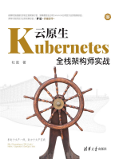

# Kubernetes

!!! success "**系统全面的学习kubernetes云原生**"

## 书籍封面

{: .zoom}

## 内容目录

### 1.安装篇

 [1.Kubeadm安装高可用K8s集群](../1.安装篇/1.Kubeadm安装高可用K8s集群.md) 

 [2.二进制安装高可用K8s集群](../1.安装篇/2.二进制安装高可用K8s集群.md) 

### 2.基础篇

[3.Docker基础](../2.基础篇/3.Docker基础.md)

[4.Kubernetes的基础概念](../2.基础篇/4.Kubernetes的基础概念.md)

[5.Kubernetes调度基础](../2.基础篇/5.Kubernetes调度基础.md)

[6.Kubernetes服务发布基础](../2.基础篇/6.Kubernetes服务发布基础.md)

[7.Kubernetes配置管理](../2.基础篇/7.Kubernetes配置管理.md)

### 3. 进阶篇

[8.Kubernetes存储入门](../3.进阶篇/8.Kubernetes存储入门.md)

[9.Kubernetes高级调度](../3.进阶篇/9.Kubernetes高级调度.md)

### 4.高级篇

[12.云原生存储Rook](../4.高级篇/12.云原生存储Rook.md)

[13.中间件容器化](../4.高级篇/13.中间件容器化.md)

### 5. 运维篇

[Kubernetes日志收集](../5.运维篇/14.Kubernetes日志收集.md)

[Kubernetes监控告警](../5.运维篇/15.Kubernetes监控告警.md)

[服务发布Ingress进阶](../5.运维篇/16.服务发布Ingress进阶.md)

### 6.DevOps篇

[DevOps实践](../6.DevOps篇/17.DevOps实践.md)

**本教程从概念到实践，从手工到自动化，内容翔实且丰富，其中的范例与项目均在实践中多次验证，可直接用于生产环境。**

==本书教程适合Kubernetes初学者、开发人员、运维人员、架构师使用，也可以作为培训机构和大专院校的教学用书。==

!!! abstract "代码仓库地址"

    https://github.com/dotbalo/kubernetes-guide
