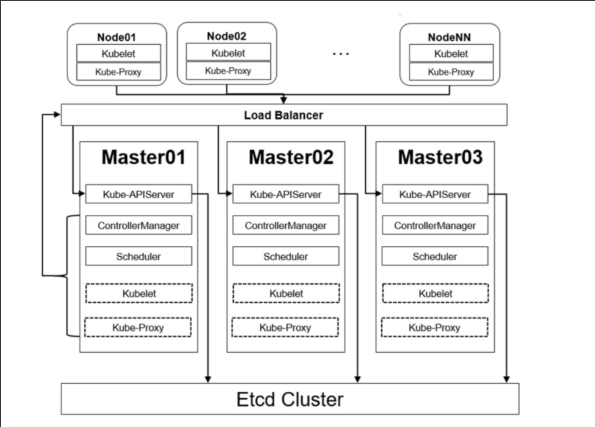
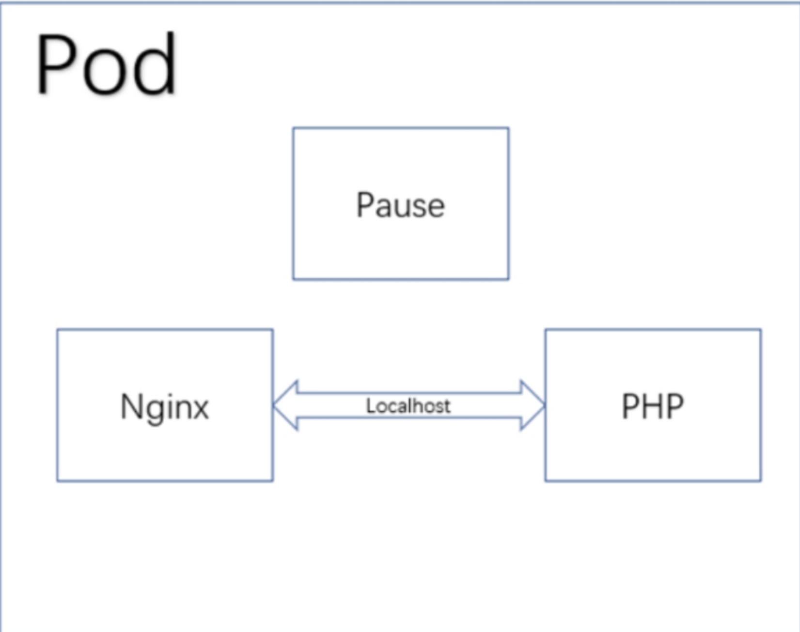

# Kubernetes的基础概念


## 1.为什么要用Kubernetes

很多人会有疑问，有Docker了为什么还用Kubernetes？

在业务开始进行容器化时，前期需要容器化的项目可能并不多，涉及的容器也并不多，此时基于Docker容器直接部署至宿主机也能实现自己的需求。

但是随着项目越来越多，管理的容器也越来越多，此时使用“裸容器”部署的方式管理起来就显得很吃力，并且随着业务量的增加，会明显体会到“裸容器”的不足，比如：

- 宿主机宕机造成该宿主机上的容器不可用，且无法自动恢复。
- 容器明明在运行，接口就是不通（健康检查做得不到位）。
- 应用程序部署、回滚、扩缩容困难。
- 成百上千的容器和涉及的端口难以维护


上面的问题只是做一个简单的罗列，真正使用时还有很多其他的问题。

可能读者也体验过像docker-compose、docker-swarm等编排工具，但这些工具的功能和Kubernetes的功能还是相差甚远，所以注定Kubernetes编排工具将成为主流的容器编排工具。


### 1.1 对于开发人员


在没有用Kubernetes的时候，查看线下测试的日志，需要开发或者测试人员找到对应的机器，再找到对应的容器，才能查看日志。

在使用Kubernetes之后，开发和测试人员直接在Kubernetes的Dashboard上找到对应的Namespace，即可定位到业务的容器，然后可以直接通过控制台查看到对应的日志，大大降低了操作时间。


把应用部署到Kubernetes之后，代码的发布、回滚以及蓝绿发布、金丝雀发布等都变得简单可控，不仅加快了业务代码的迭代速度，而且全程无须人工干预。生产环境可以使用Jenkins、GitRunner等工具进行发版或回滚等。从开发环境到测试环境，最后到生产环境，完全遵守一次构建，多集群、多环境部署，通过不同的启动参数、不同的环境变量、不同的配置文件区分不同的环境。

在使用服务网格后，开发人员在开发应用的过程中，无须再去关心代码的网络部分，这些功能都被服务网格实现，让开发人员可以只关心代码逻辑部分，即可轻松实现网络部分的功能，比如断流、分流、路由、负载均衡、限速和触发故障等功能。

在测试过程中，可能同时存在多套环境，当然也会创建其他环境或临时环境，之前测试环境的创建需要找运维人员或者自行手工搭建。

在迁移至Kubernetes集群后，开发人员如果需要新的环境，无须再找运维，只需要在Jenkins上点点鼠标即可在Kubernetes集群上创建一套新的测试环境。


### 1.2 对于运维人员

对于运维人员，可能经常因为一些重复、烦琐的工作感觉厌倦，比如一个项目需要一套新的测试环境，另一个项目需要迁移测试环境至其他平台。

传统架构可能需要装系统、装依赖环境、部署域名、开通权限等，这一整套下来，不仅耗时，而且可能会因为有某些遗漏而造成诸多问题。

而如今，可以直接使用Kubernetes包管理工具，一键式部署一套新的测试环境，甚至全程无须自己干预，开发人员通过Jenkins或者自动化运维平台即可一键式创建，大大降低了运维成本。

在没有使用Kubernetes时，业务应用的扩容和缩容都需要人工去处理，从采购服务器、上架到部署依赖环境，不仅需要大量的人力物力，而且非常容易在中间过程出现问题，又要花费大量的时间去查找问题。

成功上架后，还需要在前端负载均衡添加该服务器。而如今，可以利用Kubernetes的弹性计算一键式扩容和缩容，不仅大大提高了运维效率，而且还节省了不少的服务器资源，提高了资源利用率。


- 在反向代理配置方面，可能对Nginx的配置规则并不熟悉，一些高级的功能也很难实现，但是在Kubernetes上，利用Kubernetes的Ingress即可简单地实现那些复杂的逻辑，并且不会再遇到Nginx少加一个斜杠和多加一个斜杠的问题。


- 在负载均衡方面，之前负载均衡可能是Nginx、LVS、HAProxy、F5等，云上可能是云服务商提供的负载均衡机制。每次添加删除节点时，都需要手动去配置前端负载均衡，手动去匹配后端节点。在使用Kubernetes进行编排服务时，使用Kubernetes内部的Service即可实现自动管理节点，并且支持自动扩容、缩容。


- 在高可用方面，Kubernetes天生的高可用功能让运维人员彻底释放了双手，无须再去创建各类高可用工具，以及检测脚本。


Kubernetes支持进程、接口级别的健康检查，如发现接口超时或者返回值不正确，会自动处理该问题。


- 在中间件搭建方面，根据定义好的资源文件，可以实现秒级搭建各类中间件高可用集群，并且支持一键式扩容、缩容，如Redis、RabbitMQ、Zookeeper等，并且大大减少了出错的概率。


- 在应用端口方面，传统架构中，一台服务器可能跑了很多进程，每个进程都有一个端口，需要人为地去配置端口，并且还需要考虑端口冲突的问题，如果有防火墙的话，还需要配置防火墙。在Kubernetes中，端口统一管理、统一配置，每个应用的端口都可以设置成一样的，之后通过Service进行负载均衡，大大降低了端口管理的复杂度和端口冲突。


无论是对于开发人员、测试人员还是运维人员，Kubernetes的诞生不仅减少了工作的复杂度，还减少了各种运维成本。
上述带来的便利性只是比较小的一部分，更多优点只有用了才能真正体会到。


## 2.Kubernetes带来的挑战

Kubernetes从诞生至今，一路突飞猛进，在容器编排的领域里过三关斩六将，最终拿下了容器编排的冠军宝座，成为最无可替代、不可撼动的佼佼者，但是针对Kubernetes的学习和使用始终是一个很大的难题。


首先Kubernetes本身的学习就很困难，因为Kubernetes概念太多，涉及的知识面也非常广泛，可能学习了一个月也无法入门，甚至连集群也搭建不出来，使人望而却步。
并且Kubernetes对运维的技术能力要求也比较高，因为运维不仅仅局限于传统运维，有时候可能要修改业务代码、制定业务上线体系、给研发人员在开发应用中给出更好的建议等。

需要掌握的知识也有很多，可能需要掌握公司内所有使用到的代码，比如代码如何进行编译、如何正确发布、如何修改代码配置文件等，这对于运维人员也是一种挑战。

Kubernetes之所以被叫作K8s，业界有两种说法，通俗的说法是k和s之间有8个字母；另一种说法是K8s集群至少需要搭建8遍才能搭建成功。

当然，在实际使用时，可能不止8遍。 

Kubernetes的诞生把运维从传统运维转变到了DevOps方向，需要面临的问题更多，需要面临的新技术也很多，但是当真正掌握了Kubernetes的核心和设计理念，就会受益终身。


## 3.Kubernetes架构解析


首先我们来看一下Kubernetes的架构图，如图4.1所示。

{: .zoom}


图4.1 Kubernetes高可用架构


由图可知， Kubernetes架构可简单分为主(Master)节点 、 从(工作/Worker/Node)节点和数据库Etcd。

其中主节点为集群的控制单元，一般不会运行业务应用程序 ，主要包含的程序有如下：

- Kube-APIServer
- Kube-ControllerManager
- Kube-Scheduler。
  

从节点为工作节点，也就是部署应用 程序容器的节点，主要包含的组件有：
- Kubelet
- Kube-Proxy 
  

当然如果Master 节点也要部署容器，也会包含这两个组件。


同时，可以看出一个集群中可以有很多Node节点，用以保证集群容器的 分布式部署用于实现业务的高可用性，也可以有很多Master节点，之后通过一个负载均衡保证集群控制节点的高可用。


负载均衡可以使用软件负载均衡Nginx/LVS/HAProxy+KeepAlived 或者硬件负载均衡F5等,
通过负载均衡对 Kube-APIServer提供的VIP即可实现Master节点的高可用，其他组件通过该 VIP连接至Kube-APIServer。


Etcd集群可以和Master节点部署在同一个宿主 机，也可以单独部署，生产环境建议部署大于3的奇数台Etcd节点实现Etcd集群的高可用。


## 4.Master节点

Master节点是Kubernetes集群的控制节点，在生产环境中不建议部署集群核心组件外的任何容器（在Kubeadm安装方式下，系统组件以容器方式运行在Master节点的宿主机上；二进制安装方式下，系统组件以守护进程的方式运行，Master节点可以不运行任何容器），公司业务程序的容器更是不建议部署到Master节点上，以免升级或者维护时对业务造成影响。

Master节点的组件包括：

- APIServer：整个集群的控制中枢，提供集群中各个模块之间的数据交换，并将集群状态和信息存储到分布式键-值（key-value）存储系统Etcd集群中。
  同时，它也是集群管理、资源配额、提供完备的集群安全机制的入口，为集群各类资源对象提供增删改查以及watch的REST API接口。
  APIServer作为Kubernetes的关键组件，使用Kubernetes API和JSON over HTTP提供Kubernetes的内部和外部接口。

---


- Scheduler：集群Pod的调度中心，主要通过调度算法将Pod分配到最佳的Node节点，它通过APIServer监听所有Pod的状态，一旦发现新的未被调度到任何Node节点的Pod（PodSpec.NodeName为空），就会根据一系列策略选择最佳节点进行调度，对每一个Pod创建一个绑定（Binding），然后被调度的节点上的Kubelet负责启动该Pod。Scheduler是集群可插拔式组件，它跟踪每个节点上的资源利用率以确保工作负载不会超过可用资源。因此，Scheduler必须知道资源需求、资源可用性以及其他约束和策略，例如服务质量、亲和力/反关联性要求、数据位置等。Scheduler将资源供应与工作负载需求相匹配以维持系统的稳定和可靠性，因此Scheduler在调度的过程中需要考虑公平、资源高效利用、效率等方面的问题。

---


- Controller Manager：集群状态管理器（它的英文直译名为控制器管理器），以保证Pod或其他资源达到期望值。
  当集群中某个Pod的副本数或其他资源因故障和错误导致无法正常运行，没有达到设定的值时，Controller Manager会尝试自动修复并使其达到期望状态。
  Controller Manager包含NodeController、ReplicationController、EndpointController、NamespaceController、ServiceAccountController、ResourceQuotaController、ServiceController和TokenController等，该控制器管理器可与API服务器进行通信，以在需要时创建、更新或删除它所管理的资源，如Pod、服务断点等。Scheduler和Controller Manager虽然部署了多个节点，但同时工作的节点只有一个，因为Scheduler和Controller Manager属于有状态服务，为了防止重复调度，多个节点的Scheduler和Controller Manager进行了选主工作，工作节点（主节点）信息保存在Scheduler和Controller Manager的EndPoint中，
  可以通过`kubectl describe ep kube-scheduler kube-controller-manager -n kube-system`查看（Kubernetes 1.20版本以上需要在leases中查看：`kubectl get leases -n kube-system`）。

---


- Etcd：CoreOS开发，用于可靠地存储集群的配置数据，是一种持久型、轻量型、分布式的键-值（key-value）数据存储组件。
  Etcd作为Kubernetes集群的持久化存储系统，集群的灾难恢复、状态信息存储都与其密不可分，所以在Kubernetes高可用集群中，Etcd的高可用是至关重要的一部分，在生产环境中建议部署大于3的奇数个数的Etcd，以保证数据的安全性和可恢复性。Etcd可与Master组件部署在同一个节点上，大规模集群环境下建议部署在集群外，并且使用高性能服务器来提高Etcd的性能和降低Etcd同步数据的延迟。

---


## 5.Node节点

Node节点也被称为Worker、Node和Minion，是主要负责部署容器（工作负载）的单机（或虚拟机），集群中的每个节点都必须具备容器的Runtime（运行时），比如Docker或其他遵循CRI标准的Runtime等。

Kubelet作为守护进程运行在Node节点上，负责监听该节点上所有的Pod，同时负责上报该节点上所有Pod的运行状态，确保节点上的所有容器都能正常运行。当Node节点宕机或故障（NotReady状态）时，该节点上运行的Pod会被自动转移到其他节点上。


Node节点包括：

- Kubelet：负责与Master通信协作，管理该节点上的Pod，对容器进行健康检查及监控，同时负责上报节点和节点上面Pod的状态。
- Kube-Proxy：负责各Pod之间的通信和负载均衡，将指定的流量分发到后端正确的机器上。
- Docker Engine：Docker引擎， 负责对容器的管理。
---

其他组件及工具：

- CoreDNS：用于Kubernetes集群内部Service的解析，可以让Pod把Service名称解析成Service的IP，然后通过Service的IP地址连接到对应的应用上。
- Calico：符合CNI标准的一个网络插件，它负责给每个Pod分配一个不会重复的IP，并且把每个节点当作一个“路由器”，这样一个节点的Pod就可以通过IP地址访问其他节点的Pod。


## 6.Pod的概念

Kubernetes最小的单元-Pod。


### 6.1 什么是Pod

**1．先从使用方来看**

在实际使用时，单个容器是无法单独来支撑我们的应用，往往需要很多微服务才能组成一个系统，并且还会存在A服务依赖B服务，B服务需要和C服务共用某个目录，实现数据共享。

另外，在使用裸容器时，很难实现对容器内进程的健康检查及横向扩容等，而Pod可以轻轻松松解决上述问题。


**2．再从Kubernetes角度看**

Docker只是容器Runtime（运行时）中的一种，市面上还有很多容器的Runtime，比如Rkt、CRI-O等，而Kubernetes作为目前最流行的容器编排工具，
需要支持各个Runtime并且不依赖于底层Runtime的实现技术，于是就抽象了Pod这个概念，用于管理多个紧密相连的符合CRI标准的容器，可以从图4.2来理解Pod。

{: .zoom}

图4.2Pod图


由图可知，Pod可简单地理解为一组、一个或多个容器，每个Pod还包含一个Pause容器，Pause容器是Pod的父容器，它主要负责僵尸进程的回收管理，
**通过Pause容器可以使同一个Pod里面的不同容器共享存储、网络、PID、IPC等，容器之间可以使用`localhost:port`相互访问，可以使用Volume等实现数据共享。**

根据Docker的构造，Pod可被建模为一组具有共享命名空间、卷、IP地址和端口的容器。


使用裸容器时，需要将容器内应用程序的端口映射到宿主机，如果容器过多，端口管理就会比较困难，而且容易引起端口冲突。

而Kubernetes为每个Pod都分配一个唯一的IP地址，这样就可以保证不同应用程序可以使用同一个端口，之后通过Kubernetes的内部Service进行访问，这样就避免了发生端口冲突的问题。


和裸容器部署一样，Pod在运行时也会有不同的状态，Pod的状态信息保存在PodStatus对象中，在PodStatus中有一个Phase字段，用于描述Pod在其生命周期中的不同状态。可以使用Kubernetes的客户端工具Kubectl查看某个Pod的Phase字段，比如查看kube-system命名空间下的metrics-server的状态：

```shell
$ kubectl get pod -n kube-system -l k8s-app=metrics-server
NAME                             READY   STATUS    RESTARTS   AGE
metrics-server-9cb7dd7bc-88mvk   1/1     Running   0          130d
metrics-server-9cb7dd7bc-jfvwq   1/1     Running   0          142d
metrics-server-9cb7dd7bc-v9kfz   1/1     Running   0          142d


$ kubectl get pod/metrics-server-9cb7dd7bc-v9kfz -n kube-system -o yaml|grep phase
phase: Running
```


可以看到此时Pod的状态是Running，当然状态不仅仅只有Running，常见的状态如表


| 状态                           | 说明                                   |
| ------------------------------ | -------------------------------------- |
|Pending|Pod 已被 Kubernetes 系统接受，但有一个或者多个容器尚未创建亦未运行。此阶段包括等待 Pod 被调度的时间和通过网络下载镜像的时间，|
|Running|Pod 已经绑定到了某个节点，Pod 中所有的容器都已被创建。至少有一个容器仍在运行，或者正处于启动或重启状态。|
|Succeeded|Pod 中的所有容器都已成功终止，并且不会再重启。|
|Failed|Pod 中的所有容器都已终止，并且至少有一个容器是因为失败终止。也就是说，容器以非 0 状态退出或者被系统终止。|
|Unknown|因为某些原因无法取得 Pod 的状态。这种情况通常是因为与 Pod 所在主机通信失败。|
|ImagePullBackOff ErrImagePull|镜像拉取失败，一般是由于网络不通、镜像不存在、需要认证引起的，可以使用describe命令查看具体原因|
|CrashLoopBackOff	|容器启动失败，可以通过logs命令查看具体原因，一般为启动命令不正确、健康检查不通过等|
|OOMkilled|容器内存溢出，一般是容器的内存Limit设置得过小，或者程序本身内存溢出，可以通过logs查看程序的启动日志|
|Terminating	|Pod正在被删除，可以使用describe命令查看状态|
|SysctlForbidden|Pod自定义了内核配置，但kubelet没有添加内核配置或者配置的内核参数不支持可以使用describe命令查看具体原因|
|Completed|容器内部主进程退出，一般计划任务结束会显示该状态，可以通过logs查看容器状态|
|ContainerCreating	|Pod正在创建，一般为正在下载镜像，或者有配置不当的地方，可以使用describe命令查看具体原因|


!!! tip "小知识"
    
    Pod的Phase字段只有Pending、Running、Succeeded、Failed、Unknown 5种状态，其余的为处于上述状态的原因，可以通过kubectl get po xxx -o yaml查看


### 6.2 Pod探针

在生产环境下，进程正常启动并不代表应用能正常处理请求，所以合理地设计应用的健康检查尤为重要。在使用裸机或者裸容器部署时，一般很难对应用做很完善的健康检查，而Pod提供的探针可以很方便地用来检测容器内的应用是否正常。

目前探针有3种检测方式，可以根据不同的场景选择合适的健康检查方式。检测方式如表所示。


Pod探针的实现方式


| 实现方式                           | 说明                                   |
| ------------------------------ | -------------------------------------- |
|ExecAction|在容器内执行指定命令。如果命令退出时返回码为 0 则认为诊断成功。|
|TCPSocketAction|对容器的 IP 地址上的指定端口执行 TCP 检查。如果端口打开，则诊断被认为是成功的。|
|HTTPGetAction|对容器的 IP 地址上指定端口和路径执行 HTTP Get 请求。如果响应的状态码大于等于 200 且小于 400，则诊断被认为是成功的。|

上述检查方式可以被周期性执行，每次检查容器后可能得到的容器状态如表


Pod探针检查容器后可能得到的状态

| 状态| 说明 |
| ------------------------------ | -------------------------------------- |
|Success（成功）|容器通过了诊断。|
|Failure（失败）|容器未通过诊断。|
|Unknown（未知）|诊断失败，因此不会采取任何行动。|

Kubelet实现上述检查有3种检测方式，在生产环境中多加利用可以提高应用的可用率。

目前支持的探测器类型有3种，可以选择性地对容器进行检测，参考表

探针的种类

|种类|说明|
|---|---|
|livenessProbe|指示容器是否正在运行。如果存活态探测失败，则 kubelet 会杀死容器， 并且容器将根据其重启策略决定未来。如果容器不提供存活探针， 则默认状态为 Success。|
|readinessProbe|指示容器是否准备好为请求提供服务。如果就绪态探测失败， 端点控制器将从与 Pod 匹配的所有服务的端点列表中删除该 Pod 的 IP 地址。初始延迟之前的就绪态的状态值默认为 Failure。 如果容器不提供就绪态探针，则默认状态为 Success。|
|startupProbe|指示容器中的应用是否已经启动。如果提供了启动探针，则所有其他探针都会被 禁用，直到此探针成功为止。如果启动探测失败，kubelet 将杀死容器，而容器依其 重启策略进行重启。如果容器没有提供启动探测，则默认状态为 Success。|


### 6.3 Pod镜像拉取策略和重启策略

在发布应用或更改控制器配置时，会触发Pod的滚动更新，此时针对容器的镜像有不同的拉取方式

**镜像拉取策略**

```yaml
    spec:
      containers:
      - name:  copycat
        image: hub.gitee.cc/gitee_ci/copycat:v2.0.0
        imagePullPolicy: Always
        resources:
        ......
```

|操作方式|说明|
|---|---|
|Always|不管镜像是否存在都会进行一次拉取。|
|Never|不管镜像是否存在都不会进行拉取。|
|IfNotPresent|只有镜像不存在时，才会进行拉取|

Pod进行部署或运行时，难免会出现故障，对于故障Pod也有不同的处理方式，如表

**Pod重启策略**

|操作方式|说明|
|---|---|
|Always|但凡Pod对象终止就将其重启，此为默认设定。|
|OnFailure|仅在Pod对象出现错误时方才将其重启。|
|Never|从不重启。|


!!! warning  

    需要注意的是，restartPolicy适用于Pod对象中的所有容器，而且它仅用于控制在同一节点上重新启动Pod对象的相关容器。


首次需要重启的容器，将在其需要时立即进行重启，随后再次需要重启的操作将由kubelet延迟一段时间后进行，
且反复的重启操作的延迟时长依次为10秒、20秒、40秒、80秒、160秒和300秒，300秒是最大延迟时长。

事实上，一旦绑定到一个节点，Pod对象将永远不会被重新绑定到另一个节点，它要么被重启，要么终止，直到节点发生故障或被删除。


### 6.4 创建一个Pod

在生产环境中，很少单独运行一个Pod，因为单独创建的Pod并不能实现一些高级的发布策略，所以在实际使用中经常会用Deployment、DaemonSet、StatefulSet等高级控制器调度并管理Pod。


当然有时候也会单独启动一个Pod用于测试业务等，此时可以单独创建一个临时Pod。创建一个Pod的标准格式如下（下面定义的内容可以直接用在Deployment、DaemonSet、StatefulSet中）：

```yaml
apiVersion: v1 # 必选，API的版本号
kind: Pod       # 必选，类型Pod
metadata:       # 必选，元数据
  name: nginx   # 必选，符合RFC 1035规范的Pod名称
  namespace: default # 可选，Pod所在的命名空间，不指定默认为default，可以使用-n 指定namespace
  labels:       # 可选，标签选择器，一般用于过滤和区分Pod
    app: nginx
    role: frontend # 可以写多个
  annotations:  # 可选，注释列表，可以写多个
    app: nginx
spec:   # 必选，用于定义容器的详细信息
  initContainers: # 初始化容器，在容器启动之前执行的一些初始化操作
  - command:
    - sh
    - -c
    - echo "I am InitContainer for init some configuration"
    image: busybox
    imagePullPolicy: IfNotPresent
    name: init-container
  containers:   # 必选，容器列表
  - name: nginx # 必选，符合RFC 1035规范的容器名称
    image: nginx:latest    # 必选，容器所用的镜像的地址
    imagePullPolicy: Always     # 可选，镜像拉取策略
    command: # 可选，容器启动执行的命令
    - nginx
    - -g
    - "daemon off;"
    workingDir: /usr/share/nginx/html       # 可选，容器的工作目录
    volumeMounts:   # 可选，存储卷配置，可以配置多个
    - name: webroot # 存储卷名称
      mountPath: /usr/share/nginx/html # 挂载目录
      readOnly: true        # 只读
    ports:  # 可选，容器需要暴露的端口号列表
    - name: http    # 端口名称
      containerPort: 80     # 端口号
      protocol: TCP # 端口协议，默认TCP
    env:    # 可选，环境变量配置列表
    - name: TZ      # 变量名
      value: Asia/Shanghai # 变量的值
    - name: LANG
      value: en_US.utf8
    resources:      # 可选，资源限制和资源请求限制
      limits:       # 最大限制设置
        cpu: 1000m
        memory: 1024Mi
      requests:     # 启动所需的资源
        cpu: 100m
        memory: 512Mi
#    startupProbe: # 可选，检测容器内进程是否完成启动。注意三种检查方式同时只能使用一种。
#      httpGet:      # httpGet检测方式，生产环境建议使用httpGet实现接口级健康检查，健康检查由应用程序提供。
#            path: /api/successStart # 检查路径
#            port: 80
    readinessProbe: # 可选，健康检查。注意三种检查方式同时只能使用一种。
      httpGet:      # httpGet检测方式，生产环境建议使用httpGet实现接口级健康检查，健康检查由应用程序提供。
            path: / # 检查路径
            port: 80        # 监控端口
    livenessProbe:  # 可选，健康检查
      #exec:        # 执行容器命令检测方式
            #command:
            #- cat
            #- /health
    #httpGet:       # httpGet检测方式
    #   path: /_health # 检查路径
    #   port: 8080
    #   httpHeaders: # 检查的请求头
    #   - name: end-user
    #     value: Jason
      tcpSocket:    # 端口检测方式
            port: 80
      initialDelaySeconds: 60       # 初始化时间
      timeoutSeconds: 2     # 超时时间
      periodSeconds: 5      # 检测间隔
      successThreshold: 1 	# 检查成功为1次表示就绪
      failureThreshold: 2 	# 检测失败2次表示未就绪
    lifecycle:
      postStart: # 容器创建完成后执行的指令, 可以是exec httpGet TCPSocket
        exec:
          command:
          - sh
          - -c
          - 'mkdir /data/ '
      preStop:
        httpGet:
              path: /
              port: 80
      #  exec:
      #    command:
      #    - sh
      #    - -c
      #    - sleep 9
  restartPolicy: Always   # 可选，默认为Always
  #nodeSelector: # 可选，指定Node节点
  #      region: subnet7
  imagePullSecrets:     # 可选，拉取镜像使用的secret，可以配置多个
  - name: default-dockercfg-86258
  hostNetwork: false    # 可选，是否为主机模式，如是，会占用主机端口
  volumes:      # 共享存储卷列表
  - name: webroot # 名称，与上述对应
    emptyDir: {}    # 挂载目录
        #hostPath:              # 挂载本机目录
        #  path: /etc/hosts
```


!!! example "范例"

    该YAML文件定义的是一些比较常用的配置，后续的章节会扩展更多配置项。对于YAML的语法不熟的读者可以简单学习一下。


可以在Kubernetes集群中使用kubectl创建该Pod：

```shell
$ kubectl apply -f pod.yml
pod/nginx created
```

上述pod.yaml定义了labels字段，可以根据该标签过滤查看该Pod的状态：

```shell
$ kubectl get pod -n default -l app=nginx
NAME    READY   STATUS    RESTARTS   AGE
nginx   0/1     Running   0          86s
```


当不再使用该Pod时，可以删除该Pod（由于是单独创建的Pod，删除后不会重建，高级控制器删除后会自动重建）：

```sh
$ kubectl delete pod/nginx
pod "nginx" deleted

$ kubectl get pod -n default -l app=nginx
No resources found in default namespace.
```


## 6.小结

本章主要是对Kubernetes的基础和Pod进行简单的了解。
接下来，对于更高级调度资源的使用和配置都是基于Pod的定义展开的，所以对于Pod的学习尤为重要，同时对于Pod的资源定义在后面的调度资源中都是通用的。

另外，一个Pod可以配置多个容器，但是一个容器不要配置多个进程，这是非常不推荐的用法。