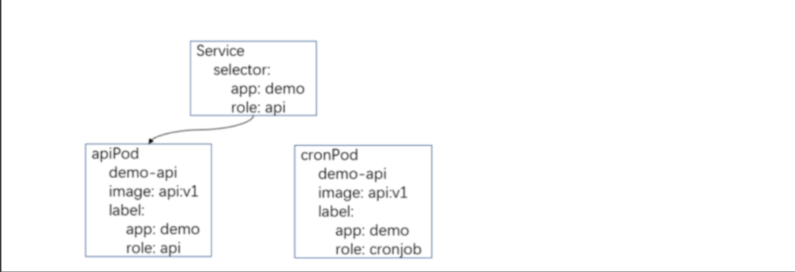
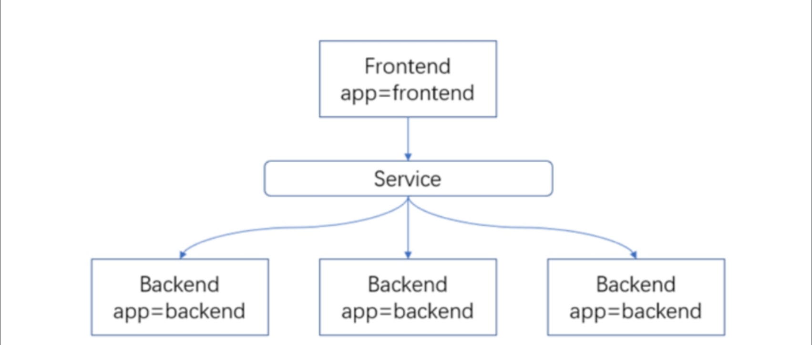
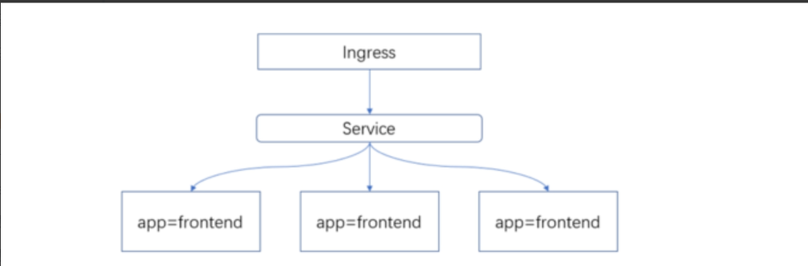

# Kubernetes服务发布基础

在传统架构中，用户访问公司内的服务可能通过了多层代理、网关、防火墙等。在Kubernetes中，访问Kubernetes中的应用同样也会经过多层代理、网关、防火墙等。

但是在传统架构中，可能是通过Nginx、HAProxy、LVS、公有云的SLB、ELB等实现的负载均衡和域名路由，虽然Kubernetes也是通过诸如此类的技术实现的域名路由或者负载均衡，只不过对应的名字叫法可能有所变化，读者不要把这些当作一个比较新颖的东西，其实内部的实现和之前并无区别。


在传统架构配置多个相同服务的负载均衡可能使用的是Nginx的upstream，在Kubernetes中用Service实现。

在传统架构配置域名访问应用可能使用Nginx的Server配置，在Kubernetes中用Ingress实现域名路由的配置（最终通过Ingress的配置生成对应控制器的配置，比如使用Nginx作为Ingress控制器，Ingress资源最终生成的就是Nginx的配置文件）。


## 1.标签和选择器

很多情况下，我们需要对各类资源进行分组管理，或者同一个应用的Pod可能会根据不同的功能进行划分，比如有一个后端的应用，
需要提供API接口供前端调用，也需要进行一些周期性的计划任务，相当于同一个镜像分两个身份运行，所以就需要对这两个资源文件用标签进行区分，这样的话就可以让流量进入提供API接口的Pod，执行计划任务的Pod不接收任何流量，

如图6.1所示。

{: .zoom}

图6.1 同一个应用不同的运行方式

此时其他应用调用该应用的Service（Service为容器服务的入口，可以通过Service访问符合选择器（Selector）过滤的容器的应用程序，缩写为svc，具体可以参考本书6.2节）时，
流量只能到达api的Pod，不会到达cron的Pod，因为选择器进行匹配时是“与”的关系，需要所有的标签（Label）都要匹配，所以role=cronjob的Pod不会被接入流量。

使用标签同样可以对Kubernetes的其他资源进行配置，当Kubernetes对系统的任何API对象（如Pod和节点）进行“分组”时，会对其添加标签 （key=value形式的“键-值对”），用以精准地选择对应的API对象。

而选择 器则是针对匹配对象的查询方法。

常用的标签tier可用于区分容器的属性，如frontend、backend；或者一个release_track用于区分容器的环境，如canary、production等。


### 1.1 定义标签

应用案例：公司与xx银行有一条专属的高速光纤通道，此通道只能与192.168.7.0网段进行通信，因此只能将与xx银行通信的应用部署到192.168.7.0网段所在的节点上，此时可以对节点添加标签：

```shell
$ kubectl label node k8s-node02 region=subnet7
node/k8s-node02 labeled
```

然后可以通过选择器对其筛选：

```shell
$ kubectl get node -l region=subnet7
NAME             STATUS   ROLES     AGE    VERSION
k8s-node02   Ready    ingress   321d   v1.21.3
```

删除标签

```shell
$ kubectl label node giteego-k8s-n2 region-
node/giteego-k8s-n2 labeled

$ kubectl get no -l region=subnet7
No resources found
```


最后在Deployment或其他控制器中指定将Pod部署到该节点：

```yaml
 # 可选，指定Node节点
  nodeSelector:
    region: subnet7
  restartPolicy: Always
```

也可以用同样的方式对Service添加标签：

```shell
$ kubectl label svc canary-v1 -n canary-production env=canary version=v1
service/canary-v1 labeled
```

查看该Service的标签：

```shell
$ kubectl get svc -n canary-production --show-labels
```

还可以查看所有version为v1的Service：

```shell
$ kubectl get svc --all-namespaces -l version=v1
```

上述演示了对节点、Service添加自定义标签的方法，对其他资源添加标签的方式相同。


### 1.2 选择器

选择器主要用于资源的匹配，只有符合条件的资源才会被调用或使用，可以使用该方式对集群中的各类资源进行分配。

由于Kubernetes的核心资源Deployment、StatefulSet管理哪些Pod是通过选择器字段决定的，通过Service访问哪些后端Pod也是通过选择器字段决定的，
因此本节将介绍如何使用选择器过滤出自己想要的资源。


首先使用--show-labels查看目前已有的标签：

```shell
$ kubectl get service --show-labels
NAME                          TYPE        CLUSTER-IP      EXTERNAL-IP   PORT(S)   AGE    LABELS
kubernetes                    ClusterIP   10.96.0.1       <none>        443/TCP   321d   component=apiserver,provider=kubernetes
nginx-deployment-helm-nginx   ClusterIP   10.103.233.67   <none>        80/TCP    16d    app.kubernetes.io/instance=nginx-deployment,app.kubernetes.io/managed-by=Helm,app.kubernetes.io/name=helm-nginx,app.kubernetes.io/version=1.16.0,helm.sh/chart=helm-nginx-0.1.0
```

选择匹配provider为details或者kubernetes的Service：

```sh
$ kubectl get svc -l "provider in (details,kubernetes)" --show-labels
NAME         TYPE        CLUSTER-IP   EXTERNAL-IP   PORT(S)   AGE    LABELS
kubernetes   ClusterIP   10.96.0.1    <none>        443/TCP   321d   component=apiserver,provider=kubernetes
```

选择provider为details或kubernetes但不包括version=v1的Service：

```sh
$ kubectl get svc -l version!=v1,"provider in (details,kubernetes)" --show-labels
NAME         TYPE        CLUSTER-IP   EXTERNAL-IP   PORT(S)   AGE    LABELS
kubernetes   ClusterIP   10.96.0.1    <none>        443/TCP   321d   component=apiserver,provider=kubernetes
```

选择label的key名为app的Service：
```shell
$ kubectl get svc -l app --show-labels
```


### 1.3 修改标签

在实际使用中，资源标签的更改是经常发生的事情，可以使用overwrite 参数修改标签。

比如将version=v1改为version=v2：
```sh

$ kubectl get svc -n canary-production --show-labels

$ kubectl label svc canary-v1 -n canary-production version=v2 --overwrite

$ kubectl get svc -n canary-production --show-labels
```


### 1.4 删除标签
有时候也会需要删除某资源的标签，在label的key名后面加一个减号即可删除，比如删除key名为version的标签：

```shell
$ kubectl label svc canary-v1 -n canary-product version-

$ kubectl get svc -n canary-production --show-labels
```


```shell
# 设置标签
$ kubectl label node gitee-k8s-w02 monitor=prometheus
node/gitee-k8s-w02 labeled

# 带有prometheus标识符的标签
$ kubectl label nodes gitee-k8s-w02 node-role.kubernetes.io/prometheus="true"


# 删除标签
$ kubectl label nodes gitee-k8s-w02 monitor-
node/gitee-k8s-w02 labeled

# 带有prometheus标识符的标签
$ kubectl label nodes gitee-k8s-w02 node-role.kubernetes.io/prometheus-


# label为node-role.kubernetes.io/prometheus="true"
nodeSelector: {"node-role.kubernetes.io/prometheus":"true"}


# 修改一个label的值，需要加上–overwrite参数：
$ kubectl label nodes k8s-test01 gpu=false --overwrite
```


!!! example "参考文献"

        https://www.qikqiak.com/k8strain2/scheduler/usage/#nodeSelector


## 2.Service

使用虚拟机或者裸容器部署应用时，程序之前的互相访问一般都是使用宿主机的IP地址和端口号进行访问的，因为宿主机的IP地址一般不会轻易改变，所以IP+端口的方式并没有什么大的问题。

而使用Kubernetes的Pod部署应用时，Pod大部分都是随机地部署至最佳的节点上，并且经常被删除重建，
所以Pod的IP地址并不是一成不变的，这样的话服务之前的访问就不能使用IP+端口的方式， 所以Service应运而生。


Service主要用于Pod之间的通信，对于Pod的IP地址而言，Service是提前定义好并且是不变的资源类型，
在生产环境中最佳的实践方式就是每个应用互相调用时使用Service的名字进行连接， 而非IP地址。


### 2.1 Service的基本概念
Kubernetes的Pod具有生命周期的概念，它可以被创建、删除、销毁，一旦被销毁就意味着生命周期的结束。

通过ReplicaSet能够动态地创建和销毁Pod，例如进行扩缩容和执行滚动升级。
每个Pod都会获取到它自己的IP地址，但是这些IP地址不总是稳定和可依赖的，这样就会导致一个问题：

在Kubernetes集群中，如果一组Pod（比如后端的Pod）为其他Pod（比如前端的Pod）提供服务，那么如果它们之间使用Pod的IP地址进行通信，在Pod重建后，将无法再进行连接。

为了解决上述问题，Kubernetes引用了Service这样一种抽象概念： 逻辑上的一组Pod，即一种可以访问Pod的策略，通常被称为微服务。

这一组Pod能够被Service访问，通常是通过Label Selector（标签选择器）实现的，如图6.2所示。


{: .zoom}

图6.2 Service代理模式


假设有一个用作图片处理的backend（后端），运行了3个副本，每个副 本具有一个app=backend的Label，这些副本是可互换（无状态）的，
之后创建一个Service指定Selector为app=backend，那么frontend（前端）即可通过这个Service的名称直接访问backend，所以frontend不需要关心它调用了哪个backend副本。

即使组成这一组backend程序的Pod发生了变化，frontend也没有必要知道，而且也不需要跟踪这一组backend的状态，因为Service能够解耦这种关联。


### 2.2 定义Service

和创建其他类型的资源一样，定义一个YAML文件，即可通过kubectl客户端创建一个Service。 
例如有一组Pod，它们暴露了9376端口，同时具有`app=myapp`的标签，此时可以定义Service的YAML文件如下：

```yaml
kind: Service
apiVersion: v1
metadata:
  name: my-service
spec:
  selector:
    app: myapp
  ports:
    - protocol: TCP
      port: 80
      targetPort: 9376
```

上述文件配置创建一个名为my-service的Service对象，它会将请求代理 到TCP端口为9376并且具有标签app=myapp的Pod上。
这个Service会被分配一个IP地址，通常称为ClusterIP，它会被服务的代理使用，
在集群内部可以通过该ClusterIP（不建议使用ClusterIP进行访问）或Service名加上port进行访问，该示例my-service:80即可访问具有app=myapp标签的Pod的9376端口。


**需要注意的是，Service能够将一个接收端口映射到任意的targetPort， 如果targetPort为空，targetPort将被设置为与Port字段相同的值 。**

targetPort可以设置为一个字符串，引用backend Pod的一个端口的名称，这样的话即使更改了Pod的端口，也不会对Service的访问造成影响。
Kubernetes Service能够支持TCP、UDP、SCTP等协议，默认为TCP协议。


### 2.3 无选择器的Service和Endpoint

以下情况均可使用无选择器的Service，例如：

- 希望在生产环境中使用某个固定的名称而非IP地址访问外部的中间件服务。
- 希望Service指向另一个Namespace或其他集群中的服务。
- 正在将工作负载转移到Kubernetes集群，但是一部分服务仍运行在Kubernetes集群之外的backend。

在这些场景中，都能定义没有选择器的Service，只需要把上述的Service去除Selector字段即可。

由于这个Service没有选择器，就不会创建相关的Endpoints对象，可以手动创建一个同名的Endpoints（同名的Service和Endpoints会自动建立链接）：

```yaml
kind: Service
apiVersion: v1
metadata:
  name: my-service
spec:
  ports:
    - protocol: TCP
      port: 80
      targetPort: 9376
---
kind: Endpoints
apiVersion: v1
metadata:
  name: my-service
subsets:
  - addresses:
      - ip: 1.2.3.4
    ports:
      - port: 9376
```

!!! warning "注意"

    
    Endpoint IP地址不能是loopback(127.0.0.0/8)、 link-loca(l169.254.0.0/16)或者link-local多播地址(224.0.0.0/24)。

    访问没有选择器的Service与有选择器的Service的原理相同，通过Service名称即可访问，请求将被路由到用户定义的Endpoint，该示例为 1.2.3.4:9376。


### 2.4 ExternalName Service

ExternalName Service是Service的特例，它没有选择器，也没有定义任何端口和Endpoint，它通过返回该外部服务的别名来提供服务。

比如可以定义一个Service，后端设置为一个外部域名，这样通过Service的名称即可访问该域名。

使用nslookup解析以下文件定义的Service，集群的DNS服务将返回一个值为my.database.example.com的CNAME记录：

```yaml
kind: Service
apiVersion: v1
metadata:
  name: my-service
  namespace: prod
spec:
  type: ExternalName    
  externalName: my.database.example.com
```


### 2.5 Service代理模式
在Kubernetes集群中，每个节点运行一个kube-proxy进程。
kube-proxy 负责为Service实现一种VIP（虚拟IP）的形式，而不是ExternalName的形式。
在Kubernetesv 1.0版本中，代理完全是userspace。在Kubernetesv 1.1版中新增了iptables代理，从Kubernetesv 1.2版起，默认是iptables代理。

**从Kubernetesv 1.8版开始新增了ipvs代理，生产环境建议使用ipvs模式。**


#### 2.5.1 iptables代理模式
这种模式下，kube-proxy会监视Kubernetes master节点对Service对象和Endpoints对象的添加和移除。

对每个Service它会创建iptables规则，从而捕获该Service的ClusterIP（虚拟IP）和端口的请求，进而将请求重定向
到Service的一组backend中的某个Pod上面。对于每个Endpoints对象，它也 会创建iptables规则，这个规则会选择一个backend Pod。
默认的策略是随机选择一个backend，如果要实现基于客户端IP的会话亲和性，可以将service.spec.sessionAffinity的值设置为ClusterIP（默认为 None）。

和userspace代理类似，网络返回的结果都是到达Service的IP:Port请求，这些请求会被代理到一个合适的backend，不需要客户端知道关于
Kubernetes、Service或Pod的任何信息。这比userspace代理更快、更可靠，并且当初始选择的Pod没有响应时，iptables代理能够自动重试另一个Pod。


#### 2.5.2 ipvs代理模式
在此模式下，kube-proxy监视Kubernetes Service和Endpoint，调用 netlink接口以相应地创建ipvs规则，
并定期与Kubernetes Service和 Endpoint同步ipvs规则，以确保ipvs状态与期望保持一致。访问服务时，流量将被重定向到其中一个后端Pod。

与iptables类似，ipvs基于netfilter钩子函数，但是ipvs使用哈希表作 为底层数据结构并在内核空间中工作，这意味着ipvs可以更快地重定向流量，
并且在同步代理规则时具有更好的性能，此外，ipvs为负载均衡算法提 供了更多的选项，例如：

- rr：轮询。 
- lc：最少连接。
- dh：目标哈希。
- sh：源哈希。
- sed：预计延迟最短。
- nq：从不排队。


!!! Warning "注意"


    Kube-proxy使用ipvs模式必须在每个节点上安装ipvs模块，如果没有安装 ipvs模块，将会默认使用iptables模式。


### 2.6 多端口Service

在许多情况下，Service可能需要暴露多个端口，对于这种情况，Kubernetes支持Service定义多个端口，但使用多个端口时，必须提供所有端口的名称，

例如将Service的80端口代理到后端的9376，443端口代理到后端的9377：

```yaml
kind: Service
apiVersion: v1
metadata:
  name: my-service
spec:
  selector:
    app: myapp
  ports:
  - name: http
    protocol: TCP
    port: 80
    targetPort: 9376
  - name: https
    protocol: TCP
    port: 443
    targetPort: 9377
```


### 2.7 Service的类型

Kubernetes Service Type（服务类型）主要包括以下几种：

- ClusterIP：在集群内部使用，默认值，只能从集群中访问。
- NodePort：在所有安装了Kube-Proxy的节点上打开一个端口，此端口可以代理至后端Pod，可以通过NodePort从集群外部访问集群内的 服务，格式为NodeIP:NodePort。 
- LoadBalancer：使用云提供商的负载均衡器公开服务，成本较高。
- ExternalName：通过返回定义的CNAME别名，将Service映射到可被 DNS解析的其他域名，需要1.7或更高版本kube-dns的支持。

应用程序部署到Kubernetes后，需要将某些服务发布至Kubernetes集群 外，也就是可以被其他人访问或者调用，比较常用的发布方式是IP+端口或使 用域名的方式。

IP+端口的方式可以用NodePort类型Service进行发布，域名的方式可以使用Ingress（6.3节介绍）进行发布。


以NodePort为例，如果将Service的type字段设置为NodePort，则Kubernetes将从--service-nodeport-range参数指定的范围（默认为30000～ 32767）中自动分配端口，
也可以手动指定NodePort，创建该Service后，集群每个节点都将暴露一个端口，通过某个宿主机的IP+端口即可访问后端的应用，
也可以前端采用一个反代服务器代理至多个Node节点+端口，防止单个Node节点故障引起的服务不可用。


定义一个NodePort类型的Service格式如下（ Kubernetes集群安装时Dashboard的访问就是基于NodePort类型的Service进行访问的，6.3节将会讲
到如何使用域名访问Kubernetes集群的应用）：

```yaml
kind: Service
apiVersion: v1
metadata:
  labels:
    k8s-app: kubernetes-dashboard
  name: kubernetes-dashboard
  namespace: kube-system
spec:
  type: NodePort
  ports:
    - port: 443
      targetPort: 8443
      nodePort: 30000
  selector:
    k8s-app: kubernetes-dashboard
```


!!! example "参考文献"


     https://www.qikqiak.com/k8strain/network/service/


!!! tip "其他服务访问方式详情参见以下网址："


    https://kubernetes.io/docs/concepts/services-networking/service/#publishing-services-service-types


### 2.8 Kubernetes服务发现

Kubernetes支持两种类型的服务发现：环境变量和DNS。

#### 2.8.1 基于环境变量的服务发现

当Pod部署到一个Node节点后，该Node节点上的Kubelet会在该Pod内部设置一组环境变量， 
这些环境变量是根据活跃的Service生成并以{SERVICE_NAME}_SERVICE_HOST和{SERVICE_NAME}_SERVICE_PORT格式命名的变量，其中服务名都转换为大写字母，“.”和“-”转换为“_”。 

当一个Pod运行到节点时，kubelet会为每个容器添加一组环境变量，Pod容器中的程序就可以使用这些环境变量发现Service。

`busybox.yaml`

```yaml
apiVersion: v1
kind: Pod
metadata:
  name: busybox
  namespace: default

spec:
  containers:
    - image: busybox
      command:
        - sleep
        - "3600"
      imagePullPolicy: IfNotPresent
      name: busybox
  restartPolicy: Always

```

```shell
[root@ci-base pod]# kubectl create -f busybox.yaml
pod/busybox created

[root@ci-base pod]# kubectl get pod
NAME      READY   STATUS    RESTARTS   AGE
busybox   1/1     Running   0          2s

[root@ci-base pod]# kubectl exec -it busybox sh
/ # env
KUBERNETES_PORT=tcp://10.96.0.1:443
KUBERNETES_SERVICE_PORT=443
HOSTNAME=busybox
SHLVL=1
HOME=/root
HU_NGINX_PORT_80_TCP=tcp://10.102.125.25:80
HU_NGINX_PORT_443_TCP_ADDR=10.102.125.25
HU_NGINX_PORT_443_TCP_PORT=443
HU_NGINX_PORT_443_TCP_PROTO=tcp
HU_NGINX_SERVICE_PORT_HTTP=80
TERM=xterm
KUBERNETES_PORT_443_TCP_ADDR=10.96.0.1
HU_NGINX_SERVICE_PORT_HTTPS=443
HU_NGINX_PORT_443_TCP=tcp://10.102.125.25:443
PATH=/usr/local/sbin:/usr/local/bin:/usr/sbin:/usr/bin:/sbin:/bin
HU_NGINX_SERVICE_HOST=10.102.125.25
KUBERNETES_PORT_443_TCP_PORT=443
KUBERNETES_PORT_443_TCP_PROTO=tcp
HU_NGINX_SERVICE_PORT=80
HU_NGINX_PORT=tcp://10.102.125.25:80
KUBERNETES_PORT_443_TCP=tcp://10.96.0.1:443
KUBERNETES_SERVICE_PORT_HTTPS=443
KUBERNETES_SERVICE_HOST=10.96.0.1
PWD=/
HU_NGINX_PORT_80_TCP_ADDR=10.102.125.25
HU_NGINX_PORT_80_TCP_PORT=80
HU_NGINX_PORT_80_TCP_PROTO=tcp

/ # echo ${HU_NGINX_SERVICE_HOST}
10.102.125.25
/ # echo ${HU_NGINX_SERVICE_PORT}
80
```

```shell
[root@ci-base pod]# kubectl get svc
NAME         TYPE        CLUSTER-IP      EXTERNAL-IP   PORT(S)          AGE
hu-nginx     ClusterIP   10.102.125.25   <none>        80/TCP,443/TCP   7m52s
```


!!! warning "注意"


    - Pod和Service的创建顺序是有要求的，Service必须在Pod创建之前创建，新创建的Pod会自动注入Service的环境变量。必须先声明Service为Pod做代理，再创建Pod，这样Pod就有了Service的环境变量

    - Pod只能获取同一Namespace中的Service的环境变量，如果Service和Pod跨命名空间，则无法获取环境变量。


#### 2．基于DNS的服务发现
Kubernetes进行服务发现的另一种方式是基于Kubernetes内部的DNS记 录，新版Kubernetes默认使用CoreDNS作为集群的内部DNS，
一般CoreDNS的 Service地址为Service网段的第10个IP，比如10.96.0.10，端口53， 集群内Pod可通过该地址和端口进行Kubernetes内部的服务解析。

DNS服务器监听 Kubernetes创建的Service，然后给每个Service添加一组DNS记录，集群中的 Pod就能通过Kubernetes内部的DNS解析到Service的IP，也就是Service的ClusterIP。


为服务提供名称域名的访问。

- DNS服务监视Kubernetes API，为每一个Service创建DNS记录用于域名解析。
- ClusterIP A记录格式：`<service-name>.<namespace-name>.svc.cluster.local` 示例：my-svc.my-namespace.svc.cluster.local


例如创建一个含有nslookup命令的容器 ， 
测试解析kube-dns的Service（指定的Service名为kube-dns.kube-system，同一个命名空间下可以省略.kube-system）：
```shell
$ kubectl run redis --image=redis:3.2.10-alpine
$ kubectl get pod
NAME    READY   STATUS    RESTARTS   AGE
redis   1/1     Running   0          28s


$ kubectl exec -ti redis -- nslookup kube-dns.kube-system
nslookup: can't resolve '(null)': Name does not resolve

Name:      kube-dns.kube-system
Address 1: 10.96.0.10 kube-dns.kube-system.svc.cluster.local
```

Kubernetes还支持命名端口的DNS SRV（服务)记录，如果一个服务有一个TCP端口，并且该端口的名称为http，
则可以使用"_http._tcp.{SERVICE_NAME}.{SERVICE_NAMESPACE}"执行DNS SRV查询，以查询该Service的IP和端口。


Kubernetes目前支持环境变量和DNS两种简单的服务发现，两种方式各有 优缺点，其中环境变量形式需要开发人员自行实现变量的解析，
而基于DNS的 服务发现不需要多余的代码，直接通过http://SERVICE_NAME:SERVICE_PORT 即可调用其他组件，但是会有一些网络上的消耗。
相对于Kubernetes的服务发现，业界更常用的可能是基于Spring Cloud的Eureka，或者是Consul等工具实现微服务的自动发现，
不过并不是所有的项目都是基于Spring Cloud全家桶进行开发的，而使用其他工具或Kubernetes环境变量进行服务发现，
也会带来实现服务发现逻辑代码时间上的消耗，所以可能基于Kubernetes DNS的服务发现更为简单高效。


## 3.Ingress

Ingress为Kubernetes集群中的服务提供了入口，可以提供负载均衡、
SSL终止和基于名称（域名）的虚拟主机、应用的灰度发布等功能，在生产环 境中常用的Ingress有Treafik、Nginx、HAProxy、Istio等。


### 3.1 基本概念

上一节讲解Service时，我们可以通过NodePort类型的Service在集群外 部访问Kubernetes集群内的应用，然而通过IP地址+端口的访问模式并不是应
用发布的最佳实践，也不是推荐的发布方式，相对于IP地址，我们更喜欢在 浏览器输入域名访问应用，
那么在Kubernetes集群中如何使用域名发布服务呢？


在没有使用Kubernetes的传统架构中，部署一个应用并使用域名进行发 布的流程如下：

1）部署应用至宿主机，启动应用并暴露一个端口号。

2）通过Nginx或其他代理工具配置域名，并代理至后端应用。

3）在域名厂商进行域名解析，设置DNS记录至Nginx或其他代理工具

(Nginx的前面可能还有其他代理服务器，在此不进行说明)的服务器上，之后就能通过域名访问我们的应用。

在使用Kubernetes时，部署一个应用并使用域名进行发布的流程如下：
1）部署应用至Kubernetes集群，容器内定义了程序启动的方式。

2）配置ClusterIP类型的Service，通过Selector链接到容器内的应用。

3）配置Ingress链接到该应用的Service，之后将域名解析到Ingress(Ingress前面可能还有其他代理服务器)对应的宿主机上即可。

此时在Kubernetes中对应的架构图如图6.3所示。

{: .zoom}

图6.3 Ingress代理模式


那Ingress到底是什么呢？

通俗来讲，Ingress和之前提到的Service、Deployment等类似，也是一个Kubernetes的资源对象，Deployment是用来部署应用的，Ingress就是实现用域名的方式访问应用。

Ingress实现的方式有很多，比如Nginx、HAProxy、 Treafik等，就Nginx而言 ，和上述提到的传统服务架构用Nginx类似 。

Ingress控制器在每个符合条件的宿主机上部署一个Pod，这个Pod里面运行的 就是Nginx进程，里面的实现逻辑和宿主机部署Nginx的方式并无太大区别，
关键区别是宿主机部署的Nginx需要更改Nginx的配置文件配置域名， 而Ingress则和其他Kubernetes资源文件一样，使用YAML文件进行配置，之后
Ingress控制器根据YAML文件定义的内容自动生成对应的配置文件。

在Kubernetes v1.1版中正式引用Ingress的概念，用于从集群外部到集 群内部Service的HTTP和HTTPS路由，可以配置提供服务外部访问的URL、负载
均衡和终止SSL，并提供基于域名的虚拟主机。流量从Internet到Ingress再 到Services最后到Pod上，通常情况下，Ingress部署在所有的Node节点上，
暴露443和80端口（一般通过hostNetwork的方式部署Ingress),之后再通过F5或公有云LB代理到对应的Ingress节点上，之后将域名解析到F5或公有云LB即可实现基于域名的服务发布。


!!! abstract "Ingress选型"

    参考文献

    - https://www.yuque.com/coolops/kubernetes/uung6g
    - https://www.yuque.com/cuiliang0302/kubernets/qc173m
    - https://www.qikqiak.com/k8strain/network/ingress/nginx/


!!! abstract "**Nginx Ingress奇巧淫技**"


    https://www.yuque.com/coolops/kubernetes/ke3qu2


### 3.2 创建一个Ingress

创建Ingress和创建其他资源类似，也是使用YAML格式的文件。

创建一个简单的Ingress代码如下
(Kubernetes版本小于1.22时，APIVersion为 networking.k8s.io/v1beta1,大于等于1.22版本时必须为networking.k8s.io/v1,最早期的版本还有extensions/v1beta1，在此不再说明）：

```yaml
apiVersion: networking.k8s.io/v1beta1
kind: Ingress
metadata:
  name: simple-fanout-example
  annotations:
    kubernetes.io/ingress.class: "nginx" # 不同的controller，ingress.class可能不一致
spec:
  rules:
  - host: foo.bar.com
    http:
      paths:
      - path: /foo
        pathType: Prefix
        backend:
          serviceName: service1
          servicePort: 4200
      - path: /bar
	    pathType: ImplementationSpecific
        backend:
          serviceName: service2
          servicePort: 8080
```

上述host定义该Ingress的域名，将其解析至任意部署了Ingress控制器 的Node上即可访问，

如果访问的是foo.bar.com/foo，则被转发到service1的4200端口，
如果访问的是foo.bar.com/bar，则被转发到service2的8080端口。


**当集群版本大于等于1.19时，Ingress的APIVersion变为了v1版本（1.22后废弃了v1beta1）**，对应的配置也有一些变化，代码如下：

```yaml
apiVersion: networking.k8s.io/v1 # 1.19+
kind: Ingress
metadata:
  name: simple-fanout-example
spec:
  ingressClassName: nginx
  rules:
  - host: foo.bar.com
    http:
      paths:
      - path: /foo
        backend:
          service
             name: service1
             port:
               number: 4200
```


### 3.3 Ingress使用入门

#### 1.单域名

一个比较常见的配置是单个域名匹配多个path到不同的Service（Kubernetes 1.19版本以上可以参考前文）：

```yaml
apiVersion: networking.k8s.io/v1beta1
kind: Ingress
metadata:
  name: simple-fanout-example
  annotations:
    nginx.ingress.kubernetes.io/rewrite-target: /
spec:
  rules:
  - host: foo.bar.com
    http:
      paths:
      - path: /foo
        backend:
          serviceName: service1
          servicePort: 4200
      - path: /bar
        backend:
          serviceName: service2
          servicePort: 8080
```


此时，访问foo.bar.com/foo到service1的4200，访问foo.bar.com/bar到service2的8080。


#### 2.多域名

也支持和Nginx一样的多域名配置，也就是基于域名的虚拟主机，支持将HTTP流量路由到同一IP地址的多个主机名（Kubernetes 1.19以上版本可以参考前文）：

```yaml
apiVersion: networking.k8s.io/v1beta1
kind: Ingress
metadata:
  name: name-virtual-host-ingress
spec:
  rules:
  - host: foo.bar.com
    http:
      paths:
      - backend:
          serviceName: service1
          servicePort: 80
  - host: bar.foo.com
    http:
      paths:
      - backend:
          serviceName: service2
          servicePort: 80
```

此时，访问foo.bar.com到service1，访问bar.foo.com到service2。

#### 3.基于TLS的Ingress

生产环境的域名大部分都是HTTPS的，Ingress也支持HTTPS类型的域名。首先创建证书，生产环境的证书为公司购买的证书：

```sh
$ kubectl -n default create secret tls nginx-test-tls --key=tls.key --cert=tls.crt
```


定义Ingress（Kubernetes 1.19以上版本可以参考前文）：

```yaml
apiVersion: networking.k8s.io/v1beta1
kind: Ingress
metadata:
  name: nginx-https-test
  namespace: default
  annotations:
    kubernetes.io/ingress.class: "nginx"
spec:
  rules:
  - host: https-test.com
    http:
      paths:
      - backend:
          serviceName: nginx-svc
          servicePort: 80
  tls:
   - secretName: nginx-test-tls
```

> 提示
> tls为域名证书配置项，一个Ingress可以定义多个tls类型的Secret。


### 3.4 更新Ingress
更新Ingress可以直接使用`kubectl edit ingress INGRESS-NAME`进行更改，也可以通过`kubectl apply/replace -f NEW-INGRESS-YAML.yaml`进行更改。


本章只介绍了Ingress的基本概念，更多Ingress的配置请参考Ingress Nginx进阶一章（本书第16章）的内容。


## 4.小结
本章讲解了服务发布的两种方式，即Service和Ingress。
通常情况下， Service用于程序间的内部访问，即后端服务之间的相互调用。
而Ingress多 用于对外发布服务，即通过域名的形式让用户能访问到内部服务，这也是最普遍的发布方式，
但是如果一个不需要对外发布的后端服务，通过Ingress被另一个后端服务调用，则相当于从外部绕了一圈，这不是推荐的方式。


实际使用时，也会有架构直接通过Service的NodePort暴露服务，然后由 上层的网关进行代理，域名都配置在上层，这样的话，服务过多会引起端口 维护非常复杂，可能还会有性能损耗。

所以一般推荐在上层配置通配符域名，比如*.test.com到Kubernetes的Ingress Controller，之后由Ingress再做路由。比如a.test.com指向A项目，a.test.com/xxx指向A项目的xxx服务。


另外在程序设计时，有了Service无须再考虑负载均衡等问题，所以如果有程序间的调用，首选Service，并且以后可以无缝地接入服务网格，进行服 务治理。

在使用Kubernetes时，其实并不推荐使用Spring Cloud这类架构， 因为很多功能都是类似的，
在Kubernetes上仍旧使用Spring Cloud属于“套娃”型架构，应该向着单服务方向进行开发，比如直接使用Spring Boot即可。

