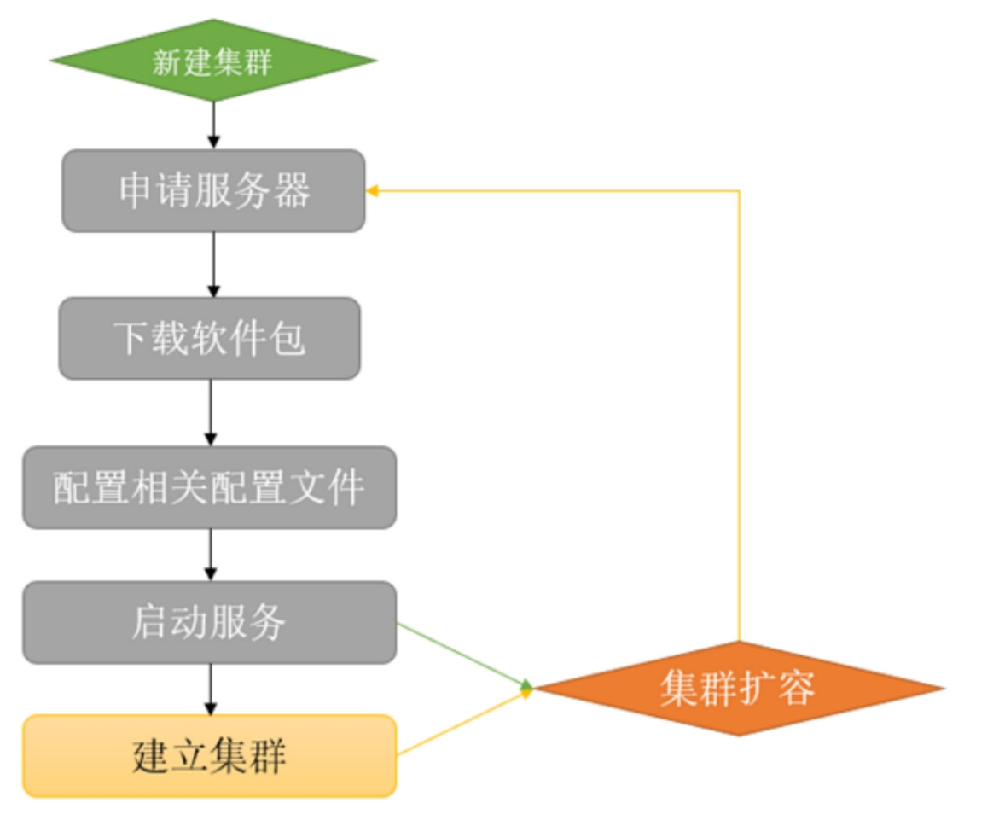
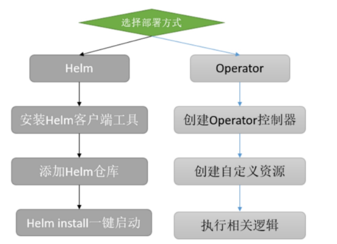

# 中间件容器化

通过前面的学习，我们基本掌握了Kubernetes的核心概念，相信读者已经能够部署一些比较简单的服务，同时也可以将公司的应用迁移至
Kubernetes。

但是在使用Kubernetes时，只部署一些简单的单体应用并非我们的最终目标。

在很多情况下，我们还需要将一些复杂的中间件部署到Kubernetes，比如Redis、RabbitMQ、Kafka、Zookeeper集群等。

由于这些应用比较复杂，并且搭建时涉及的资源文件比较多，因此使用传统的管理方式显得很麻烦，我
们需要一种简单的方式就可以部署、管理Kubernetes上的比较复杂的应用，在Kubernetes中，可以使用包管理工具Operator和Helm来管理比较复杂的中
间件，本章的内容就是使用Kubernetes包管理工具将比较复杂的中间件部署至Kubernetes。


## 1. 传统架构如何管理中间件集群
使用Kubernetes部署中间件集群之前，我们先来回顾一下，在传统架构中是如何管理中间件集群的。


在传统架构中，管理一个中间件集群的流程大致如图

1）假设现在需要中间件集群，比如需要一个三主三从的Redis集群。

2）如果公司环境目前没有服务器，需要新申请3～6（有可能是复用之前的服务器搭建集群）台服务器用来部署Redis集群。

3）从Redis官方网站下载某个版本的Redis安装包，并且安装到每一台服务器上，同时可能每台服务器也需要做相关的优化配置，比如修改提升性能
的内核等。

4）进行每台服务器的Redis配置，如果是一台服务器部署两个Redis实例，可能还需要配置不同的端口号等。

传统架构管理中间件
{: .zoom}

5）启动每台服务器上的Redis实例。

6）通过相关命令建立集群，当然有的中间件是没有此步骤的，可以直接通过相关配置文件直接建立集群。

7）如果集群想要添加节点，可能就需要重复2）～6）的步骤。

综上可知，在传统架构中想要搭建一个类似于Redis的中间件集群，其实是一件挺烦琐且非常具有重复性的事，并且由于服务器的环境不同，在安装
过程中可能还会遇到各种各样的问题，浪费很多时间和精力。

但是在Kubernetes中，可以利用Kubernetes的特性非常方便且迅速地启动一个对应的集群。接下来讲解如何在Kubernetes中部署相关的中间件。


## 2. Kubernetes如何管理中间件集群

在Kubernetes中，可以使用Kubernetes的包管理工具非常方便地搭建一个中间件集群，最为常用的包管理工具还是以Operator和Helm为主，首先我
们来简单看一下Operator和Helm的区别。


### 2.1 Operator和Helm的区别

简而言之，包管理工具就是把相关文件的定义统一管理，然后可以很方便地通过这些工具管理比较复杂的应用，比如MyS?L集群、Redis集群等，实
现一键创建集群、扩容、备份等。当然，公司内开发的应用程序也可以通过Kubernetes的包管理工具进行管理，目前常用的两种包管理工具是Operator
和Helm，类似的还有Kustomize、CNAB等。


虽然Operator和Helm实现的功能类似，但是两者还是有很大的区别的。


==Operator更倾向于管理复杂的有状态服务，比如MySQL集群、Redis集群、TiDB集群等，而Helm更倾向于管理无状态应用的部署，比如公司的服务、某
些不需要持久化数据的中间件、不需要实现额外功能的服务等。==


如果读者之前使用Operator和Helm部署过一些服务，就会知道很多中间件的部署都有Helm和Operator两种方式可以选择，比如RabbitMQ可以通过Helm部署，也可以通过Operator部署。读者可能会有一些疑惑，既然功能类似，为何还要大费周章地重复“造轮子”呢？


前文提到过，Helm适合部署不需要额外功能的服务，这里提到的额外功能有备份、回滚以及更高级的用法。

如果想要实现这些逻辑，使用Helm不容易实现，或者无法实现，而Operator可以通过代码来实现相关的逻辑，这也是为什么**Operator更倾向于管理更为复杂的服务。**

另外，还有一个很大的区别，就是两种工具的实现难度是不一样的。

比如自己写一个Helm的Chart（Helm包的名称叫Chart），只需要将相关的模板文件放在Chart的templates目录， 然后抽离相关的配置， 放置于
values.yaml，模板文件通过go template语法即可生成相关的资源文件并加载到Kubernetes中。

而Operator需要自己动手编写一个控制器，这个控制器可以解析自己定义的CRD（Custom Resource Define，自定义资源类型），然
后生成相关的资源文件并加载到Kubernetes中。想要实现上述所讲的备份、回滚等功能，也需要自己编写相应的代码实现。

所以Operator需要一定的开发能力，可以用Golang、Java等语言。


在实际使用时，两者没有最佳选择，只有更合适的选择。

比如想要搭建某个流行的中间件集群（比如Redis集群），我们不需要从头开始写一个Redis集群的Operator或者Helm的Chart。

因为像Redis这样比较流行的中间件，官方或者第三方平台（比如Bitnami）已经为我们提供了一些非常好用且
功能齐全的Operator或者Helm Chart，直接使用即可。

在企业内部编写Operator或者Helm Chart大部分都是基于公司自己的业务系统展开的（当然，一些公司也会为开源项目做出自己的贡献，也会为中间件编写相应的
Operator，比如UCloud提供的Redis Cluster Operator也是非常好用的），比如公司的某个产品，可以一键式部署或者迁移等。

**而像这类一键式搭建业务系统的需求，编写Helm要比Operator简单很多，但是如果想要实现更多、更复杂的逻辑，Operator可能更为合适。**


### 2.2 Kubernetes管理中间件集群的流程

之前我们已经介绍了传统架构管理中间件集群的流程，接下来介绍Kubernetes是如何利用包管理工具来管理中间件集群的。

无论是选择Helm还是Operator来管理中间件，都是非常简单的。Helm和Operator管理中间件的流程如图

{: .zoom}

比如使用Helm管理中间件集群的流程如下：

1）首先集群中需要有一个Helm的客户端，用来执行增删改查命令，和Kubectl类似。

2）之后需要找到对应的Chart（可以在中间件的官网或者GitHub中查找），比如安装Redis、Zookeeper集群的包。这个包和镜像类似，都是放在
一个仓库中，镜像放在镜像仓库，Chart放在Chart仓库。

3）如果是新建集群，只需要执行helm install命令即可一键式创建该集群。如果想要更新配置，直接使用helm upgrade即可。


使用Operator管理中间件的流程如下：

1）相对于Helm需要安装单独的客户端工具，Operator不需要单独的客户端工具，使用kubectl即可。所以第一步就是找到对应的Operator（和Helm类
似，可以在GitHub或者其官方网站上查找）。

2）创建对应的控制器，用来解析一些自定义资源逻辑的程序。

3）之后创建自定义资源即可，对应的控制器会解析自定义资源实现相关功能，比如创建集群、扩容、备份等。

由此看来，Helm和Operator可以很方便地实现中间件集群的管理和维护。接下来我们通过几个简单的例子实践一下Helm和Operator的使用。


## 3. Operator的使用

### 3.1 使用Operator安装Redis集群

本小节演示的Operator是由UCloud开源的一个项目。

!!! info "项目地址"

    https://github.com/ucloud/redis-cluster-operator，

接下来根据前文提到的流程创建一个具有6个实例的Redis集群。

首先需要下载该项目至服务器：
```shell
$ git clone https://github.com/ucloud/redis-cluster-operator.git
$ cd redis-cluster-operator
```

之后创建对应的CRD，然后就可以通过这些CRD声明一个创建Redis集群的YAML文件：
```shell
$ kubectl create -f deploy/crds/redis.kun_distributedredisclusters_crd.yaml
$ kubectl create -f deploy/crds/redis.kun_redisclusterbackups_crd.yaml
```
假设需要将Redis集群部署至redis-cluster命名空间，需要先创建redis-cluster命名空间和对应的一些权限，并且将Operator控制器安装至该
命名空间：
```shell
$ kubectl create ns redis-cluster
$ kubectl create -f deploy/service_account.yaml -n redis-cluster
$ kubectl create -f deploy/namespace/role.yaml -n redis-cluster
$ kubectl create -f deploy/namespace/role_binding.yaml -n redis-cluster
$ kubectl create -f deploy/namespace/operator.yaml -n redis-cluster
```
查看Redis Operator的Pod状态：
```shell
$ kubectl get pod -n redis-cluster
NAME                                      READY   STATUS    RESTARTS   AGE
redis-cluster-operator-675ccbc697-c6m2t   1/1     Running   0          37s
```
接下来通过一个自定义类型的YAML文件一键式启动一个三主三从的节点，在启动之前先来看一下这个文件的内容：
```shell
$ cat deploy/example/redis.kun_v1alpha1_distributedrediscluster_cr.yaml
apiVersion: redis.kun/v1alpha1
kind: DistributedRedisCluster
metadata:
  annotations:
    # if your operator run as cluster-scoped, add this annotations
    #redis.kun/scope: cluster-scoped
  name: example-distributedrediscluster
spec:
  # Add fields here
  masterSize: 3
  clusterReplicas: 1
  image: redis:5.0.4-alpine
```

注意看该文件的kind和apiVersion，在标准的Kubernetes中，是没有apiVersion为redis.kun/v1alpha1、kind为DistributedRedisCluster这种类
型的资源的。

我们常用的是类似于Deployment、StatefulSet的资源，这种不属于原生资源的资源称为自定义资源类型（Custom Resource Definition，
CRD )。

上述是通过命令` kubectl create -f deploy/crds/redis.kun_distributedredisclusters_crd.yaml`创建了“扩展资源类型”。

继续看该文件的spec定义，也是和原生的资源定义有所不同，所以标准Kubernetes解析不了该类型的资源，该类型的资源创建后，由Redis
Operator负责解析。接下来看一下这段YAML代码具体的含义：

- masterSize：新建的Redis集群有几个主节点。
- clusterReplicas：每个主节点有几个从节点。
- image：该集群使用哪个镜像。

!!! Warning "注意"

    由于我们创建的是命名空间基本的Operator，因此需要将annotations的redis.kun/scope:cluster-scoped注释掉。

在明白其配置含义后，通过一条命令即可创建一个Redis集群：
```shell
$ kubectl create -f deploy/example/redis.kun_v1alpha1_distributedrediscluster_cr.yaml -n redis-cluster
distributedrediscluster.redis.kun/example-distributedrediscluster created
```

创建完成后，可以通过查看自定义distributedrediscluster资源的状态来判断Redis集群是否完成了初始化：

```sh
$ kubectl get distributedrediscluster -n redis-cluster
NAME                              MASTERSIZE   STATUS    AGE
example-distributedrediscluster   3            Scaling   42s
```

此时也可以查看Pod的状态，虽然都是正常状态，但是由于没有完成槽的分配，因此当前集群还是不可用的状态：

```sh
$ kubectl get pod -n redis-cluster -w
NAME                                      READY   STATUS    RESTARTS   AGE
drc-example-distributedrediscluster-0-0   1/1     Running   0          7m3s
drc-example-distributedrediscluster-0-1   1/1     Running   0          6m3s
drc-example-distributedrediscluster-1-0   1/1     Running   0          7m3s
drc-example-distributedrediscluster-1-1   1/1     Running   0          6m23s
drc-example-distributedrediscluster-2-0   1/1     Running   0          7m3s
drc-example-distributedrediscluster-2-1   1/1     Running   0          6m23s
redis-cluster-operator-675ccbc697-c6m2t   1/1     Running   0          14m
```
当状态由Scaling变成了Healthy（此过程可能需要30分钟左右的时间），即表示Redis集群已经创建完成，并完成了槽的配置，此时已经可以正
常使用：

```sh
$ kubectl get distributedrediscluster -n redis-cluster
NAME                              MASTERSIZE   STATUS    AGE
example-distributedrediscluster   3            Healthy   7m7s
```

在创建Redis集群后，会创建如下几个Service：

```sh
$ kubectl get svc -n redis-cluster
NAME                                TYPE        CLUSTER-IP      EXTERNAL-IP   PORT(S)              AGE
example-distributedrediscluster     ClusterIP   10.104.160.70   <none>        6379/TCP,16379/TCP   7m52s
example-distributedrediscluster-0   ClusterIP   None            <none>        6379/TCP,16379/TCP   7m52s
example-distributedrediscluster-1   ClusterIP   None            <none>        6379/TCP,16379/TCP   7m52s
example-distributedrediscluster-2   ClusterIP   None            <none>        6379/TCP,16379/TCP   7m52s
redis-cluster-operator-metrics      ClusterIP   10.101.25.137   <none>        8383/TCP,8686/TCP    14m
```

其中example-distributedrediscluster为程序端用来操作Redis集群的Service名称，可以通过redis://example-distributedrediscluster.redis-cluster:6379链接至该集群。

接下来我们可以使用任意具有Redis客户端工具的Pod进行连接测试，比如使用drc-example-distributedrediscluster-0-0这个Pod进行测试，首先
登录至该Pod（由于Redis客户端和Redis集群是同一个Namespace，因此.redis-cluster可以省略）：

```shell
$ kubectl exec -it drc-example-distributedrediscluster-0-0 -n redis-cluster -- sh
/data # redis-cli -h example-distributedrediscluster
example-distributedrediscluster:6379> info
.....

# Replication
role:slave
master_host:10.0.14.130
master_port:6379
master_link_status:up
master_last_io_seconds_ago:10
master_sync_in_progress:0
slave_repl_offset:728
slave_priority:100
slave_read_only:1
connected_slaves:0
master_replid:a303475b201463f9c7476f9356f73fb5511b8e57
master_replid2:0000000000000000000000000000000000000000
master_repl_offset:728
second_repl_offset:-1
repl_backlog_active:1
repl_backlog_size:1048576
repl_backlog_first_byte_offset:1
repl_backlog_histlen:728
```

使用redis-cli连接到Redis集群后，可以执行Redis的相关命令查看一些信息，在此不再演示，有兴趣的读者可以自行查找学习。接下来我们进行数
据的写入。

请注意框内的提示，我们在执行set命令时，Redis抛出一个异常MOVED，这就是Redis集群的机制，了解过Redis集群架构的读者
可能有所了解。

Redis集群采用分片机制，每个数据插入时会选择一个对应的槽存放数据，如果该槽位不在这个已经连接的实例上，就需要进行“下一
跳”，也就是会连接到具有该槽位的节点上，再写入数据，当然如果该槽位正好位于正在连接的这个实例上，就会直接写入数据。

```sh
/data # redis-cli -h example-distributedrediscluster
example-distributedrediscluster:6379> set a 1
(error) MOVED 15495 10.0.20.225:6379
```

接下来连接到10.0.20.225:6379这个实例上，尝试写入数据

```sh
/data # redis-cli -h 10.0.20.225
10.0.20.225:6379> set a 1
OK
10.0.20.225:6379> get a
"1"
10.0.20.225:6379> quit
/data #
```

可以看到当连接至172.27.14.202节点时，就可以设置key为a的值，当查看a的值的时候，也能直接返回结果，当然如果连接的不是10.0.20.225这
个实例，也是返回MOVED错误。

由于Redis集群的这种机制，因此在Kubernetes集群外部的客户端无法正常使用Kubernetes中的Redis集群，因为在它需要MOVED时，会返回一个Pod的
IP，这个IP为Kubernetes内部IP，标准的Kubernetes不会让外部网络和其直接通信，如果需要集群外部连接至Kubernetes内部的Redis集群，可以采用
Redis集群的代理工具进行解决，有兴趣的读者可以自行尝试。

但是生产环境的Redis集群一般不会直接暴露在外，这也是一种安全的手段，非生产环境采用单示例的Redis即可满足需要，单示例的Redis是没有此类问题的，可以直接通过NodePort类型的Service进行连接。

> 注意
> 以上演示的集群安装并没有进行Redis集群数据的持久化，如果想要持久化数 据 ， 需要有StorageClass的支持，提供动态存储。
>
> 之后使用deploy/example/persistent.yaml文件创建具有持久化数据的Redis集群，只需要修改class字段为集群内块存储的StorageClass名字即可，size按需修改。当然，不要忘记注释redis.kun/scope: cluster-scoped字段。


### 3.2 Redis集群一键扩容

上一小节通过Operator很方便、迅速地搭建了一个Redis集群，接下来介绍如何通过Operator完成一键式集群扩容。

前面提到过自定义资源的配置，有一个参数为masterSize: 3，该参数决定了该集群一共有多少个Master节点，clusterReplicas参数决定了每个
Master节点有几个从节点，如果想要扩容该集群，只需要更改这两个参数即可。

比如将集群扩容为具有4个Master节点的集群：

```sh
$ grep "master" deploy/example/redis.kun_v1alpha1_distributedrediscluster_cr.yaml
  masterSize: 4

$ kubectl replace -f deploy/example/redis.kun_v1alpha1_distributedrediscluster_cr.yaml -n redis-cluster
distributedrediscluster.redis.kun/example-distributedrediscluster replaced
```

再次查看Pod，会发现创建了两个新的Pod：

```sh
$ kubectl get pod -n redis-cluster
NAME                                      READY   STATUS    RESTARTS   AGE
drc-example-distributedrediscluster-0-0   1/1     Running   0          54m
drc-example-distributedrediscluster-0-1   1/1     Running   0          53m
drc-example-distributedrediscluster-1-0   1/1     Running   0          54m
drc-example-distributedrediscluster-1-1   1/1     Running   0          53m
drc-example-distributedrediscluster-2-0   1/1     Running   0          54m
drc-example-distributedrediscluster-2-1   1/1     Running   0          53m
drc-example-distributedrediscluster-3-0   1/1     Running   0          2m37s
drc-example-distributedrediscluster-3-1   1/1     Running   0          97s
redis-cluster-operator-675ccbc697-c6m2t   1/1     Running   0          61m
```

此时集群的状态又会变成Scaling然后变成Healthy状态：

```sh
$ kubectl get distributedredisclusters -n redis-cluster
NAME                              MASTERSIZE   STATUS    AGE
example-distributedrediscluster   4            Healthy   55m
```

---

!!! Warning "注意"

    > 在扩容和缩容的过程中，Redis集群是不可用状态，所以最好在非业务时间段进行扩容。Redis集群的可用性测试和创建小节一致，
    > 此处不再演示。

### 3.3 集群清理

如果只是用来测试和学习，在操作完成后可以清理该集群，清理步骤较传统架构简单，只需要将安装的create改成delete即可：

```sh
$ kubectl delete -f deploy/example/redis.kun_v1alpha1_distributedrediscluster_cr.yaml -n redis-cluster
$ kubectl delete -f deploy/cluster/operator.yaml -n redis-cluster
$ kubectl delete -f deploy/cluster/cluster_role_binding.yaml -n redis-cluster
$ kubectl delete -f deploy/cluster/cluster_role -n redis-cluster
$ kubectl delete -f deploy/service_account.yaml -n redis-cluster
$ kubectl delete -f deploy/crds/redis.kun_redisclusterbackups_crd.yaml -n redis-cluster
$ kubectl delete -f deploy/crds/redis.kun_distributedredisclusters_crd.yaml -n redis-cluster
$ kubectl delete ns redis-cluster
```

如果以后不需要再创建Redis集群，可以把CRD也删除：

```sh
$ kubectl delete -f deploy/crds/redis.kun_distributedredisclusters_crd.yaml
$ kubectl delete -f deploy/crds/redis.kun_redisclusterbackups_crd.yaml
```


## 4. Helm的使用

上一小节演示了如何使用Operator快速创建一个Redis集群，同时也实现了一键式扩容。

本节将会继续学习Kubernetes包管理工具Helm的使用，实现一键式创建Zookeeper、Kafka集群等。


### 4.1 安装Helm客户端

使用Helm和Operator不同的是，Helm的操作需要使用单独的Helm客户端工具。对于Helm V3和V2的安装是有所区别的，Helm V3只需要将Helm客户端
的二进制文件放在/usr/local/bin/下即可，V2除了二进制工具外，还需要安装一个Tiller服务端，由于现在主要以V3为主，因此不再演示V2的安装和使
用。

首先在Helm官方下载Helm的二进制包（此处演示的为Linux的安装步骤，其他步骤可以参考：https://helm.sh/docs/intro/install/）：

软件包下载地址为：https://github.com/helm/helm/releases

```sh
# 本例安装的为3.7.2，其他版本下载地址https://github.com/helm/helm/releases
$ wget https://mirrors.huaweicloud.com/helm/v3.7.2/helm-v3.7.2-linux-amd64.tar.gz
$ tar -zxvf helm-v3.7.2-linux-amd64.tar.gz 
$ cd linux-amd64/ 
$ cp helm /usr/local/bin/
$ chmod a+x  /usr/local/bin/helm

#查看版本
$ helm version
version.BuildInfo{Version:"v3.7.2", GitCommit:"663a896f4a815053445eec4153677ddc24a0a361", GitTreeState:"clean", GoVersion:"go1.16.10"}
```


### 4.2 Helm客户端命令入门

在学习Helm命令之前，先来认识一下Helm。Helm的机制和Docker有些类似，Docker有镜像的概念，用来放置相关程序，并且镜像是放在镜像仓库里
面进行管理的。

而Helm相对于Docker镜像有一个名词叫Chart，是Helm放置模板和配置的地方，同时Chart也可以放在仓库中，只不过放置镜像的叫镜像仓
库，放置Chart的叫Chart仓库，比较主流的镜像仓库Harbor不仅支持镜像的存储，也支持Chart的存储。


有了上述理解，结合之前讲过的管理中间件的流程，可以知道我们在安装相关中间件的时候，需要先找到对应的包（就是前面讲的Chart），而这个
包有一个存放的仓库，因此需要先在当前环境添加这个仓库，从这个仓库中下载该包，然后进行安装（不下载也可以直接安装）即可。


安装完Helm后，可以执行helm repo list查看已经添加的仓库有哪些：

```sh
$ helm repo list
NAME                            URL
kubernetes-dashboard            https://kubernetes.github.io/dashboard/
ingress-nginx                   https://kubernetes.github.io/ingress-nginx
nfs-subdir-external-provisioner https://kubernetes-sigs.github.io/nfs-subdir-external-provisioner/
mycharts                        https://hujianli94.github.io/mycharts/
```

默认情况下，有一个名字为stable的仓库，仓库地址是https://charts.helm.sh/stable。
之后可以通过helm repo add命令添加一个BitNami（BitNami是一个开源项目，具有很多解决方案，我们常用的很多服务在BitNami仓库都能找到）的仓库：

```sh
$ helm repo add bitnami https://charts.bitnami.com/bitnami
$ helm repo update
Hang tight while we grab the latest from your chart repositories...
...Successfully got an update from the "nfs-subdir-external-provisioner" chart repository
...Successfully got an update from the "mycharts" chart repository
...Successfully got an update from the "ingress-nginx" chart repository
```

添加完成后再次查看仓库列表：

```sh
$ helm repo list
NAME                            URL
.....
bitnami                         https://charts.bitnami.com/bitnami
```

接下来可以通过helm search命令查看BitNami仓库有哪些可用的Chart：

```sh
$ helm search repo bitnami
NAME                                            CHART VERSION   APP VERSION     DESCRIPTION
bitnami/airflow                                 14.0.12         2.5.1           Apache Airflow is a tool to express and execute...
bitnami/apache                                  9.2.16          2.4.55          Apache HTTP Server is an open-source HTTP serve...
bitnami/appsmith                                0.1.13          1.9.8           Appsmith is an open source platform for buildin...
bitnami/argo-cd                                 4.4.10          2.6.2           Argo CD is a continuous delivery tool for Kuber...
bitnami/argo-workflows                          5.1.9           3.4.5           Argo Workflows is meant to orchestrate Kubernet...
bitnami/aspnet-core                             4.0.6           7.0.3           ASP.NET Core is an open-source framework for we...
bitnami/cassandra                               10.0.3          4.1.0           Apache Cassandra is an open source distributed ...
bitnami/cert-manager                            0.9.1           1.11.0          cert-manager is a Kubernetes add-on to automate...
bitnami/clickhouse                              3.0.2           23.1.3          ClickHouse is an open-source column-oriented OL...
bitnami/common                                  2.2.3           2.2.3           A Library Helm Chart for grouping common logic ...
.....
```

- NAME：Chart的名字。
- CHART VERSION：Chart的版本。
- APP VERSION：Chart内应用的名称。
- DESCRIPTION：Chart的描述文件。

也可以直接搜索软件的名字，比如搜索Kafka相关的Chart：

```sh
$ helm search repo kafka
NAME                            CHART VERSION   APP VERSION     DESCRIPTION
bitnami/kafka                   21.0.1          3.4.0           Apache Kafka is a distributed streaming platfor...
bitnami/dataplatform-bp2        12.0.5          1.0.1           DEPRECATED This Helm chart can be used for the ...
bitnami/schema-registry         8.0.6           7.3.1           Confluent Schema Registry provides a RESTful in...
```

接下来可以使用helm pull将某个Chart下载至本地，比如将上述检索的Kafka下载至本地：

```sh
[root@k8s-master01 helm-devops]# mkdir helm-study
[root@k8s-master01 helm-devops]# cd helm-study/
[root@k8s-master01 helm-study]# helm pull bitnami/kafka
[root@k8s-master01 helm-study]# ls
kafka-21.0.1.tgz
```

此时下载的为新版的Chart，读者的版本可能会不一致，我们可以通过-l参数查看某个Chart的历史版本：

```sh
$ helm search repo kafka -l
NAME                            CHART VERSION   APP VERSION     DESCRIPTION
bitnami/kafka                   21.0.1          3.4.0           Apache Kafka is a distributed streaming platfor...
bitnami/kafka                   21.0.0          3.4.0           Apache Kafka is a distributed streaming platfor...
bitnami/kafka                   20.1.1          3.4.0           Apache Kafka is a distributed streaming platfor...
bitnami/kafka                   20.1.0          3.4.0           Apache Kafka is a distributed streaming platfor...
bitnami/kafka                   20.0.6          3.3.2           Apache Kafka is a distributed streaming platfor...
bitnami/kafka                   20.0.5          3.3.2           Apache Kafka is a distributed streaming platfor...
bitnami/kafka                   20.0.4          3.3.1           Apache Kafka is a distributed streaming platfor...
bitnami/kafka                   20.0.3          3.3.1           Apache Kafka is a distributed streaming platfor...
bitnami/kafka                   20.0.2          3.3.1           Apache Kafka is a distributed streaming platfor...
bitnami/kafka                   20.0.1          3.3.1           Apache Kafka is a distributed streaming platfor...
bitnami/kafka                   20.0.0          3.3.1           Apache Kafka is a distributed streaming platfor...
.....
```

然后通过指定--version参数下载指定版本：

```sh
$ helm pull bitnami/kafka --version=17.2.3
$ ls
kafka-17.2.3.tgz  kafka-21.0.1.tgz
```

其他关于Helm的增删改查，在安装中间件时再为读者介绍。

### 4.3 部署Zookeeper

接下来通过Helm安装一个Zookeeper集群至Kubernetes。使用Helm安装Chart时，需要注意Chart包可以下载至本地，也可以不用下载至本地。

本小节演示的是下载至本地进行安装，下一小节将演示无须下载至本地进行安装。

首先将Zookeeper的Chart包下载至本地：

```sh
$ helm pull bitnami/zookeeper
$ ls
kafka-17.2.3.tgz  kafka-21.0.1.tgz  zookeeper-11.1.3.tgz
```

之后将该包解压，然后修改values.yaml的配置即可：

```sh
$ tar xf zookeeper-11.1.3.tgz
$ ls
kafka-17.2.3.tgz  kafka-21.0.1.tgz  zookeeper  zookeeper-11.1.3.tgz

$ cd zookeeper/
$ ll
total 108
-rw-r--r-- 1 root root   219 Feb 18 05:13 Chart.lock
drwxr-xr-x 3 root root    20 Feb 24 10:21 charts
-rw-r--r-- 1 root root   740 Feb 18 05:13 Chart.yaml
-rw-r--r-- 1 root root 60053 Feb 18 05:13 README.md
drwxr-xr-x 2 root root  4096 Feb 24 10:21 templates
-rw-r--r-- 1 root root 36146 Feb 18 05:13 values.yaml
```

和 Operator的区别是 ， Operator通过CRD管理配置 ， Helm通过values.yaml管理配置，所以我们只需要更改values.yaml即可实现一些定制
化配置。打开values.yaml修改一些常用配置：

```sh
$ vim values.yaml

replicaCount: 3
# 演示环境关闭认证，生产环境需要按需开启
auth:
  client:
    enabled: false
persistence:
  # 关闭数据持久化，测试环境
  enabled: false
  existingClaim: ""
  # 生产环境需要配置storageClass实现数据持久化
  storageClass: ""
  accessModes:
    - ReadWriteOnce
  size: 8Gi
  annotations: {}
```

修改完毕后，一条命令即可创建Zookeeper集群，假设部署至public-service命名空间：

```sh
$ helm install zookeeper . --namespace public-service --create-namespace
NAME: zookeeper
LAST DEPLOYED: Fri Feb 24 10:32:01 2023
NAMESPACE: public-service
STATUS: deployed
REVISION: 1
TEST SUITE: None
NOTES:
CHART NAME: zookeeper
CHART VERSION: 11.1.3
APP VERSION: 3.8.1

** Please be patient while the chart is being deployed **

ZooKeeper can be accessed via port 2181 on the following DNS name from within your cluster:

    zookeeper.public-service.svc.cluster.local

To connect to your ZooKeeper server run the following commands:

    export POD_NAME=$(kubectl get pods --namespace public-service -l "app.kubernetes.io/name=zookeeper,app.kubernetes.io/instance=zookeeper,app.kubernetes.io/component=zookeeper" -o jsonpath="{.items[0].metadata.name}")
    kubectl exec -it $POD_NAME -- zkCli.sh

To connect to your ZooKeeper server from outside the cluster execute the following commands:

    kubectl port-forward --namespace public-service svc/zookeeper 2181:2181 &
    zkCli.sh 127.0.0.1:2181
```

---

注意

由于我们是将Chart包下载至本地，更改values.yaml文件后才执行的安装，因此在使用`helm install -n public-service zookeeper .`命令时，不
要忘记命令最后有一个点，并且需要在values.yaml所在目录下执行。


另外,本次演示的内容没有进行数据持久化，生产环境可以使用StorageClass进行数据持久化，下一小节演示的Kafka同样如此。

---

查看Pod的状态：

```sh
$ kubectl get pod -n public-service
NAME          READY   STATUS    RESTARTS   AGE
zookeeper-0   1/1     Running   0          4m55s
zookeeper-1   1/1     Running   0          4m55s
zookeeper-2   1/1     Running   0          4m55s
```

查看创建的Service：

````sh
$ kubectl get svc -n public-service
NAME                 TYPE        CLUSTER-IP        EXTERNAL-IP   PORT(S)                      AGE
zookeeper            ClusterIP   192.168.144.220   <none>        2181/TCP,2888/TCP,3888/TCP   5m11s
zookeeper-headless   ClusterIP   None              <none>        2181/TCP,2888/TCP,3888/TCP   5m11s
````

其中zookeeper-headless是Zookeeper实例内部通信使用的，Zookeeper是外部程序调用的Service。

之后可以通过Zookeeper的客户端工具查看Zookeeper集群的状态：

```sh
$ kubectl exec -it pod/zookeeper-0 -n public-service /opt/bitnami/zookeeper/bin/zkServer.sh status
kubectl exec [POD] [COMMAND] is DEPRECATED and will be removed in a future version. Use kubectl exec [POD] -- [COMMAND] instead.
/opt/bitnami/java/bin/java
ZooKeeper JMX enabled by default
Using config: /opt/bitnami/zookeeper/bin/../conf/zoo.cfg
Client port found: 2181. Client address: localhost. Client SSL: false.
Mode: follower
```

其他节点可自行测试。

### 4.4 部署Kafka

上一小节使用Helm安装Zookeeper集群至Kubernetes，采用的是先下载后安装。

本小节演示不下载进行Chart的安装，相同的是，Kafka的Chart也是使用Bitnami仓库中的Chart。


新版的Kafka集群的创建已经可以不依赖Zookeeper，但是目前生产上采用的并不都是全新的版本，所以本次演示的是之前版本的Kafka。由于上一小
节已经安装了Zookeeper集群，因此本次安装依赖的Zookeeper可以使用上一小节安装的，通过一条命令即可安装Kafka集群：

```sh
$ helm repo add bitnami https://charts.bitnami.com/bitnami
## 部署3节点kafka
helm install kafka bitnami/kafka \
  --set zookeeper.enabled=false \
--set containerPorts.client=9092 \
--set service.ports.client=9092
  --set replicaCount=3 \
# 替换ZOOKEEPER-SERVICE-NAME为 zookeeper.default.svc
  --set externalZookeeper.servers=ZOOKEEPER-SERVICE-NAME
```

可以看到本次安装并没有下载对应的Chart包，也没有修改values.yaml的操作，而是使用--set指定一些配置，--set的功能相当于修改values.yaml中的配置，用来渲染模板。

比如--set persistence.enabled=false就是和之前修改values.yaml的配置功能一样，需要注意--set的优先级高于values.yaml中的配置，
也就是说如果是下载下来的Chart包，然后修改了values.yaml的内容，但是依旧可以使用--set覆盖里面的配置。


### 4.5 Kafka集群扩容

由于Kafka是直接通过--set安装的，因此更新时需要找到之前的命令进行更新，如果忘记可以通过helm get values查看：

```sh
$ helm upgrade kafka bitnami/kafka \
  --set zookeeper.enabled=false \
  --set replicaCount=7 \
  --set externalZookeeper.servers=ZOOKEEPER-SERVICE-NAME
```


### 4.6 删除Helm Release

如果前面创建的中间件不再使用，可以使用Helm delete删除，删除Zookeeper和命名空间：
```shell
$ helm delete kafka -n public-service
release "kafka" uninstalled

#之后删除Zookeeper和命名空间：
$ helm delete Zookeeper -n public-service
release "zookeeper" uninstalled

$ kubectl delete ns public-service
namespace "public-service" deleted
```

### 4.7 部署Kubenetes-Dashboard

#### 1. 目标

1. 使用Helm3快速完成Dashboard部署
2. 调整session的默认失效时间
3. 本次部署的dashboard版本2.0.4


#### 2. Helm部署

 **chart地址**

https://artifacthub.io/packages/helm/k8s-dashboard/kubernetes-dashboard/2.8.1


**参数示例**

```yaml
extraArgs:
  - --token-ttl=0
  - --system-banner="Welcome to 3IN Kubernetes Cluster. 操作需谨慎！！！"
ingress:
  enabled: true
  annotations:
    kubernetes.io/ingress.class: nginx
    kubernetes.io/tls-acme: 'true'
    nginx.ingress.kubernetes.io/backend-protocol: "HTTPS"
  paths:
  - /
  hosts:
  - kube-dashboard.3incloud.cn
  tls:
  - secretName: tls-3incloudcn
    hosts:
    - kube-dashboard.3incloud.cn
metricsScraper:
  enabled: true
```

> \- token-ttl=0配置用来表示登陆后session不失效


**安装**

```sh
# add repo
$ helm repo add k8s-dashboard https://kubernetes.github.io/dashboard/

# install
$ helm install kube-dashboard k8s-dashboard/kubernetes-dashboard -n kube-dashboard -f value.yaml
```


**错误修正**

修改Deployment kube-dashboard-metrics-server 镜像为registry.cn-hangzhou.aliyuncs.com/vcors/metrics-server-amd64:v0.3.6，gcr仓库镜像国内访问不到。


#### 3. 创建账户

创建账户

```
cat <<EOF | kubectl apply -f -
apiVersion: v1
kind: ServiceAccount
metadata:
  name: test
  namespace: kube-dashboard
EOF
```

绑定角色

```
cat <<EOF | kubectl apply -f -
apiVersion: rbac.authorization.k8s.io/v1
kind: ClusterRoleBinding
metadata:
  name: test
roleRef:
  apiGroup: rbac.authorization.k8s.io
  kind: ClusterRole
  name: cluster-admin
subjects:
- kind: ServiceAccount
  name: test
  namespace: kube-dashboard
EOF
```

获取Token

```
kubectl -n kube-dashboard describe secret $(kubectl -n monitor get secret | grep wuyuexin | awk '{print $1}')
```

大功告成

!!! example "参考文献"

    https://github.com/kubernetes/dashboard


### 4.8 Helm部署DevOps工具

!!! example "参考文献"

    > https://www.yuque.com/wuyuexin/bu3d95/aqrvn9
    >
    > **在Kubernetes上使用Jenkins**
    >
    > https://www.yuque.com/wuyuexin/bu3d95/eikxqa


## 5. Helm更多使用

!!! example "参考文献"

    https://docs.youdianzhishi.com/k8s/helm/overview/


## 6. 小结

本章演示了Operator和Helm的简单使用，可以看到，基本上常用的一些 服务都能找到对应的Operator或者Helm进行部署，一些常用的开源项目一般 不需要我们自行编写Operator控制器或者Helm的包， 只需要在官方网站或者 GitHub找到相关资料即可。

通过上述演示也能看出来，无论是什么中间件， 部署步骤都是一致的，基本没有太大的区别。

Operator就是创建CRD和控制 器，然后创建自定义资源，Helm就是找到对应的包，然后通过install安装。
将一些中间件服务部署到Kubernetes中，可以很大程度地降低应用部署 的复杂度，同时可以提升部署的效率。如果企业内部有完善的存储平台供 Kubernetes使用，基本上可以将任何中间件部署至Kubernetes集群，也就是 实现“一切皆容器”的思想。

通常情况下，在Kubernetes集群外部会有一个Ceph这样的分布式存储平台供Kubernetes使用，在Kubernetes上部署对应的CSI进行存储编排，之后即可非常方便地实现中间件数据的持久化，这也是常用的一种方式和架构。