# Kubernetes日志收集


## 1. 日志收集架构


前面我们学习了 Kubernetes 集群中监控系统的搭建，除了对集群的监控报警之外，还有一项运维工作是非常重要的，那就是日志的收集。

应用程序和系统日志可以帮助我们了解集群内部的运行情况，日志对于我们调试问题和监视集群情况也是非常有用的。而且大部分的应用都会有日志记录，对于传统的应用大部分都会写入到本地的日志文件之中。对于容器化应用程序来说则更简单，只需要将日志信息写入到 stdout 和 stderr 即可，容器默认情况下就会把这些日志输出到宿主机上的一个 JSON 文件之中，同样我们也可以通过 `docker logs` 或者 `kubectl logs` 来查看到对应的日志信息。


但是，通常来说容器引擎或运行时提供的功能不足以记录完整的日志信息，比如，如果容器崩溃了、Pod 被驱逐了或者节点挂掉了，我们仍然也希望访问应用程序的日志。所以，日志应该独立于节点、Pod 或容器的生命周期，这种设计方式被称为 `cluster-level-logging`，即完全独立于 Kubernetes 系统，需要自己提供单独的日志后端存储、分析和查询工具。


### 1.1 Kubernetes 中的基本日志

下面这个示例是 Kubernetes 中的一个基本日志记录的示例，直接将数据输出到标准输出流，如下：

```yaml
apiVersion: v1
kind: Pod
metadata:
  name: counter
spec:
  containers:
    - name: count
      image: busybox
      args:
        [
          /bin/sh,
          -c,
          'i=0; while true; do echo "$i: $(date)"; i=$((i+1)); sleep 1; done',
        ]
```

将上面文件保存为 counter-pod.yaml，该 Pod 每秒输出一些文本信息，创建这个 Pod：

```shell
$ kubectl apply -f counter-pod.yaml
pod "counter" created
```

创建完成后，可以使用 `kubectl logs` 命令查看日志信息：

```shell
$ kubectl logs counter
0: Thu Dec 27 15:47:04 UTC 2018
1: Thu Dec 27 15:47:05 UTC 2018
2: Thu Dec 27 15:47:06 UTC 2018
3: Thu Dec 27 15:47:07 UTC 2018
......
```


### 1.2 Kubernetes 日志收集


Kubernetes 集群本身不提供日志收集的解决方案，一般来说有主要的 3 种方案来做日志收集：

- 在节点上运行一个 agent 来收集日志
- 在 Pod 中包含一个 sidecar 容器来收集应用日志
- 直接在应用程序中将日志信息推送到采集后端


#### 1.2.1 节点日志采集代理

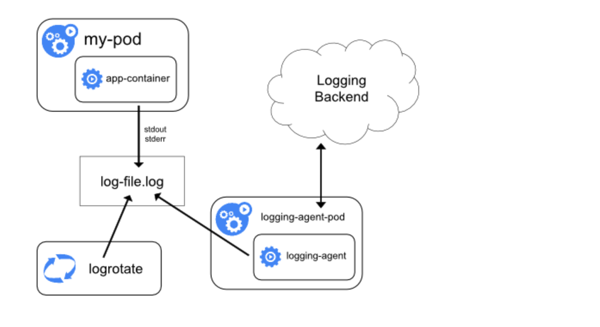{: .zoom}


通过在每个节点上运行一个日志收集的 agent 来采集日志数据，日志采集 agent 是一种专用工具，用于将日志数据推送到统一的后端。

一般来说，这种 agent 用一个容器来运行，可以访问该节点上所有应用程序容器的日志文件所在目录。

由于这种 agent 必须在每个节点上运行，所以直接使用 DaemonSet 控制器运行该应用程序即可。

在节点上运行一个日志收集的 agent 这种方式是最常见的一种方法，因为它只需要在每个节点上运行一个代理程序，并不需要对节点上运行的应用程序进行更改，对应用程序没有任何侵入性，但是这种方法也仅仅适用于收集输出到 stdout 和 stderr 的应用程序日志。


#### 1.2.2 以 sidecar 容器收集日志

我们看上面的图可以看到有一个明显的问题就是我们采集的日志都是通过输出到容器的 stdout 和 stderr 里面的信息，这些信息会在本地的容器对应目录中保留成 JSON 日志文件，所以直接在节点上运行一个 agent 就可以采集到日志。但是如果我们的应用程序的日志是输出到容器中的某个日志文件的话呢？这种日志数据显然只通过上面的方案是采集不到的了。

**用 sidecar 容器重新输出日志**

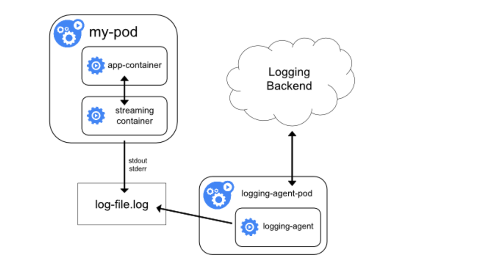{: .zoom}

对于上面这种情况我们可以直接在 Pod 中启动另外一个 sidecar 容器，直接将应用程序的日志通过这个容器重新输出到 stdout，这样是不是通过上面的节点日志收集方案又可以完成了。

由于这个 sidecar 容器的主要逻辑就是将应用程序中的日志进行重定向打印，所以背后的逻辑非常简单，开销很小，而且由于输出到了 stdout 或者 stderr，所以我们也可以使用 kubectl logs 来查看日志了。

下面的示例是在 Pod 中将日志记录在了容器的两个本地文件之中：
```yaml
apiVersion: v1
kind: Pod
metadata:
  name: counter
spec:
  containers:
    - name: count
      image: busybox
      args:
        - /bin/sh
        - -c
        - >
          i=0;
          while true;
          do
            echo "$i: $(date)" >> /var/log/1.log;
            echo "$(date) INFO $i" >> /var/log/2.log;
            i=$((i+1));
            sleep 1;
          done
      volumeMounts:
        - name: varlog
          mountPath: /var/log
  volumes:
    - name: varlog
      emptyDir: {}
```


由于 Pod 中容器的特性，我们可以利用另外一个 sidecar 容器去获取到另外容器中的日志文件，然后将日志重定向到自己的 stdout 流中，可以将上面的 YAML 文件做如下修改：（two-files-counter-pod-streaming-sidecar.yaml）

```yaml
apiVersion: v1
kind: Pod
metadata:
  name: counter
spec:
  containers:
    - name: count
      image: busybox
      args:
        - /bin/sh
        - -c
        - >
          i=0;
          while true;
          do
            echo "$i: $(date)" >> /var/log/1.log;
            echo "$(date) INFO $i" >> /var/log/2.log;
            i=$((i+1));
            sleep 1;
          done
      volumeMounts:
        - name: varlog
          mountPath: /var/log
    - name: count-log-1
      image: busybox
      args: [/bin/sh, -c, "tail -n+1 -f /var/log/1.log"]
      volumeMounts:
        - name: varlog
          mountPath: /var/log
    - name: count-log-2
      image: busybox
      args: [/bin/sh, -c, "tail -n+1 -f /var/log/2.log"]
      volumeMounts:
        - name: varlog
          mountPath: /var/log
  volumes:
    - name: varlog
      emptyDir: {}
```

直接创建上面的 Pod：
```shell
$ kubectl apply -f two-files-counter-pod-streaming-sidecar.yaml
pod "counter" created
```

运行成功后，我们可以通过下面的命令来查看日志的信息：
```shell
$ kubectl logs counter count-log-1
0: Mon Jan  1 00:00:00 UTC 2001
1: Mon Jan  1 00:00:01 UTC 2001
2: Mon Jan  1 00:00:02 UTC 2001
...
$ kubectl logs counter count-log-2
Mon Jan  1 00:00:00 UTC 2001 INFO 0
Mon Jan  1 00:00:01 UTC 2001 INFO 1
Mon Jan  1 00:00:02 UTC 2001 INFO 2
...
```
这样前面节点上的日志采集 agent 就可以自动获取这些日志信息，而不需要其他配置。

这种方法虽然可以解决上面的问题，但是也有一个明显的缺陷，就是日志不仅会在原容器文件中保留下来，还会通过 stdout 输出后占用磁盘空间，这样无形中就增加了一倍磁盘空间。


**使用 sidecar 运行日志采集 agent**

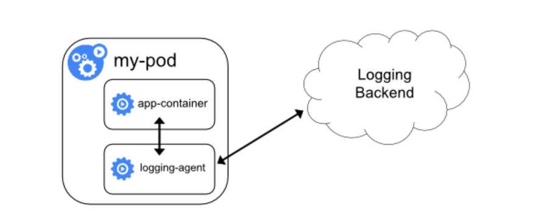{: .zoom}

如果你觉得在节点上运行一个日志采集的代理不够灵活的话，那么你也可以创建一个单独的日志采集代理程序的 sidecar 容器，不过需要单独配置和应用程序一起运行。

不过这样虽然更加灵活，但是在 sidecar 容器中运行日志采集代理程序会导致大量资源消耗，因为你有多少个要采集的 Pod，就需要运行多少个采集代理程序，另外还无法使用 kubectl logs 命令来访问这些日志，因为它们不受 kubelet 控制。

举个例子，你可以使用的 Stackdriver，它使用 fluentd 作为记录剂。以下是两个可用于实现此方法的配置文件。第一个文件包含配置流利的 ConfigMap。

下面是 Kubernetes 官方的一个 fluentd 的配置文件示例，使用 ConfigMap 对象来保存：
```yaml
apiVersion: v1
kind: ConfigMap
metadata:
  name: fluentd-config
data:
  fluentd.conf: |
    <source>
      type tail
      format none
      path /var/log/1.log
      pos_file /var/log/1.log.pos
      tag count.format1
    </source>

    <source>
      type tail
      format none
      path /var/log/2.log
      pos_file /var/log/2.log.pos
      tag count.format2
    </source>

    <match **>
      type google_cloud
    </match>
```

上面的配置文件是配置收集原文件 /var/log/1.log 和 /var/log/2.log 的日志数据，然后通过 google_cloud 这个插件将数据推送到 Stackdriver 后端去。

下面是我们使用上面的配置文件在应用程序中运行一个 fluentd 的容器来读取日志数据：

```yaml

apiVersion: v1
kind: Pod
metadata:
  name: counter
spec:
  containers:
    - name: count
      image: busybox
      args:
        - /bin/sh
        - -c
        - >
          i=0;
          while true;
          do
            echo "$i: $(date)" >> /var/log/1.log;
            echo "$(date) INFO $i" >> /var/log/2.log;
            i=$((i+1));
            sleep 1;
          done
      volumeMounts:
        - name: varlog
          mountPath: /var/log
    - name: count-agent
      image: k8s.gcr.io/fluentd-gcp:1.30
      env:
        - name: FLUENTD_ARGS
          value: -c /etc/fluentd-config/fluentd.conf
      volumeMounts:
        - name: varlog
          mountPath: /var/log
        - name: config-volume
          mountPath: /etc/fluentd-config
  volumes:
    - name: varlog
      emptyDir: {}
    - name: config-volume
      configMap:
        name: fluentd-config
```

上面的 Pod 创建完成后，容器 count-agent 就会将 count 容器中的日志进行收集然后上传。

当然，这只是一个简单的示例，我们也完全可以使用其他的任何日志采集工具来替换 fluentd，比如 logstash、fluent-bit 等等。

#### 1.2.3 直接从应用程序收集日志


除了上面的几种方案之外，我们也完全可以通过直接在应用程序中去显示的将日志推送到日志后端，但是这种方式需要代码层面的实现，也超出了 Kubernetes 本身的范围。

{: .zoom}


## 2. 搭建 EFK 日志系统
前面大家介绍了 Kubernetes 集群中的几种日志收集方案，Kubernetes 中比较流行的日志收集解决方案是 Elasticsearch、Fluentd 和 Kibana（EFK）技术栈，也是官方现在比较推荐的一种方案。

Elasticsearch 是一个实时的、分布式的可扩展的搜索引擎，允许进行全文、结构化搜索，它通常用于索引和搜索大量日志数据，也可用于搜索许多不同类型的文档。

Elasticsearch 通常与 Kibana 一起部署，Kibana 是 Elasticsearch 的一个功能强大的数据可视化 Dashboard，Kibana 允许你通过 web 界面来浏览 Elasticsearch 日志数据。

Fluentd是一个流行的开源数据收集器，我们将在 Kubernetes 集群节点上安装 Fluentd，通过获取容器日志文件、过滤和转换日志数据，然后将数据传递到 Elasticsearch 集群，在该集群中对其进行索引和存储。

我们先来配置启动一个可扩展的 Elasticsearch 集群，然后在 Kubernetes 集群中创建一个 Kibana 应用，最后通过 DaemonSet 来运行 Fluentd，以便它在每个 Kubernetes 工作节点上都可以运行一个 Pod。

### 2.1 安装 Elasticsearch 集群

在创建 Elasticsearch 集群之前，我们先创建一个命名空间，我们将在其中安装所有日志相关的资源对象。

```shell
$ kubectl create ns logging
```

#### 2.1.1 环境准备

ElasticSearch 安装有最低安装要求，如果安装后 Pod 无法正常启动，请检查是否符合最低要求的配置，要求如下：

| 节点名称      | 节点类型 | CPU 配置 | Memory 配置 |
| ------------- | :------: | :------: | :---------: |
| k8s-master    |  master  |    4C    |     4Gi     |
| k8s-node-2-12 |  worker  |    8C    |     8Gi     |
| k8s-node-2-13 |  worker  |    8C    |     8Gi     |
| k8s-node-2-14 |  worker  |    8C    |     8Gi     |


es集群要求

| ElasticSearch节点    | CPU最小要求 | Memory 最小要求 |
| -------------------- | :---------: | :-------------: |
| elasticsearch-master |    >2核     |      >2Gi       |
| elasticsearch-data   |    >1核     |      >2Gi       |
| elasticsearch-client |    >1核     |      >2Gi       |

这里我们要安装的 ES 集群环境信息如下所示：


| 集群名称    | 节点类型 | 副本数目 |存储大小|网络模式|描述|
| -------------------- | :---------: | :-------------: |:-------------: |:-------------: |-----------------------------|
| elasticsearch |    Master     |      3       | 5Gi  |  ClusterIP       |   主节点        |
| elasticsearch |    Data       |      3       | 50Gi |  ClusterIP       |   数据节点        |
| elasticsearch |    Client     |      2       | 无 |    NodePort         |  处理用户请求、转发  |

这里我们使用一个 NFS 类型的 StorageClass 来做持久化存储，当然如果你是线上环境建议使用 Local PV 或者 Ceph RBD 之类的存储来持久化 Elasticsearch 的数据。


安装nfs-storageClass存储
```shell
$ helm repo add azure http://mirror.azure.cn/kubernetes/charts/
$ helm repo update

# 或者下载到本地再安装
$ helm pull azure/nfs-client-provisioner
$ tar xvf nfs-client-provisioner-*.tgz

$ kubectl create ns nfs

$ helm install efk-nfs-storage -n nfs \
--set nfs.server=192.168.1.46 \
--set nfs.path=/efk  \
--set storageClass.name=efk-nfs,storageClass.reclaimPolicy=Retain \
--set storageClass.defaultClass=true \
nfs-client-provisioner

```

此外由于 ElasticSearch 7.x 版本默认安装了 X-Pack 插件，并且部分功能免费，需要我们配置一些安全证书文件。

**1、生成证书文件**

```shell
# 运行容器生成证书
$ docker run --name elastic-certs -i -w /app elasticsearch:7.12.0 /bin/sh -c  \
  "elasticsearch-certutil ca --out /app/elastic-stack-ca.p12 --pass '' && \
    elasticsearch-certutil cert --name security-master --dns \
    security-master --ca /app/elastic-stack-ca.p12 --pass '' --ca-pass '' --out /app/elastic-certificates.p12"

# 从容器中将生成的证书拷贝出来
$ docker cp elastic-certs:/app/elastic-certificates.p12 .

# 删除容器
$ docker rm -f elastic-certs

# 将 pcks12 中的信息分离出来，写入文件
$ openssl pkcs12 -nodes -passin pass:'' -in elastic-certificates.p12 -out elastic-certificate.pem
```

**2、添加证书到 Kubernetes**

```shell

# 添加证书
$ kubectl create secret -n logging generic elastic-certs --from-file=elastic-certificates.p12

# 设置集群用户名密码
$ kubectl create secret -n logging generic elastic-auth --from-literal=username=elastic --from-literal=password=oschina
```

#### 2.1.2 安装 ES 集群

首先添加 ELastic 的 Helm 仓库：
```shell
$ helm repo add elastic https://helm.elastic.co
$ helm repo update
```
ElaticSearch 安装需要安装三次，分别安装 Master、Data、Client 节点，Master 节点负责集群间的管理工作；Data 节点负责存储数据；Client 节点负责代理 ElasticSearch Cluster 集群，负载均衡。

首先使用 helm pull 拉取 Chart 并解压：
```shell
$ helm pull elastic/elasticsearch --untar --version 7.17.3
$ cd elasticsearch
```

在 Chart 目录下面创建用于 Master 节点安装配置的 values 文件：

`values-master.yaml`

```yaml
# values-master.yaml
## 设置集群名称
clusterName: "elasticsearch"
## 设置节点名称
nodeGroup: "master"

## 设置角色
roles:
  master: "true"
  ingest: "false"
  data: "false"

# ============镜像配置============
## 指定镜像与镜像版本
image: "elasticsearch"
imageTag: "7.17.3"
imagePullPolicy: "IfNotPresent"

## 副本数
replicas: 3

# ============资源配置============
## JVM 配置参数
esJavaOpts: "-Xmx1g -Xms1g"
## 部署资源配置(生成环境要设置大些)
resources:
  requests:
    cpu: "2000m"
    memory: "2Gi"
  limits:
    cpu: "2000m"
    memory: "2Gi"
## 数据持久卷配置
persistence:
  enabled: true
## 存储数据大小配置
volumeClaimTemplate:
  storageClassName: efk-nfs
  accessModes: ["ReadWriteOnce"]
  resources:
    requests:
      storage: 50Gi

# ============安全配置============
## 设置协议，可配置为 http、https
protocol: http
## 证书挂载配置，这里我们挂入上面创建的证书
secretMounts:
  - name: elastic-certs
    secretName: elastic-certs
    path: /usr/share/elasticsearch/config/certs
    defaultMode: 0755

## 允许您在/usr/share/elasticsearch/config/中添加任何自定义配置文件,例如 elasticsearch.yml、log4j2.properties
## ElasticSearch 7.x 默认安装了 x-pack 插件，部分功能免费，这里我们配置下
## 下面注掉的部分为配置 https 证书，配置此部分还需要配置 helm 参数 protocol 值改为 https
esConfig:
  elasticsearch.yml: |
    xpack.security.enabled: true
    xpack.security.transport.ssl.enabled: true
    xpack.security.transport.ssl.verification_mode: certificate
    xpack.security.transport.ssl.keystore.path: /usr/share/elasticsearch/config/certs/elastic-certificates.p12
    xpack.security.transport.ssl.truststore.path: /usr/share/elasticsearch/config/certs/elastic-certificates.p12
    # xpack.security.http.ssl.enabled: true
    # xpack.security.http.ssl.truststore.path: /usr/share/elasticsearch/config/certs/elastic-certificates.p12
    # xpack.security.http.ssl.keystore.path: /usr/share/elasticsearch/config/certs/elastic-certificates.p12
## 环境变量配置，这里引入上面设置的用户名、密码 secret 文件
extraEnvs:
  - name: ELASTIC_USERNAME
    valueFrom:
      secretKeyRef:
        name: elastic-auth
        key: username
  - name: ELASTIC_PASSWORD
    valueFrom:
      secretKeyRef:
        name: elastic-auth
        key: password

# ============调度配置============
## 设置调度策略
## - hard：只有当有足够的节点时 Pod 才会被调度，并且它们永远不会出现在同一个节点上
## - soft：尽最大努力调度
antiAffinity: "soft"
# tolerations:
#   - operator: "Exists" ##容忍全部污点
```

然后创建用于 Data 节点安装的 values 文件：

```yaml
# values-data.yaml
# ============设置集群名称============
## 设置集群名称
clusterName: "elasticsearch"
## 设置节点名称
nodeGroup: "data"
## 设置角色
roles:
  master: "false"
  ingest: "true"
  data: "true"

# ============镜像配置============
## 指定镜像与镜像版本
image: "elasticsearch"
imageTag: "7.17.3"
## 副本数(建议设置为3，我这里资源不足只用了1个副本)
replicas: 3

# ============资源配置============
## JVM 配置参数
esJavaOpts: "-Xmx1g -Xms1g"
## 部署资源配置(生成环境一定要设置大些)
resources:
  requests:
    cpu: "1000m"
    memory: "2Gi"
  limits:
    cpu: "1000m"
    memory: "2Gi"
## 数据持久卷配置
persistence:
  enabled: true
## 存储数据大小配置
volumeClaimTemplate:
  storageClassName: efk-nfs
  accessModes: ["ReadWriteOnce"]
  resources:
    requests:
      storage: 200Gi

# ============安全配置============
## 设置协议，可配置为 http、https
protocol: http
## 证书挂载配置，这里我们挂入上面创建的证书
secretMounts:
  - name: elastic-certs
    secretName: elastic-certs
    path: /usr/share/elasticsearch/config/certs
## 允许您在/usr/share/elasticsearch/config/中添加任何自定义配置文件,例如 elasticsearch.yml
## ElasticSearch 7.x 默认安装了 x-pack 插件，部分功能免费，这里我们配置下
## 下面注掉的部分为配置 https 证书，配置此部分还需要配置 helm 参数 protocol 值改为 https
esConfig:
  elasticsearch.yml: |
    xpack.security.enabled: true
    xpack.security.transport.ssl.enabled: true
    xpack.security.transport.ssl.verification_mode: certificate
    xpack.security.transport.ssl.keystore.path: /usr/share/elasticsearch/config/certs/elastic-certificates.p12
    xpack.security.transport.ssl.truststore.path: /usr/share/elasticsearch/config/certs/elastic-certificates.p12
    # xpack.security.http.ssl.enabled: true
    # xpack.security.http.ssl.truststore.path: /usr/share/elasticsearch/config/certs/elastic-certificates.p12
    # xpack.security.http.ssl.keystore.path: /usr/share/elasticsearch/config/certs/elastic-certificates.p12
## 环境变量配置，这里引入上面设置的用户名、密码 secret 文件
extraEnvs:
  - name: ELASTIC_USERNAME
    valueFrom:
      secretKeyRef:
        name: elastic-auth
        key: username
  - name: ELASTIC_PASSWORD
    valueFrom:
      secretKeyRef:
        name: elastic-auth
        key: password

# ============调度配置============
## 设置调度策略
## - hard：只有当有足够的节点时 Pod 才会被调度，并且它们永远不会出现在同一个节点上
## - soft：尽最大努力调度
antiAffinity: "soft"
## 容忍配置
# tolerations:
#   - operator: "Exists" ##容忍全部污点
```

最后一个是用于创建 Client 节点的 values 文件：

`values-client.yaml`

```yaml
# values-client.yaml
# ============设置集群名称============
## 设置集群名称
clusterName: "elasticsearch"
## 设置节点名称
nodeGroup: "client"
## 设置角色
roles:
  master: "false"
  ingest: "false"
  data: "false"

# ============镜像配置============
## 指定镜像与镜像版本
image: "elasticsearch"
imageTag: "7.17.3"
## 副本数
replicas: 1

# ============资源配置============
## JVM 配置参数
esJavaOpts: "-Xmx1g -Xms1g"
## 部署资源配置(生成环境一定要设置大些)
resources:
  requests:
    cpu: "1000m"
    memory: "2Gi"
  limits:
    cpu: "1000m"
    memory: "2Gi"
## 数据持久卷配置
persistence:
  enabled: false

# ============安全配置============
## 设置协议，可配置为 http、https
protocol: http
## 证书挂载配置，这里我们挂入上面创建的证书
secretMounts:
  - name: elastic-certs
    secretName: elastic-certs
    path: /usr/share/elasticsearch/config/certs
## 允许您在/usr/share/elasticsearch/config/中添加任何自定义配置文件,例如 elasticsearch.yml
## ElasticSearch 7.x 默认安装了 x-pack 插件，部分功能免费，这里我们配置下
## 下面注掉的部分为配置 https 证书，配置此部分还需要配置 helm 参数 protocol 值改为 https
esConfig:
  elasticsearch.yml: |
    xpack.security.enabled: true
    xpack.security.transport.ssl.enabled: true
    xpack.security.transport.ssl.verification_mode: certificate
    xpack.security.transport.ssl.keystore.path: /usr/share/elasticsearch/config/certs/elastic-certificates.p12
    xpack.security.transport.ssl.truststore.path: /usr/share/elasticsearch/config/certs/elastic-certificates.p12
    # xpack.security.http.ssl.enabled: true
    # xpack.security.http.ssl.truststore.path: /usr/share/elasticsearch/config/certs/elastic-certificates.p12
    # xpack.security.http.ssl.keystore.path: /usr/share/elasticsearch/config/certs/elastic-certificates.p12
## 环境变量配置，这里引入上面设置的用户名、密码 secret 文件
extraEnvs:
  - name: ELASTIC_USERNAME
    valueFrom:
      secretKeyRef:
        name: elastic-auth
        key: username
  - name: ELASTIC_PASSWORD
    valueFrom:
      secretKeyRef:
        name: elastic-auth
        key: password

# ============Service 配置============
service:
  type: NodePort
  nodePort: "30200"
```

现在用上面的 values 文件来安装：

```shell
# 安装 master 节点
$ helm upgrade --install es-master -f values-master.yaml --namespace logging .
# 安装 data 节点
$ helm upgrade --install es-data -f values-data.yaml --namespace logging .
# 安装 client 节点
$ helm upgrade --install es-client -f values-client.yaml --namespace logging .
```

> 在安装 Master 节点后 Pod 启动时候会抛出异常，就绪探针探活失败，这是个正常现象。在执行安装 Data 节点后 Master 节点 Pod 就会恢复正常。


#### 2.1.3 安装 Kibana

Elasticsearch 集群安装完成后接下来配置安装 Kibana

使用 helm pull 命令拉取 Kibana Chart 包并解压：

```shell
$ helm pull elastic/kibana --untar --version 7.17.3
$ cd kibana
```

创建用于安装 Kibana 的 values 文件：
`values-prod.yaml`

```yaml
# values-prod.yaml
## 指定镜像与镜像版本
image: "kibana"
imageTag: "7.17.3"

## 配置 ElasticSearch 地址
elasticsearchHosts: "http://elasticsearch-client:9200"

# ============环境变量配置============
## 环境变量配置，这里引入上面设置的用户名、密码 secret 文件
extraEnvs:
  - name: "ELASTICSEARCH_USERNAME"
    valueFrom:
      secretKeyRef:
        name: elastic-auth
        key: username
  - name: "ELASTICSEARCH_PASSWORD"
    valueFrom:
      secretKeyRef:
        name: elastic-auth
        key: password

# ============资源配置============
resources:
  requests:
    cpu: "500m"
    memory: "1Gi"
  limits:
    cpu: "500m"
    memory: "1Gi"

# ============配置 Kibana 参数============
## kibana 配置中添加语言配置，设置 kibana 为中文
kibanaConfig:
  kibana.yml: |
    i18n.locale: "zh-CN"

# ============Service 配置============
service:
  type: NodePort
  nodePort: "30601"
```

使用上面的配置直接安装即可：

```shell
$ helm install kibana -f values-prod.yaml --namespace logging .
```

下面是安装完成后的 ES 集群和 Kibana 资源：

```shell
$ kubectl get pods -n logging
NAME                            READY   STATUS    RESTARTS   AGE
elasticsearch-client-0          1/1     Running   0          12m
elasticsearch-data-0            1/1     Running   0          12m
elasticsearch-data-1            1/1     Running   0          12m
elasticsearch-data-2            1/1     Running   0          12m
elasticsearch-master-0          1/1     Running   0          13m
elasticsearch-master-1          1/1     Running   0          13m
elasticsearch-master-2          1/1     Running   0          13m
kibana-kibana-f76c9758d-9ndrn   1/1     Running   0          5m34s


$ kubectl get svc -n logging
NAME                            TYPE        CLUSTER-IP       EXTERNAL-IP   PORT(S)                         AGE
elasticsearch-client            NodePort    172.16.131.20    <none>        9200:30200/TCP,9300:31868/TCP   10m
elasticsearch-client-headless   ClusterIP   None             <none>        9200/TCP,9300/TCP               10m
elasticsearch-data              ClusterIP   172.16.180.25    <none>        9200/TCP,9300/TCP               10m
elasticsearch-data-headless     ClusterIP   None             <none>        9200/TCP,9300/TCP               10m
elasticsearch-master            ClusterIP   172.16.182.14    <none>        9200/TCP,9300/TCP               10m
elasticsearch-master-headless   ClusterIP   None             <none>        9200/TCP,9300/TCP               10m
kibana-kibana                   NodePort    172.16.244.211   <none>        5601:30601/TCP                  2m4s

```

上面我们安装 Kibana 的时候指定了 30601 的 NodePort 端口，所以我们可以从任意节点 http://IP:30601 来访问 Kibana。

{: .zoom}
我们可以看到会跳转到登录页面，让我们输出用户名、密码，这里我们输入上面配置的用户名 elastic、密码 oschina进行登录。

登录成功后点击自己浏览，进入如下所示的 Kibana 主页：
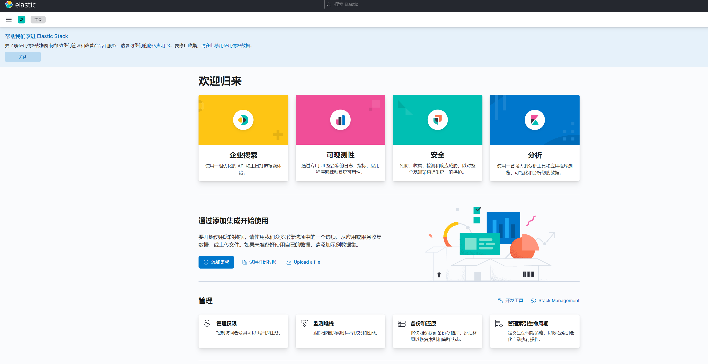{: .zoom}


### 2.2 部署 Fluentd
Fluentd 是一个高效的日志聚合器，是用 Ruby 编写的，并且可以很好地扩展。
对于大部分企业来说，Fluentd 足够高效并且消耗的资源相对较少，另外一个工具 Fluent-bit 更轻量级，占用资源更少，
但是插件相对 Fluentd 来说不够丰富，所以整体来说，Fluentd 更加成熟，使用更加广泛，所以这里我们使用 Fluentd 来作为日志收集工具。


#### 2.2.1 工作原理

Fluentd 通过一组给定的数据源抓取日志数据，处理后（转换成结构化的数据格式）将它们转发给其他服务，比如 Elasticsearch、对象存储等等。Fluentd 支持超过 300 个日志存储和分析服务，所以在这方面是非常灵活的。主要运行步骤如下：

- 首先 Fluentd 从多个日志源获取数据 
- 结构化并且标记这些数据 
- 然后根据匹配的标签将数据发送到多个目标服务去

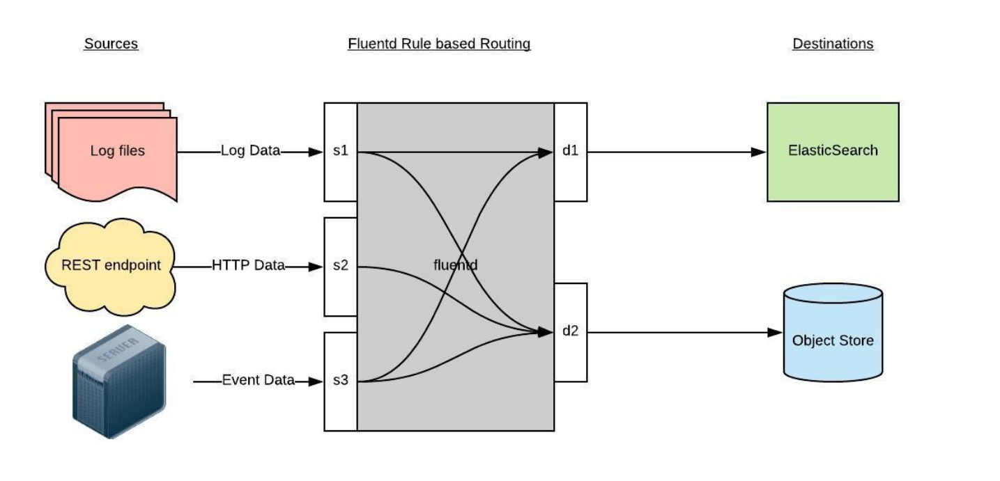{: .zoom}

#### 2.2.2 配置
一般来说我们是通过一个配置文件来告诉 Fluentd 如何采集、处理数据的，下面简单和大家介绍下 Fluentd 的配置方法。


**日志源配置**
比如我们这里为了收集 Kubernetes 节点上的所有容器日志，就需要做如下的日志源配置：
```yaml
<source>
  @id fluentd-containers.log
  @type tail                             # Fluentd 内置的输入方式，其原理是不停地从源文件中获取新的日志。
  path /var/log/containers/*.log         # 挂载的宿主机容器日志地址
  pos_file /var/log/es-containers.log.pos
  tag raw.kubernetes.*                   # 设置日志标签
  read_from_head true
  <parse>                                # 多行格式化成JSON
    @type multi_format                   # 使用 multi-format-parser 解析器插件
    <pattern>
      format json                        # JSON 解析器
      time_key time                      # 指定事件时间的时间字段
      time_format %Y-%m-%dT%H:%M:%S.%NZ  # 时间格式
    </pattern>
    <pattern>
      format /^(?<time>.+) (?<stream>stdout|stderr) [^ ]* (?<log>.*)$/
      time_format %Y-%m-%dT%H:%M:%S.%N%:z
    </pattern>
  </parse>
</source>
```

上面配置部分参数说明如下：

- id：表示引用该日志源的唯一标识符，该标识可用于进一步过滤和路由结构化日志数据 
- type：Fluentd 内置的指令，tail 表示 Fluentd 从上次读取的位置通过 tail 不断获取数据，另外一个是 http 表示通过一个 GET 请求来收集数据。 
- path：tail 类型下的特定参数，告诉 Fluentd 采集 /var/log/containers 目录下的所有日志，这是 docker 在 Kubernetes 节点上用来存储运行容器 stdout 输出日志数据的目录。 
- pos_file：检查点，如果 Fluentd 程序重新启动了，它将使用此文件中的位置来恢复日志数据收集。 
- tag：用来将日志源与目标或者过滤器匹配的自定义字符串，Fluentd 匹配源/目标标签来路由日志数据。


**路由配置**

上面是日志源的配置，接下来看看如何将日志数据发送到 Elasticsearch：

```yaml
<match **>
  @id elasticsearch
  @type elasticsearch
  @log_level info
  include_tag_key true
  type_name fluentd
  host "#{ENV['OUTPUT_HOST']}"
  port "#{ENV['OUTPUT_PORT']}"
  logstash_format true
  <buffer>
    @type file
    path /var/log/fluentd-buffers/kubernetes.system.buffer
    flush_mode interval
    retry_type exponential_backoff
    flush_thread_count 2
    flush_interval 5s
    retry_forever
    retry_max_interval 30
    chunk_limit_size "#{ENV['OUTPUT_BUFFER_CHUNK_LIMIT']}"
    queue_limit_length "#{ENV['OUTPUT_BUFFER_QUEUE_LIMIT']}"
    overflow_action block
  </buffer>
</match>
```


- match：标识一个目标标签，后面是一个匹配日志源的正则表达式，我们这里想要捕获所有的日志并将它们发送给 Elasticsearch，所以需要配置成**。 
- id：目标的一个唯一标识符。 
- type：支持的输出插件标识符，我们这里要输出到 Elasticsearch，所以配置成 elasticsearch，这是 Fluentd 的一个内置插件。 
- log_level：指定要捕获的日志级别，我们这里配置成 info，表示任何该级别或者该级别以上（INFO、WARNING、ERROR）的日志都将被路由到 Elsasticsearch。 
- host/port：定义 Elasticsearch 的地址，也可以配置认证信息，我们的 Elasticsearch 不需要认证，所以这里直接指定 host 和 port 即可。 
- logstash_format：Elasticsearch 服务对日志数据构建反向索引进行搜索，将 logstash_format 设置为 true，Fluentd 将会以 logstash 格式来转发结构化的日志数据。 
- Buffer： Fluentd 允许在目标不可用时进行缓存，比如，如果网络出现故障或者 Elasticsearch 不可用的时候。缓冲区配置也有助于降低磁盘的 IO。


**过滤**
由于 Kubernetes 集群中应用太多，也还有很多历史数据，所以我们可以只将某些应用的日志进行收集，比如我们只采集具有 logging=true 这个 Label 标签的 Pod 日志，这个时候就需要使用 filter，如下所示：

```yaml
# 删除无用的属性
<filter kubernetes.**>
  @type record_transformer
  remove_keys $.docker.container_id,$.kubernetes.container_image_id,$.kubernetes.pod_id,$.kubernetes.namespace_id,$.kubernetes.master_url,$.kubernetes.labels.pod-template-hash
</filter>
# 只保留具有logging=true标签的Pod日志
<filter kubernetes.**>
  @id filter_log
  @type grep
  <regexp>
    key $.kubernetes.labels.logging
    pattern ^true$
  </regexp>
</filter>
```

#### 2.2.3 安装

要收集 Kubernetes 集群的日志，直接用 DasemonSet 控制器来部署 Fluentd 应用，这样，它就可以从 Kubernetes 节点上采集日志，确保在集群中的每个节点上始终运行一个 Fluentd 容器。
当然可以直接使用 Helm 来进行一键安装，为了能够了解更多实现细节，我们这里还是采用手动方法来进行安装。

> 可以直接使用官方的对于 Kubernetes 集群的安装文档: https://docs.fluentd.org/container-deployment/kubernetes。

首先，我们通过 ConfigMap 对象来指定 Fluentd 配置文件，新建 fluentd-configmap.yaml 文件，文件内容如下：
` fluentd-configmap.yaml`

```yaml
kind: ConfigMap
apiVersion: v1
metadata:
  name: fluentd-conf
  namespace: logging
data:
  # 容器日志
  containers.input.conf: |-
    <source>
      @id fluentd-containers.log
      @type tail
      path /var/log/containers/*.log
      pos_file /var/log/es-containers.log.pos
      tag raw.kubernetes.*
      read_from_head true
      <parse>
        @type multi_format
        <pattern>
          format json
          time_key time
          time_format %Y-%m-%dT%H:%M:%S.%NZ
        </pattern>
        <pattern>
          format /^(?<time>.+) (?<stream>stdout|stderr) [^ ]* (?<log>.*)$/
          time_format %Y-%m-%dT%H:%M:%S.%N%:z
        </pattern>
      </parse>
    </source>

    # 在日志输出中检测异常(多行日志)，并将其作为一条日志转发
    # https://github.com/GoogleCloudPlatform/fluent-plugin-detect-exceptions
    <match raw.kubernetes.**>
      @id raw.kubernetes
      @type detect_exceptions
      remove_tag_prefix raw
      message log
      multiline_flush_interval 5
    </match>

    <filter **>
      @id filter_concat
      @type concat
      key message
      multiline_end_regexp /\n$/
      separator ""
    </filter>

    # 添加 Kubernetes metadata 数据
    <filter kubernetes.**>
      @id filter_kubernetes_metadata
      @type kubernetes_metadata
    </filter>

    # 修复 ES 中的 JSON 字段
    # 插件地址：https://github.com/repeatedly/fluent-plugin-multi-format-parser
    <filter kubernetes.**>
      @id filter_parser
      @type parser
      key_name log
      reserve_data true
      remove_key_name_field true
      <parse>
        @type multi_format
        <pattern>
          format json
        </pattern>
        <pattern>
          format none
        </pattern>
      </parse>
    </filter>

    # 删除一些多余的属性
    <filter kubernetes.**>
      @type record_transformer
      remove_keys $.docker.container_id,$.kubernetes.container_image_id,$.kubernetes.pod_id,$.kubernetes.namespace_id,$.kubernetes.master_url,$.kubernetes.labels.pod-template-hash
    </filter>

##   我注释掉这里的用意就是所有pod的日志都进行采集
#    ##只保留具有logging=true标签的Pod日志
#    <filter kubernetes.**>
#      @id filter_log
#      @type grep
#      <regexp>
#        key $.kubernetes.labels.logging
#        pattern ^true$
#      </regexp>
#    </filter>

  ###### 监听配置，一般用于日志聚合用 ######
  forward.input.conf: |-
    # 监听通过TCP发送的消息
    <source>
      @id forward
      @type forward
    </source>

  output.conf: |-
    <match **>
      @id elasticsearch
      @type elasticsearch
      @log_level info
      include_tag_key true
      host elasticsearch-client
      port 9200
      user elastic
      password oschina
      logstash_format true
      logstash_prefix k8s
      request_timeout 30s
      <buffer>
        @type file
        path /var/log/fluentd-buffers/kubernetes.system.buffer
        flush_mode interval
        retry_type exponential_backoff
        flush_thread_count 2
        flush_interval 5s
        retry_forever
        retry_max_interval 30
        chunk_limit_size 2M
        queue_limit_length 8
        overflow_action block
      </buffer>
    </match>
```

上面配置文件中我们只配置了 docker 容器日志目录，收集到数据经过处理后发送到 elasticsearch-client:9200 服务。

然后新建一个 `fluentd-daemonset.yaml` 的文件，文件内容如下：

```yaml
apiVersion: v1
kind: ServiceAccount
metadata:
  name: fluentd-es
  namespace: logging
  labels:
    k8s-app: fluentd-es
    kubernetes.io/cluster-service: "true"
    addonmanager.kubernetes.io/mode: Reconcile
---
kind: ClusterRole
apiVersion: rbac.authorization.k8s.io/v1
metadata:
  name: fluentd-es
  labels:
    k8s-app: fluentd-es
    kubernetes.io/cluster-service: "true"
    addonmanager.kubernetes.io/mode: Reconcile
rules:
  - apiGroups:
      - ""
    resources:
      - "namespaces"
      - "pods"
    verbs:
      - "get"
      - "watch"
      - "list"
---
kind: ClusterRoleBinding
apiVersion: rbac.authorization.k8s.io/v1
metadata:
  name: fluentd-es
  labels:
    k8s-app: fluentd-es
    kubernetes.io/cluster-service: "true"
    addonmanager.kubernetes.io/mode: Reconcile
subjects:
  - kind: ServiceAccount
    name: fluentd-es
    namespace: logging
    apiGroup: ""
roleRef:
  kind: ClusterRole
  name: fluentd-es
  apiGroup: ""
---
apiVersion: apps/v1
kind: DaemonSet
metadata:
  name: fluentd
  namespace: logging
  labels:
    app: fluentd
    kubernetes.io/cluster-service: "true"
spec:
  selector:
    matchLabels:
      app: fluentd
  template:
    metadata:
      labels:
        app: fluentd
        kubernetes.io/cluster-service: "true"
    spec:
      tolerations:
        - key: node-role.kubernetes.io/master
          effect: NoSchedule
      serviceAccountName: fluentd-es
      containers:
        - name: fluentd
          image: quay.io/fluentd_elasticsearch/fluentd:v3.4.0
          volumeMounts:
            - name: fluentconfig
              mountPath: /etc/fluent/config.d
            - name: varlog
              mountPath: /var/log
      nodeSelector:
        beta.kubernetes.io/fluentd-ds-ready: "true"
      terminationGracePeriodSeconds: 30
      volumes:
        - name: fluentconfig
          configMap:
            name: fluentd-conf
        - name: varlog
          hostPath:
            path: /var/log
```

我们将上面创建的 fluentd-config 这个 ConfigMap 对象通过 volumes 挂载到了 Fluentd 容器中，另外为了能够灵活控制哪些节点的日志可以被收集，还可以添加了一个 nodSelector 属性：

```yaml
nodeSelector:
  beta.kubernetes.io/fluentd-ds-ready: "true"
```
意思就是要想采集节点的日志，那么我们就需要给节点打上上面的标签。


!!! info "提示" 

    如果你需要在其他节点上采集日志，则需要给对应节点打上标签，使用如下命令：kubectl label nodes node名 beta.kubernetes.io/fluentd-ds-ready=true。


```shell

$ kubectl label nodes giteego-k8s-n1 beta.kubernetes.io/fluentd-ds-ready=true
$ kubectl label nodes giteego-k8s-n2 beta.kubernetes.io/fluentd-ds-ready=true
$ kubectl label nodes giteego-k8s-n3 beta.kubernetes.io/fluentd-ds-ready=true
$ kubectl label nodes giteego-k8s-n4 beta.kubernetes.io/fluentd-ds-ready=true
```

另外由于我们的集群使用的是 kubeadm 搭建的，默认情况下 master 节点有污点，所以如果要想也收集 master 节点的日志，则需要添加上容忍：

```yaml
tolerations:
  - operator: Exists
```


!!! Warning "注意"

    另外需要注意的地方是，如果更改了 docker 的根目录，则在 volumes 和 volumeMount 里面都需要更改，保持一致


!!! info "举例"

    ```yaml
      containers:
        - name: fluentd
          image: quay.io/fluentd_elasticsearch/fluentd:v3.4.0
          volumeMounts:
            - name: fluentconfig
              mountPath: /etc/fluent/config.d
            - name: varlog
              mountPath: /var/log
            - name: varlibdockercontainers
              mountPath: /home/cce/docker/containers
              readOnly: true
      nodeSelector:
        beta.kubernetes.io/fluentd-ds-ready: "true"
      terminationGracePeriodSeconds: 30
      volumes:
        - name: fluentconfig
          configMap:
            name: fluentd-conf
        - name: varlog
          hostPath:
            path: /var/log
        - name: varlibdockercontainers
          hostPath:
            path: /home/cce/docker/containers
    ```


分别创建上面的 ConfigMap 对象和 DaemonSet：

```shell
$ kubectl create -f fluentd-configmap.yaml
configmap "fluentd-conf" created
$ kubectl create -f fluentd-daemonset.yaml
serviceaccount "fluentd-es" created
clusterrole.rbac.authorization.k8s.io "fluentd-es" created
clusterrolebinding.rbac.authorization.k8s.io "fluentd-es" created
daemonset.apps "fluentd" created
```

创建完成后，查看对应的 Pods 列表，检查是否部署成功：
```shell
$ kubectl get pod -n logging
NAME                            READY   STATUS    RESTARTS   AGE
elasticsearch-client-0          1/1     Running   0          38m
elasticsearch-data-0            1/1     Running   0          38m
elasticsearch-data-1            1/1     Running   0          38m
elasticsearch-data-2            1/1     Running   0          38m
elasticsearch-master-0          1/1     Running   0          39m
elasticsearch-master-1          1/1     Running   0          39m
elasticsearch-master-2          1/1     Running   0          39m
fluentd-hmg9k                   1/1     Running   0          56s
fluentd-hpmmh                   1/1     Running   0          56s
fluentd-j6nws                   1/1     Running   0          56s
fluentd-v969z                   1/1     Running   0          56s
kibana-kibana-f76c9758d-9ndrn   1/1     Running   0          31m
```
Fluentd 启动成功后，这个时候就可以发送日志到 ES 了，但是我们这里是过滤了只采集具有 logging=true 标签的 Pod 日志，所以现在还没有任何数据会被采集。


下面我们部署一个简单的测试应用， 新建 `counter.yaml` 文件，文件内容如下：
```yaml
apiVersion: v1
kind: Pod
metadata:
  name: counter
  labels:
    logging: "true"
spec:
  containers:
    - name: count
      image: busybox
      args:
        [
          /bin/sh,
          -c,
          'i=0; while true; do echo "$i: $(date)"; i=$((i+1)); sleep 1; done',
        ]
```

该 Pod 只是简单将日志信息打印到 stdout，所以正常来说 Fluentd 会收集到这个日志数据，在 Kibana 中也就可以找到对应的日志数据了，使用 kubectl 工具创建该 Pod：

```shell

$ kubectl create -f counter.yaml
$ kubectl get pods
NAME                             READY   STATUS    RESTARTS   AGE
counter                          1/1     Running   0          9h
```

Pod 创建并运行后，回到 Kibana Dashboard 页面，点击左侧最下面的 Management -> Stack Management，进入管理页面，点击左侧 Kibana 下面的 索引模式，点击 创建索引模式 开始导入索引数据：
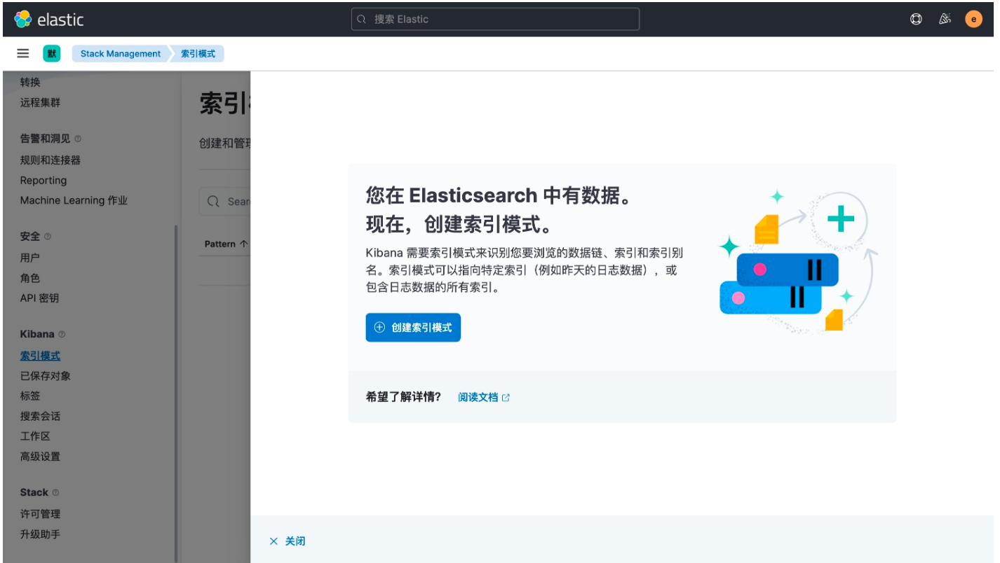{: .zoom}


在这里可以配置我们需要的 Elasticsearch 索引，前面 Fluentd 配置文件中我们采集的日志使用的是 logstash 格式，定义了一个 k8s 的前缀，
所以这里只需要在文本框中输入 `k8s-*` 即可匹配到 Elasticsearch 集群中采集的 Kubernetes 集群日志数据，然后点击下一步，进入以下页面：
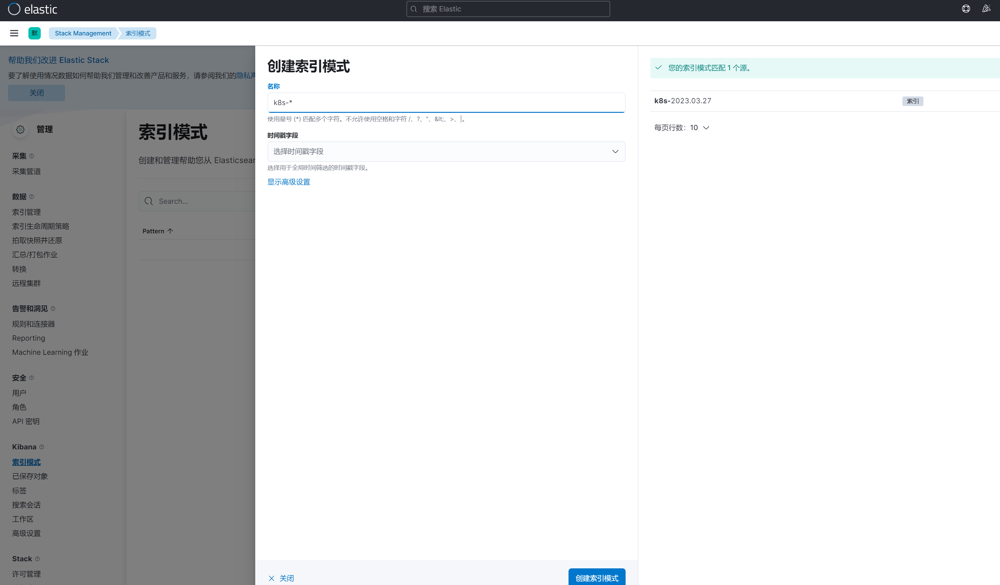{: .zoom}


在该页面中配置使用哪个字段按时间过滤日志数据，在下拉列表中，选择@timestamp字段，然后点击 创建索引模式，创建完成后，
点击左侧导航菜单中的 Discover，然后就可以看到一些直方图和最近采集到的日志数据了：

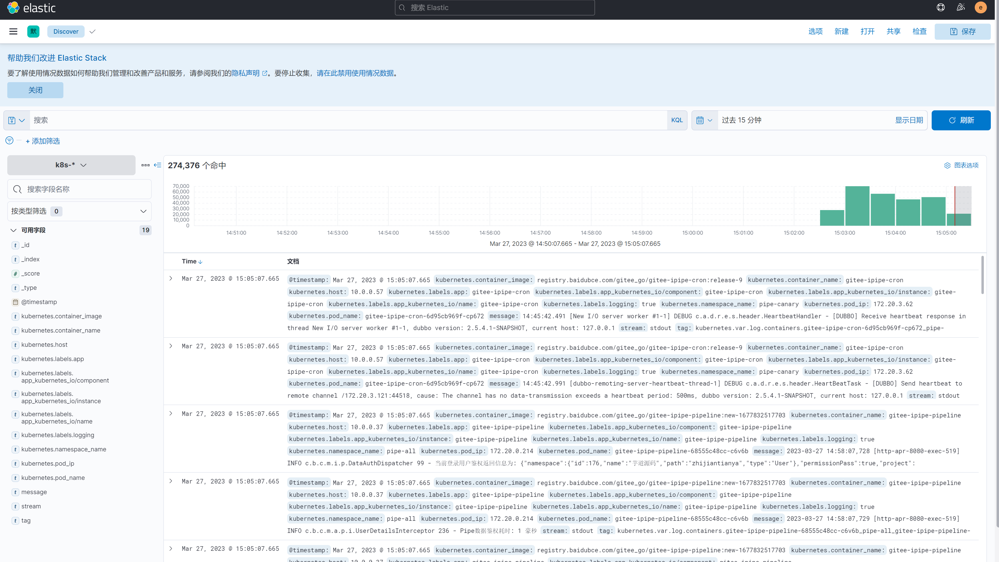{: .zoom}


现在的数据就是上面 Counter 应用的日志，如果还有其他的应用，我们也可以筛选过滤：

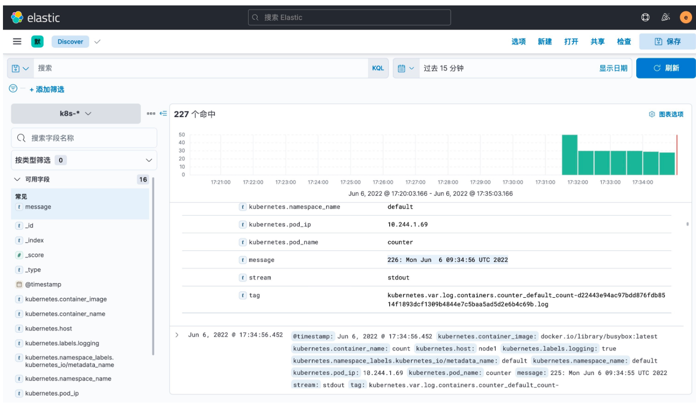{: .zoom}


我们也可以通过其他元数据来过滤日志数据，比如您可以单击任何日志条目以查看其他元数据，如容器名称，Kubernetes 节点，命名空间等。


### 2.3 安装 Kafka

对于大规模集群来说，日志数据量是非常巨大的，如果直接通过 Fluentd 将日志打入 Elasticsearch，对 ES 来说压力是非常巨大的，我们可以在中间加一层消息中间件来缓解 ES 的压力，一般情况下我们会使用 Kafka，然后可以直接使用 kafka-connect-elasticsearch 这样的工具将数据直接打入 ES，也可以在加一层 Logstash 去消费 Kafka 的数据，然后通过 Logstash 把数据存入 ES，这里我们来使用 Logstash 这种模式来对日志收集进行优化。

首先在 Kubernetes 集群中安装 Kafka，同样这里使用 Helm 进行安装：
```shell
$ helm repo add bitnami https://charts.bitnami.com/bitnami
$ helm repo update
```
首先使用 helm pull 拉取 Chart 并解压：

```shell
$ helm pull bitnami/kafka --untar --version 17.2.3
$ cd kafka
```

这里面我们指定使用一个 StorageClass 来提供持久化存储，在 Chart 目录下面创建用于安装的 values 文件：
`values-prod.yaml`

```yaml
# values-prod.yaml
## @section Persistence parameters
persistence:
  enabled: true
  storageClass: "efk-nfs"
  accessModes:
    - ReadWriteOnce
  size: 8Gi

  mountPath: /bitnami/kafka

# 配置zk volumes
zookeeper:
  enabled: true
  persistence:
    enabled: true
    storageClass: "efk-nfs"
    accessModes:
      - ReadWriteOnce
    size: 8Gi
```
直接使用上面的 values 文件安装 kafka：
```shell
$ helm upgrade --install kafka -f values-prod.yaml --namespace logging .
Release "kafka" does not exist. Installing it now.
NAME: kafka
LAST DEPLOYED: Thu Jun  9 14:02:01 2022
NAMESPACE: logging
STATUS: deployed
REVISION: 1
TEST SUITE: None
NOTES:
CHART NAME: kafka
CHART VERSION: 17.2.3
APP VERSION: 3.2.0

** Please be patient while the chart is being deployed **

Kafka can be accessed by consumers via port 9092 on the following DNS name from within your cluster:

    kafka.logging.svc.cluster.local

Each Kafka broker can be accessed by producers via port 9092 on the following DNS name(s) from within your cluster:

    kafka-0.kafka-headless.logging.svc.cluster.local:9092

To create a pod that you can use as a Kafka client run the following commands:

    kubectl run kafka-client --restart='Never' --image docker.io/bitnami/kafka:3.2.0-debian-10-r4 --namespace logging --command -- sleep infinity
    kubectl exec --tty -i kafka-client --namespace logging -- bash

    PRODUCER:
        kafka-console-producer.sh \

            --broker-list kafka-0.kafka-headless.logging.svc.cluster.local:9092 \
            --topic test

    CONSUMER:
        kafka-console-consumer.sh \

            --bootstrap-server kafka.logging.svc.cluster.local:9092 \
            --topic test \
            --from-beginning
```

安装完成后我们可以使用上面的提示来检查 Kafka 是否正常运行：

```shell

$ kubectl get pods -n logging -l app.kubernetes.io/instance=kafka
kafka-0             1/1     Running   0          7m58s
kafka-zookeeper-0   1/1     Running   0          7m58s
```

用下面的命令创建一个 Kafka 的测试客户端 Pod：
```shell
$ kubectl run kafka-client --restart='Never' --image docker.io/bitnami/kafka:3.2.0-debian-10-r4 --namespace logging --command -- sleep infinity
pod/kafka-client created
```
然后启动一个终端进入容器内部生产消息：
```shell
# 生产者
$ kubectl exec --tty -i kafka-client --namespace logging -- bash
I have no name!@kafka-client:/$ kafka-console-producer.sh --broker-list kafka-0.kafka-headless.logging.svc.cluster.local:9092 --topic test
>hello kafka on k8s
>
```

启动另外一个终端进入容器内部消费消息：
```shell
# 消费者
$ kubectl exec --tty -i kafka-client --namespace logging -- bash
I have no name!@kafka-client:/$ kafka-console-consumer.sh --bootstrap-server kafka.logging.svc.cluster.local:9092 --topic test --from-beginning
hello kafka on k8s
```

如果在消费端看到了生产的消息数据证明我们的 Kafka 已经运行成功了。


### 2.4 Fluentd 配置 Kafka
现在有了 Kafka，我们就可以将 Fluentd 的日志数据输出到 Kafka 了，只需要将 Fluentd 配置中的 <match> 更改为使用 Kafka 插件即可，但是在 Fluentd 中输出到 Kafka，
需要使用到 fluent-plugin-kafka 插件，所以需要我们自定义下 Docker 镜像，最简单的做法就是在上面 Fluentd 镜像的基础上新增 kafka 插件即可，Dockerfile 文件如下所示：

`Dockerfile`
```
FROM quay.io/fluentd_elasticsearch/fluentd:v3.4.0
RUN echo "source 'https://mirrors.tuna.tsinghua.edu.cn/rubygems/'" > Gemfile && gem install bundler
RUN gem install fluent-plugin-kafka -v 0.17.5 --no-document
```

```shell
$ docker build -t giteeops/fluentd-kafka:v0.17.5 .
$ docker push giteeops/fluentd-kafka:v0.17.5
```

使用上面的 Dockerfile 文件构建一个 Docker 镜像即可，我这里构建过后的镜像名为 `giteeops/fluentd-kafka:v0.17.5`。接下来替换 Fluentd 的 Configmap 对象中的 <match> 部分，如下所示：

```yaml

# fluentd-configmap.yaml
kind: ConfigMap
apiVersion: v1
metadata:
  name: fluentd-conf
  namespace: logging
data:
  ......
  output.conf: |-
    <match **>
      @id kafka
      @type kafka2
      @log_level info

      # list of seed brokers
      brokers kafka-0.kafka-headless.logging.svc.cluster.local:9092
      use_event_time true

      # topic settings
      topic_key k8slog
      default_topic messages  # 注意，kafka中消费使用的是这个topic
      # buffer settings
      <buffer k8slog>
        @type file
        path /var/log/td-agent/buffer/td
        flush_interval 3s
      </buffer>

      # data type settings
      <format>
        @type json
      </format>

      # producer settings
      required_acks -1
      compression_codec gzip

    </match>
```

!!! Warning "注意"
    
    node节点会创建一个/var/log/td-agent/buffer/td目录。此目录数据很大，考虑到磁盘空间的问题，可以将buffer settings为memory的方式

```yaml

  output.conf: |-
    <match **>
      @id kafka
      @type kafka2
      @log_level info

      # list of seed brokers
      brokers kafka-0.kafka-headless.logging.svc.cluster.local:9092
      use_event_time true

      # topic settings
      topic_key k8slog
      default_topic messages  # 注意，kafka中消费使用的是这个topic
      # buffer settings
      <buffer k8slog>
        @type memory
        path /var/log/td-agent/buffer/td
        flush_interval 3s
      </buffer>

      # data type settings
      <format>
        @type json
      </format>

      # producer settings
      required_acks -1
      compression_codec gzip

    </match>
```

然后替换运行的 Fluentd 镜像：
```yaml
# fluentd-daemonset.yaml
image: giteeops/fluentd-kafka:v0.17.5
```
直接更新 Fluentd 的 Configmap 与 DaemonSet 资源对象即可：
```shell
$ kubectl apply -f fluentd-configmap.yaml
$ kubectl apply -f fluentd-daemonset.yaml
```

更新成功后我们可以使用上面的测试 Kafka 客户端来验证是否有日志数据：
```shell

$ kubectl exec --tty -i kafka-client --namespace logging -- bash
I have no name!@kafka-client:/$ kafka-console-consumer.sh --bootstrap-server kafka.logging.svc.cluster.local:9092 --topic messages --from-beginning
{"stream":"stdout","docker":{},"kubernetes":{"container_name":"count","namespace_name":"default","pod_name":"counter","container_image":"busybox:latest","host":"node1","labels":{"logging":"true"}},"message":"43883: Tue Apr 27 12:16:30 UTC 2021\n"}
......
```


### 2.5 安装 Logstash
虽然数据从 Kafka 到 Elasticsearch 的方式多种多样，比如可以使用 [Kafka Connect Elasticsearch Connector](https://github.com/confluentinc/kafka-connect-elasticsearch) 来实现，

我们这里还是采用更加流行的 `Logstash` 方案，上面我们已经将日志从 Fluentd 采集输出到 Kafka 中去了，接下来我们使用 Logstash 来连接 Kafka 与 Elasticsearch 间的日志数据。

首先使用 helm pull 拉取 Chart 并解压：

```shell
$ helm pull elastic/logstash --untar --version 7.17.3
$ cd logstash
```

同样在 Chart 根目录下面创建用于安装的 Values 文件，如下所示：
```yaml
# values-prod.yaml
fullnameOverride: logstash

persistence:
  enabled: true

logstashConfig:
  logstash.yml: |
    http.host: 0.0.0.0
    # 如果启用了xpack，需要做如下配置
    xpack.monitoring.enabled: true
    xpack.monitoring.elasticsearch.hosts: ["http://elasticsearch-client:9200"]
    xpack.monitoring.elasticsearch.username: "elastic"
    xpack.monitoring.elasticsearch.password: "oschina"

# 要注意下格式
logstashPipeline:
  logstash.conf: |
    input { kafka { bootstrap_servers => "kafka-0.kafka-headless.logging.svc.cluster.local:9092" codec => json consumer_threads => 3 topics => ["messages"] } }
    filter {}  # 过滤配置（比如可以删除key、添加geoip等等）
    output { elasticsearch { hosts => [ "elasticsearch-client:9200" ] user => "elastic" password => "oschina" index => "logstash-k8s-%{+YYYY.MM.dd}" } stdout { codec => rubydebug } }

volumeClaimTemplate:
  accessModes: ["ReadWriteOnce"]
  storageClassName: efk-nfs
  resources:
    requests:
      storage: 10Gi
```

其中最重要的就是通过 logstashPipeline 配置 logstash 数据流的处理配置，通过 input 指定日志源 kafka 的配置，通过 output 输出到 Elasticsearch，同样直接使用上面的 Values 文件安装 logstash 即可：


```shell

$ helm upgrade --install logstash -f values-prod.yaml --namespace logging .
Release "logstash" does not exist. Installing it now.
NAME: logstash
LAST DEPLOYED: Thu Jun  9 15:02:49 2022
NAMESPACE: logging
STATUS: deployed
REVISION: 1
TEST SUITE: None
NOTES:
1. Watch all cluster members come up.
  $ kubectl get pods --namespace=logging -l app=logstash -w
```
安装启动完成后可以查看 logstash 的日志：

```shell

$ kubectl get pods --namespace=logging -l app=logstash
NAME         READY   STATUS    RESTARTS   AGE
logstash-0   1/1     Running   0          2m8s

$ kubectl logs -f logstash-0 -n logging
......
{
      "@version" => "1",
        "stream" => "stdout",
    "@timestamp" => 2022-06-09T07:09:16.889Z,
       "message" => "4672: Thu Jun  9 07:09:15 UTC 2022",
    "kubernetes" => {
         "container_image" => "docker.io/library/busybox:latest",
          "container_name" => "count",
                  "labels" => {
            "logging" => "true"
        },
                "pod_name" => "counter",
          "namespace_name" => "default",
                  "pod_ip" => "10.244.2.118",
                    "host" => "node2",
        "namespace_labels" => {
            "kubernetes_io/metadata_name" => "default"
        }
    },
        "docker" => {}
}
```

由于我们启用了 debug 日志调试，所以我们可以在 logstash 的日志中看到我们采集的日志消息，到这里证明我们的日志数据就获取成功了。

现在我们可以登录到 Kibana 可以看到有如下所示的索引数据了：

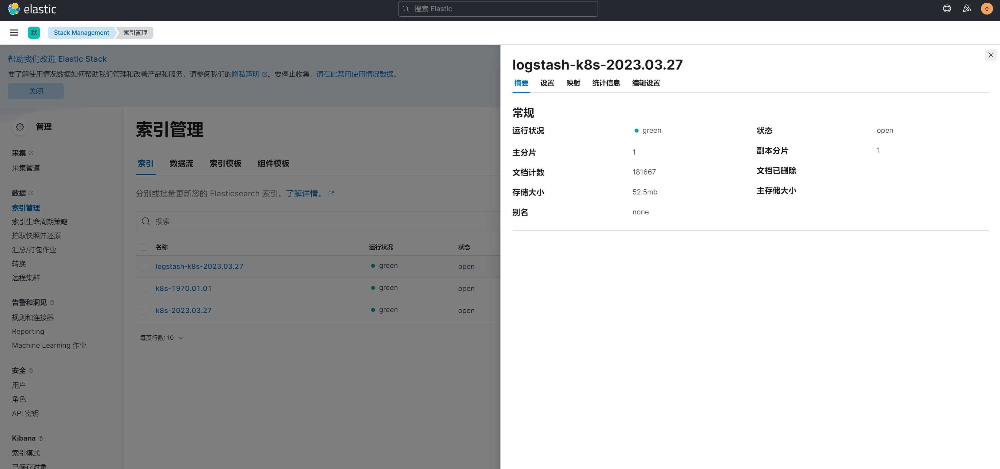{: .zoom}


然后同样创建索引模式，匹配上面的索引即可：
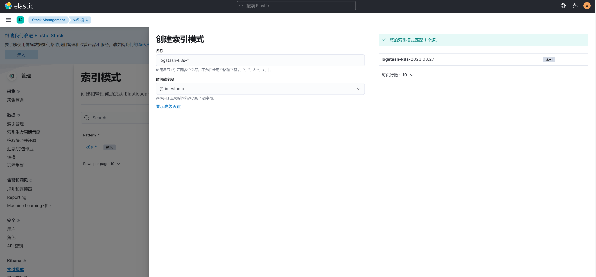{: .zoom}


创建完成后就可以前往发现页面过滤日志数据了。

到这里我们就实现了一个使用 Fluentd+Kafka+Logstash+Elasticsearch+Kibana 的 Kubernetes 日志收集工具栈，这里我们完整的 Pod 信息如下所示：
```shell
$ kubectl get pods -n logging
NAME                            READY   STATUS    RESTARTS   AGE
elasticsearch-client-0          1/1     Running   0          128m
elasticsearch-data-0            1/1     Running   0          128m
elasticsearch-master-0          1/1     Running   0          128m
fluentd-6k52h                   1/1     Running   0          61m
fluentd-cw72c                   1/1     Running   0          61m
fluentd-dn4hs                   1/1     Running   0          61m
kafka-0                         1/1     Running   3          134m
kafka-client                    1/1     Running   0          125m
kafka-zookeeper-0               1/1     Running   0          134m
kibana-kibana-66f97964b-qqjgg   1/1     Running   0          128m
logstash-0                      1/1     Running   0          13m
```

当然在实际的工作项目中还需要我们根据实际的业务场景来进行参数性能调优以及高可用等设置，以达到系统的最优性能。

上面我们在配置 logstash 的时候是将日志输出到 "logstash-k8s-%{+YYYY.MM.dd}" 这个索引模式的，可能有的场景下只通过日期去区分索引不是很合理，
那么我们可以根据自己的需求去修改索引名称，比如可以根据我们的服务名称来进行区分，那么这个服务名称可以怎么来定义呢？可以是 Pod 的名称或者通过 label 标签去指定，
比如我们这里去做一个规范，要求需要收集日志的 Pod 除了需要添加 logging: true 这个标签之外，还需要添加一个`logIndex: <索引名> `的标签。

比如重新更新我们测试的 counter 应用：
```yaml
apiVersion: v1
kind: Pod
metadata:
  name: counter
  labels:
    logging: "true" # 一定要具有该标签才会被采集
    logIndex: "test"  # 指定索引名称
spec:
  containers:
    - name: count
      image: busybox
      args:
        [
          /bin/sh,
          -c,
          'i=0; while true; do echo "$i: $(date)"; i=$((i+1)); sleep 1; done',
        ]
```

然后重新更新 logstash 的配置，修改 values 配置：
```yaml
# ......
logstashPipeline:
  logstash.conf: |
    input { kafka { bootstrap_servers => "kafka-0.kafka-headless.logging.svc.cluster.local:9092" codec => json consumer_threads => 3 topics => ["messages"] } }
    filter {}  # 过滤配置（比如可以删除key、添加geoip等等）
    output { elasticsearch { hosts => [ "elasticsearch-client:9200" ] user => "elastic" password => "oschina" index => "k8s-%{[kubernetes][labels][logIndex]}-%{+YYYY.MM.dd}" } stdout { codec => rubydebug } }
# ......
```

使用上面的 values 值更新 logstash，正常更新后上面的 counter 这个 Pod 日志会输出到一个名为 k8s-test-2022.06.09 的索引去。
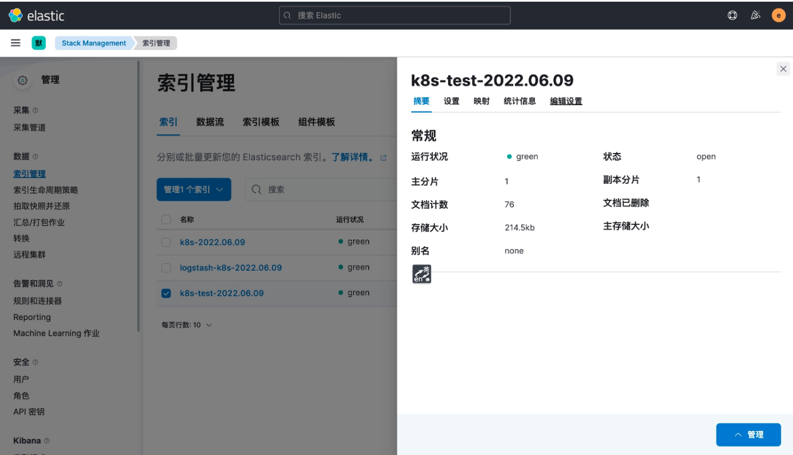{: .zoom}


这样我们就实现了自定义索引名称，当然你也可以使用 Pod 名称、容器名称、命名空间名称来作为索引的名称，这完全取决于你自己的需求。


!!! example "Elasticsearch集群性能优化实践"

    https://cloud.tencent.com/developer/article/1775059


## 3. 参考文献

!!! abstract "参考文献"

    https://mp.weixin.qq.com/s/lPeYavvFJ6GdivkT0iwTGw
    https://docs.youdianzhishi.com/k8s/logging/efk/