# Kubernetes监控告警

本章将带领读者学?如何对Kubernetes集群以及部署的应用进行监控。

传统架构中比较流行的监控工具有Zabbix、Nagios等，这些监控工具对于Kubernetes这类云平台监控不是很友好，特别是当Kubernetes集群中有了成千上万的容器后更是如此，本章将带领读者学习下一代的云原生监控平台—Prometheus。


## 1.Prometheus的架构介绍


Prometheus是一个开源的系统监控和报警框架，其本身也是一个时间序列数据库（Time Series Database，TSDB),它的设计灵感来源于Google的Borgmon，就像Kubernetes是基于Borg系统开源的。

Prometheus是由Sound Cloud的Google前员工设计并开源的，官方网站为https://prometheus.io/。
Prometheus于2016年加入云原生计算基金会（Cloud Native Computing Foundation，CNCF）,成为受欢迎程度仅次于Kubernetes的开源项目。


该项目拥有非常活跃的开发者和用户社区，目前已经被很多公司采用，并且部分公司也参与了该项目的维护。

Prometheus被称为下一代的监控平台，具有很多和“老牌”监控不一样的特性，比如：

- 一个多维的数据模型，具有由指标名称和键-值对标识的时间序列数据。
- 使用PromQL查询和聚合数据，可以非常灵活地对数据进行检索。
- 不依赖额外的数据存储，Prometheus本身就是一个时序数据库，提供本地存储和分布式存储，并且每个Prometheus都是自治的。
- 应用程序暴露Metrics接口，Prometheus通过基于HTTP的Pull模型采集数据。
- 同时可以使用PushGateway进行Push数据。
- Prometheus同时支持动态服务和静态配置发现目标机器。
- 支持多种图形和仪表盘，和Grafana堪称“绝配”


Prometheus生态系统由多个组件组成，其架构图如图15.1所示。

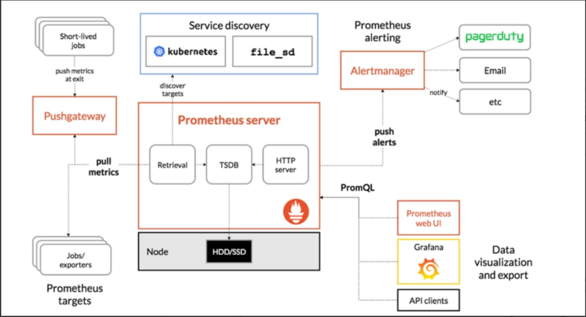
图15.1　Prometheus架构

虽然Prometheus的组件有很多，但是很多组件都是可选的，所以Prometheus要比其他监控平台更灵活。接下来看一下每个组件的用途。

Prometheus Server：Prometheus生态最重要的组件，主要用于抓取和存储时间序列数据，同时提供数据的查询和告警策略的配置管
理。

- Alertmanager：Prometheus生态用于告警的组件，Prometheus Server会将告警发送给Alertmanager，Alertmanager根据路由配置
  将告警信息发送给指定的人或组。Alertmanager支持邮件、Webhook、微信、钉钉、短信等媒介进行告警通知。

  

- Grafana：用于展示数据，便于数据的查询和观测。

  

- Push Gateway：Prometheus本身是通过Pull的方式拉取数据的，但是有些监控数据可能是短期的，如果没有采集数据可能会出现丢
  失。Push Gateway可以用来解决此类问题，它可以用来接收数据，也就是客户端可以通过Push的方式将数据推送到Push Gateway，之后Prometheus可以通过Pull拉取该数据。

  

- Exporter：主要用来采集监控数据，比如主机的监控数据可以通过node_exporter采集，MySQL的监控数据可以通过mysql_exporter采集，之后Exporter暴露一个接口，比如/metrics，Prometheus可以通过该接口采集到数据。

  

- PromQL：PromQL其实不算Prometheus的组件，它是用来查询数据的
  一种语法，比如可以通过SQL语句查询数据库的数据，通过LogQL语句查询Loki的数据，通过PromQL语句查询Prometheus的数据。

  

- Service Discovery：用来发现监控目标的自动发现，常用的有基于Kubernetes、Consul、Eureka、文件的自动发现等。


以上对Prometheus进行了简单的介绍，接下来我们上手体验Prometheus的强大之处。


## 2.Prometheus的安装

Prometheus有多种安装方式，比如二进制安装、容器安装和Kubernetes
集群中安装，由于本书是基于Kubernetes展开的，因此会将Prometheus安装到Kubernetes集群中，当然这也是官方推荐的部署方式。

将Prometheus安装到Kubernetes集群也有很多方式，比如之前提到过的Helm、Operator等，Prometheus也是支持上述安装方式的。

但是Prometheus是一个生态系统，有很多组件都需要安装，并且也有很多监控需要单独配置，于是Prometheus官方开源了一个kube-prometheus项目，该项目不仅仅是用来安装Prometheus的，也包含很多其他的组件，如下所示：

- Prometheus Operator。
- 高可用的Prometheus。
- 高可用的Alertmanager。
- 主机监控Node Exporter。
- Prometheus Adapter。
- 容器监控kube-state-metrics。
- 图形化展示Grafana。

具体可以通过https://github.com/prometheus-operator/kube-prometheus/找到该项目进行查看。

有了kube-prometheus项目，对其的安装也变得非常简单，只需要两条命令即可。

首先需要通过该项目地址找到和自己Kubernetes版本对应的Kube Prometheus Stack的版本，如图15.2所示。

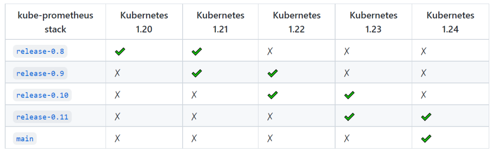

图15.2　Prometheus版本选择

之后将该项目对应分支克隆到本地：

kubernetes1.21使用如下方式
```shell
# git clone -b release-0.9 https://github.com/prometheus-operator/kube-prometheus.git
# cd kube-prometheus/manifests
```


kubernetes1.20使用如下方式
```shell
# git clone https://github.com/prometheus-operator/kube-prometheus.git
# cd kube-prometheus
# git checkout -b origin/release-0.8 remotes/origin/release-0.8
# cd manifests/
```

首先安装Prometheus Operator：

```shell
# kubectl create -f setup/
namespace/monitoring created
...
deployment.apps/prometheus-operator created
service/prometheus-operator created
serviceaccount/prometheus-operator created
```

查看Operator容器的状态：

```shell
# kubectl get pod -n monitoring
NAME                                   READY   STATUS    RESTARTS   AGE
prometheus-operator-75d9b475d9-pk8qb   2/2     Running   0          4m16s
```


**数据持久化**

配置prometheus持久化的配置清单：

prometheus-prometheus.yaml

```yaml
  image: quay.io/prometheus/prometheus:v2.26.0
  env:
  - name: TZ
    value: "Asia/Shanghai"
......
  retention: 15d
  storage:
    volumeClaimTemplate:
      spec:
        storageClassName: gitee-nfs-client
        resources:
          requests:
            storage: 20Gi
```

配置grafana持久化的配置清单：

grafana-pvc.yaml

```shell
# mkdir grafana-pvc 
# vim grafana-pvc.yaml

```

```yaml
apiVersion: v1
kind: PersistentVolumeClaim
metadata:
  name: grafana-pvc
  namespace: monitoring
spec:
  accessModes:
  - ReadWriteMany
  resources:
    requests:
      storage: 20M
  storageClassName: gitee-nfs-client
```


grafana-deployment.yaml

```yaml
.......

    spec:
      containers:
      # 固定grafana的登陆密码
      - env:
         - name: GF_SECURITY_ADMIN_USER
            value: admin
          - name: GF_SECURITY_ADMIN_PASSWORD
            value: oschina123
          - name: TZ
            value: Asia/Shanghai
        # image: grafana/grafana:8.1.1
        image: grafana/grafana:8.4.7
        name: grafana
        ports:
        - containerPort: 3000
          name: http
        readinessProbe:
          httpGet:
            path: /api/health
            port: http
        resources:
          limits:
            cpu: 200m
            memory: 200Mi
          requests:
            cpu: 100m
            memory: 100Mi
      .......

      nodeSelector:
        kubernetes.io/os: linux
      securityContext:
        fsGroup: 65534
        runAsNonRoot: true
        runAsUser: 65534
      serviceAccountName: grafana
      volumes:
      # 持久化pvc
      - name: grafana-storage
        persistentVolumeClaim:
          claimName: grafana-pvc
.......
```


配置alertmanager持久化的配置清单：

alertmanager-alertmanager.yaml

```yaml
....
  retention: 24h
  storage:
    volumeClaimTemplate:
      spec:
        storageClassName: gitee-nfs-client
        resources:
          requests:
            storage: 10Gi
```


!!! abstract "参考文献"

    https://www.lhl.zone/virtualization/kube-prometheus/102.html


Operator容器启动后，安装Prometheus Stack：

```sh
# kubectl create -f .
alertmanager.monitoring.coreos.com/main created
Warning: policy/v1beta1 PodDisruptionBudget is deprecated in v1.21+, unavailable in v1.25+; use policy/v1 PodDisruptionBudget
poddisruptionbudget.policy/alertmanager-main created
prometheusrule.monitoring.coreos.com/alertmanager-main-rules created
....
role.rbac.authorization.k8s.io/prometheus-k8s-config created
role.rbac.authorization.k8s.io/prometheus-k8s created
role.rbac.authorization.k8s.io/prometheus-k8s created
role.rbac.authorization.k8s.io/prometheus-k8s created
service/prometheus-k8s created
serviceaccount/prometheus-k8s created
servicemonitor.monitoring.coreos.com/prometheus-k8s created
```


不过需要注意有一些资源的镜像来自于 `k8s.gcr.io`，如果不能正常拉取，则可以将镜像替换成可拉取的：

- `prometheusAdapter-deployment.yaml`：将 `image: k8s.gcr.io/prometheus-adapter/prometheus-adapter:v0.9.1` 替换为 `cnych/prometheus-adapter:v0.9.1`
- `kubeStateMetrics-deployment.yaml`：将 `image: k8s.gcr.io/kube-state-metrics/kube-state-metrics:v2.4.2` 替换为 `cnych/kube-state-metrics:v2.4.2`


```shell
# sed 's#k8s.gcr.io/kube-state-metrics/kube-state-metrics:v2.1.1#cnych/kube-state-metrics:v2.4.2#g' -i *.yaml
# sed 's#k8s.gcr.io/prometheus-adapter/prometheus-adapter:v0.9.0#cnych/prometheus-adapter:v0.9.1#g' -i *.yaml
```


这会自动安装 prometheus-operator、node-exporter、kube-state-metrics、grafana、prometheus-adapter 以及 prometheus 和 alertmanager 等大量组件，如果没成功可以多次执行上面的安装命令。

查看Prometheus容器的状态：

```sh
# kubectl get pods -n monitoring
NAME                                   READY   STATUS    RESTARTS   AGE
alertmanager-main-0                    2/2     Running   0          6m41s
alertmanager-main-1                    2/2     Running   0          6m41s
alertmanager-main-2                    2/2     Running   0          6m41s
blackbox-exporter-6798fb5bb4-9rg5s     3/3     Running   0          6m41s
grafana-7476b4c65b-6qrxh               1/1     Running   0          6m40s
kube-state-metrics-64c7ff87dc-8b4bs    3/3     Running   0          6m40s
node-exporter-2f2h2                    2/2     Running   0          6m40s
node-exporter-2zcbr                    2/2     Running   0          6m40s
node-exporter-5txxx                    2/2     Running   0          6m40s
node-exporter-7wxp6                    2/2     Running   0          6m40s
node-exporter-99wrh                    2/2     Running   0          6m40s
node-exporter-dcfdn                    2/2     Running   0          6m40s
node-exporter-g7hl9                    2/2     Running   0          6m40s
node-exporter-hsgwx                    2/2     Running   0          6m40s
node-exporter-jp8qs                    2/2     Running   0          6m40s
prometheus-adapter-77774d7447-r7m9p    1/1     Running   0          6m40s
prometheus-adapter-77774d7447-xjcm5    1/1     Running   0          6m40s
prometheus-k8s-0                       2/2     Running   0          6m39s
prometheus-k8s-1                       2/2     Running   0          6m39s
prometheus-operator-75d9b475d9-pk8qb   2/2     Running   0          97m

# kubectl get svc -n monitoring
NAME                    TYPE        CLUSTER-IP       EXTERNAL-IP   PORT(S)                      AGE
alertmanager-main       ClusterIP   10.111.159.143   <none>        9093/TCP                     6m58s
alertmanager-operated   ClusterIP   None             <none>        9093/TCP,9094/TCP,9094/UDP   6m58s
blackbox-exporter       ClusterIP   10.103.27.127    <none>        9115/TCP,19115/TCP           6m58s
grafana                 ClusterIP   10.102.99.88     <none>        3000/TCP                     6m57s
kube-state-metrics      ClusterIP   None             <none>        8443/TCP,9443/TCP            6m57s
node-exporter           ClusterIP   None             <none>        9100/TCP                     6m57s
prometheus-adapter      ClusterIP   10.110.138.216   <none>        443/TCP                      6m57s
prometheus-k8s          ClusterIP   10.106.193.178   <none>        9090/TCP                     6m56s
prometheus-operated     ClusterIP   None             <none>        9090/TCP                     6m56s
prometheus-operator     ClusterIP   None             <none>        8443/TCP                     97m
```

待容器全部下载完成(首次安装镜像下载可能会很慢)并且启动后，可以访问Grafana和Prometheus 。

在执行安装时会自动创建Grafana和Prometheus的Service，可以通过NodePort或者Ingress的方式访问，在此演示的为NodePort方式。

首先将Grafana的Service改成NodePort类型：

```sh
# kubectl edit svc grafana -n monitoring
  selector:
    app.kubernetes.io/component: grafana
    app.kubernetes.io/name: grafana
    app.kubernetes.io/part-of: kube-prometheus
  sessionAffinity: None
  # 更改Grafana的Service类型
  type: NodePort
```

或者直接修改`grafana-service.yaml`文件内容
```yaml
apiVersion: v1
kind: Service
metadata:
  labels:
    app.kubernetes.io/component: grafana
    app.kubernetes.io/name: grafana
    app.kubernetes.io/part-of: kube-prometheus
    app.kubernetes.io/version: 7.5.4
  name: grafana
  namespace: monitoring
spec:
  type: NodePort
  ports:
  - name: http
    port: 3000
    nodePort: 30030
    targetPort: http
  selector:
    app.kubernetes.io/component: grafana
    app.kubernetes.io/name: grafana
    app.kubernetes.io/part-of: kube-prometheus
```


查看Grafana Service的NodePort：

```sh
# kubectl get svc grafana -n monitoring
NAME      TYPE       CLUSTER-IP     EXTERNAL-IP   PORT(S)          AGE
grafana   NodePort   10.102.99.88   <none>        3000:31790/TCP   8m55s
```

之后通过任意一个安装了kube-proxy服务的节点IP+31790端口即可访问Grafana，如图15.4所示。


Grafana默认登录的账号和密码为admin/admin，登录会提示更改密码，也可以单击skip不更改密码。然后以相同的方式更改Prometheus的Service为NodePort：

```sh
# kubectl edit svc prometheus-k8s -n monitoring
  selector:
    app: prometheus
    app.kubernetes.io/component: prometheus
    app.kubernetes.io/name: prometheus
    app.kubernetes.io/part-of: kube-prometheus
    prometheus: k8s
  sessionAffinity: ClientIP
  sessionAffinityConfig:
    clientIP:
      timeoutSeconds: 10800
  # 更改prometheus的Service类型
  type: NodePort
  
# kubectl get svc prometheus-k8s -n monitoring
NAME             TYPE       CLUSTER-IP       EXTERNAL-IP   PORT(S)          AGE
prometheus-k8s   NodePort   10.106.193.178   <none>        9090:31635/TCP   13m
```

最后通过任意一个安装了kube-proxy服务的节点IP+31635端口即可访问Prometheus的Web UI，如图15.5所示。

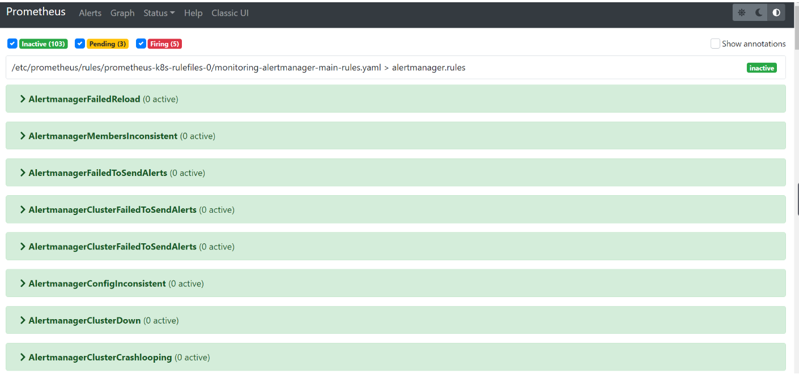
图15.5 访问Prometheus Web UI


!!! tip "提示"

    默认安装完成后，会有几个告警，先忽略。


如果要清理 Prometheus-Operator，可以直接删除对应的资源清单即可：

```shell
# kubectl delete -f kube-prometheus/manifests/
# kubectl delete -f kube-prometheus/manifests/setup/
```


## 3.云原生和非云原生应用的监控流程

通过前面的学?，可以看到只需要几条命令即可完成Prometheus Stack的安装，接下来开始介绍Prometheus是如何抓取数据的。


### 3.1 监控数据来源

从Prometheus的架构中了解到，Prometheus通常采用Pull的形式来拉取数据，也就意味着被监控应用只要有一个能获取到监控数据的接口，就可以采集到监控数据，所以接下来讲一下这个接口从何而来。

如果读者从事云相关的工作，肯定都听说过云原生这个词语，其中云原生涉及12个关键要素，其中一项就是应用的开发者在进行相关程序开发时，要考虑程序本身一些内部的运行情况，比如程序当前的连接数、资源占用情况等，此时可以引用Prometheus的客户端工具来采集并暴露数据，也就是基于云原生理念开发的程序自己会暴露Metrics接口，就像Kubernetes本身的组件、Etcd等，都有一个/metrics接口，Prometheus只需要请求这个接口即可获取到相关数据。

基于云原生理念开发的程序大部分都有相关接口，但是有很多应用并非是基于云原生理念开发的，所以没有此类接口，比如MySQL、Redis等。

那么如何采集这类程序的监控数据呢？这个时候在讲解Prometheus架构时提到的Exporter就派上用场了，Exporter主要用来采集非云原生应用的内部数据，它可以通过某些机制（比如调用接口、执行客户端命名）来获取内部一些比较重要的数据，然后将其转换成Prometheus能够识别的数据，并且由Exporter暴露/metrics，此时Prometheus就可以采集到由Exporter暴露的非云原生应用的内部运行状态。目前比较常用的Exporter工具如表15.1所示。

表15.1　目前比较常用的Exporter工具

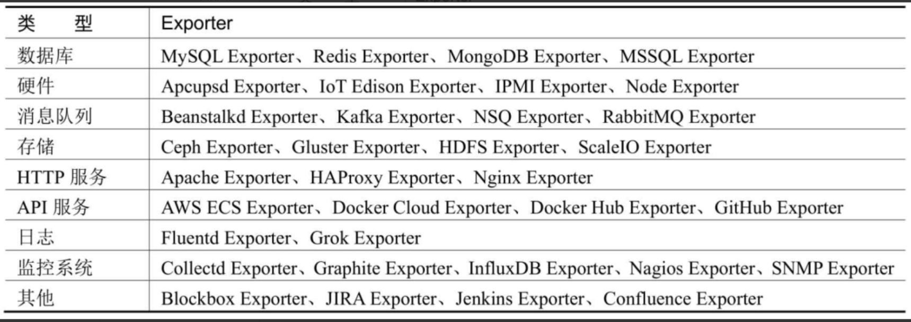


在安装了Prometheus Stack后，默认会安装一些常用的监控，比如Kubernetes组件、集群状态、主机状态的监控等。其中Kubernetes组件是基于云原生理念开发的，它自身提供了Metrics接口，比如Kubelet组件可以通过主机的10255端口访问监控数据：

```shell
# curl -s 127.0.0.1:10255/metrics| tail -5
```


如果读者的Kubelet不是10255端口，可以通过netstat查看监听的端口号：

```shell
# netstat -lnpt|grep kubelet
tcp        0      0 127.0.0.1:10248         0.0.0.0:*               LISTEN      96284/kubelet
tcp6       0      0 :::10250                :::*                    LISTEN      96284/kubelet
```

之后在Grafana页面即可看到相关的监控数据，依次单击General/Home→Default→Kubernetes/Kubelet即可看到面板，如图15.6所示。

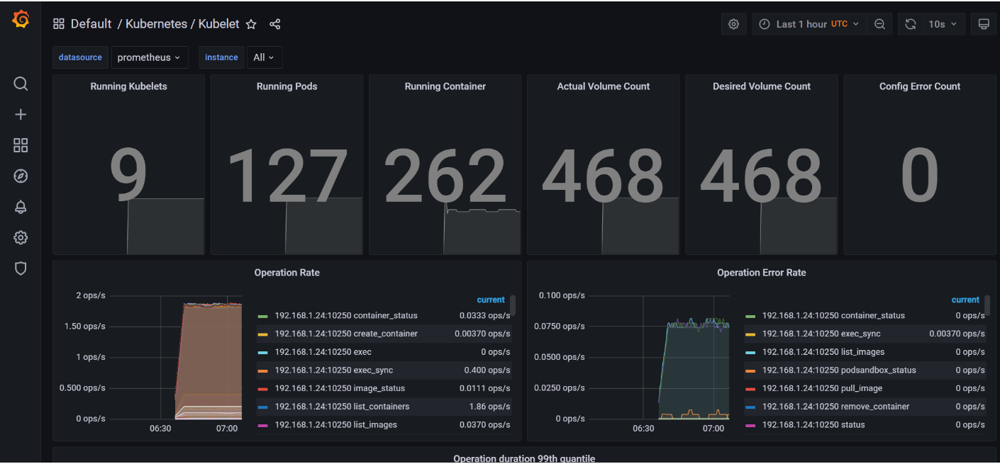


Kubernetes节点（也就是服务器本身）肯定不是云原生应用，或者说它不算一个应用，而是一个系统，那么系统本身肯定没有类似的Metrics接口。

按照之前的讲解，需要有一个Exporter采集宿主机信息，然后暴露给Prometheus，此时可以使用专用于主机信息采集的node-exporter应用来采集数据，并暴露Metrics接口给Prometheus。

安装Prometheus Stack时，默认用DaemonSet安装了node-exporter，它会在每个Kubernetes节点部署一个node-exporter：

```shell
# kubectl get ds -n monitoring
NAME            DESIRED   CURRENT   READY   UP-TO-DATE   AVAILABLE   NODE SELECTOR            AGE
node-exporter   9         9         9       9            9           kubernetes.io/os=linux   34m

# kubectl get pod -n monitoring|grep node-exporter
node-exporter-2f2h2                    2/2     Running   0          34m
node-exporter-2zcbr                    2/2     Running   0          34m
node-exporter-5txxx                    2/2     Running   0          34m
node-exporter-7wxp6                    2/2     Running   0          34m
node-exporter-99wrh                    2/2     Running   0          34m
node-exporter-dcfdn                    2/2     Running   0          34m
node-exporter-g7hl9                    2/2     Running   0          34m
node-exporter-hsgwx                    2/2     Running   0          34m
node-exporter-jp8qs                    2/2     Running   0          34m
```

此时可以在每个宿主机看到node-exporter监听的9100端口：

```shell
# netstat -lntp|grep node_exporter
tcp        0      0 127.0.0.1:9100          0.0.0.0:*               LISTEN      40711/node_exporter
```

此时访问9100即可访问到主机的监控信息：

```shell
# curl -s 127.0.0.1:9100/metrics| tail -5
# HELP promhttp_metric_handler_requests_total Total number of scrapes by HTTP status code.
# TYPE promhttp_metric_handler_requests_total counter
promhttp_metric_handler_requests_total{code="200"} 281
promhttp_metric_handler_requests_total{code="500"} 0
promhttp_metric_handler_requests_total{code="503"} 0
```

同时在Grafana上也可以看到监控面板,单击General/Home→Default→Node Exporter。

通过上面的理解，我们知道了针对云原生应用或非云原生应用的监控数据来源，但是Prometheus是如何知道要采集哪些数据的呢？接下来我们介绍如何配置Prometheus采集指定目标应用的监控数据。


### 3.2 什么是ServiceMonitor

如果读者体验过容器化或者二进制的方式安装Prometheus，就会注意到Prometheus有一个配置文件，用于配置需要监控哪些数据，或者配置一些告警策略。

这个配置文件的维护非常麻烦，特别是监控项非常多的情况下，很容易出现配置错误，而在Kubernetes上部署Prometheus，可以不用去维护这个配置文件，而是通过一个叫ServiceMonitor的资源来自动发现监控目标并动态生成配置。

比如上述展示的Kubelet和NodeExporter的监控 ， 都有一个ServiceMonitor：

```shell
# kubectl get servicemonitor -n monitoring
NAME                      AGE
alertmanager              42m
blackbox-exporter         42m
coredns                   42m
grafana                   42m
kube-apiserver            42m
kube-controller-manager   42m
kube-scheduler            42m
kube-state-metrics        42m
kubelet                   42m
node-exporter             42m
prometheus-adapter        42m
prometheus-k8s            42m
prometheus-operator       42m
```

可以通过-o命令查看配置详情：

```shell
# kubectl get servicemonitor -n monitoring kubelet -o yaml
apiVersion: monitoring.coreos.com/v1
kind: ServiceMonitor
metadata:
  creationTimestamp: "2022-12-28T06:35:18Z"
  generation: 1
  labels:
    app.kubernetes.io/name: kubelet
  name: kubelet
  namespace: monitoring
  resourceVersion: "269124093"
  selfLink: /apis/monitoring.coreos.com/v1/namespaces/monitoring/servicemonitors/kubelet
  uid: 0295ed26-49c4-4b15-ba92-f63a0bc5e7ec
spec:
  endpoints:
  - bearerTokenFile: /var/run/secrets/kubernetes.io/serviceaccount/token
    honorLabels: true
    interval: 30s
    metricRelabelings:
......

  jobLabel: app.kubernetes.io/name
  namespaceSelector:
    matchNames:
    - kube-system
  selector:
    matchLabels:
      app.kubernetes.io/name: kubelet
```

上述展示的是一个Kubelet的ServiceMonitor配置，可以看到它的kind配置为ServiceMonitor，并非标准的Kubernetes提供的资源类型。

在第13章，我们讲过Operator和CRD，Prometheus Stack也是一种CRD和Operator的实现。我们定义了一个类型为ServiceMonitor的自定义资源，Prometheus的Operator会解析该资源类型的配置，然后动态生成Prometheus的配置，

这就是ServiceMonitor的作用,它可以让我们用资源定义的方式去配置Prometheus需要监控谁，不用再处理成百上千行的Prometheus配置，也不需要每次更改Prometheus配置后重启Prometheus实例。

接下来看一个ServiceMonitor配置示例：

```yaml
apiVersion: monitoring.coreos.com/v1
kind: ServiceMonitor
metadata:
  labels:
    k8s-app: elasticsearch-exporter
    release: es-exporter
  name: es-exporter-elasticsearch-exporter
  namespace: monitoring
spec:
  endpoints:
  - honorLabels: true
    interval: 10s
    path: /metrics
    port: http
    scheme: http
  jobLabel: es-exporter
  namespaceSelector:
    matchNames:
    - monitoring
  selector:
    matchLabels:
      k8s-app: elasticsearch-exporter
      release: es-exporter
```

- honorLabels：如果目标标签和服务器标签冲突，是否保留目标标签。
- interval：监控数据抓取的时间间隔。
- path：Metrics接口路径。
- port：Metrics端口。
- scheme：Metrics接口的协议。
- namespaceSelector：监控目标Service所在的命名空间。
- selector：监控目标Service的标签。

反过来再看Kubelet的ServiceMonitor：

```yaml
  namespaceSelector:
    matchNames:
    - kube-system
  selector:
    matchLabels:
      app.kubernetes.io/name: kubelet
```

可以看到该ServiceMonitor的监控目标是kube-system命名空间下具有app.kubernetes.io/name=kubelet标签的Service,此时可以查 看该Service：

```shell
# kubectl get svc -n kube-system -l app.kubernetes.io/name=kubelet
NAME      TYPE        CLUSTER-IP   EXTERNAL-IP   PORT(S)                        AGE
kubelet   ClusterIP   None         <none>        10250/TCP,10255/TCP,4194/TCP   161m
```

通过上面的学习，我们简单总结一下，在使用Prometheus监控应用时，有云原生和非云原生应用之分，说白了就是监控数据是由程序本身提供还是通过Exporter提供。对于不同的应用，可以采用不同的管控流程，具体说明如下：

- 云原生应用：找到本身提供的Metrics接口，然后配置一个Service指向该应用的Pod，最后创建一个ServiceMonitor指定该应用的Service即可完成监控数据的采集。

- 非云原生应用：需要找到合适该应用的Exporter，之后Exporter链接至该应用并采集相关数据，然后配置一个Service指向该Exporter的Pod，最后创建一个ServiceMonitor指定该Exporter的Service即可完成监控数据的采集。


### 3.3 ServiceMonitor找不到监控主机排查

通过上面的学习，我们知道了Prometheus监控应用的流程，接下来趁热打铁看一个Kubernetes组件的监控问题。

如果读者采用的是二进制方式安装的Kubernetes集群，安装Prometheus后，kube-controller-manager和kube-
scheduler可能处于无法监控的状态，也就是找不到目标主机。

可以通过Prometheus的Web UI的Status→Service Discovery查看，如图15.7所示。

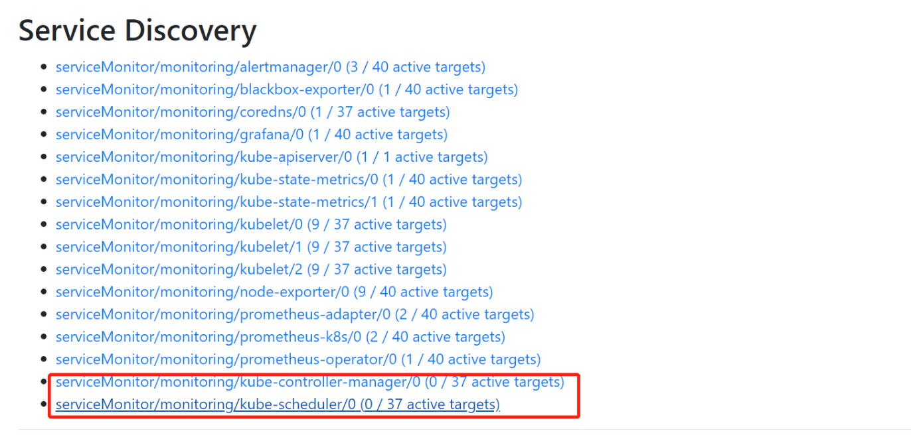


同时在Alerts页面也能看到Controller Manager和Scheduler的告警，如图15.8所示。

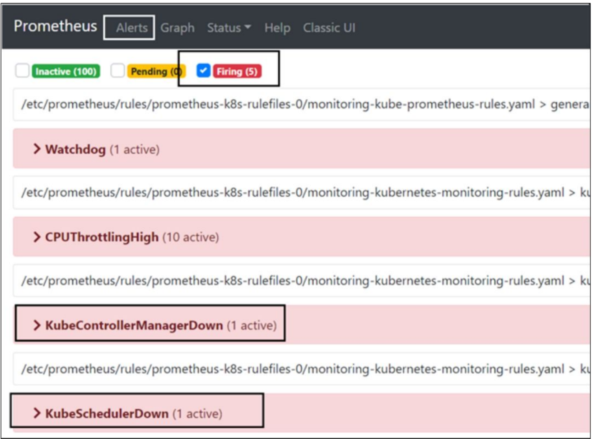

图15.8　查看告警

此时虽然有kube-controller-manager和kube-scheduler的监控配置，但是并没有发现可用的监控目标。接下来我们分析一下为什么找不到监控目标。

---

注意
本节的排查思路是通用步骤，不仅仅局限于controller和scheduler。

其次Kubernetes版本不一致，针对controller和scheduler的问题解决方式可能并不一致，但是ServiceMonitor找不到主机的排查步骤是一致的。

---

首先我们注意到Prometheus是有相关配置的，说明ServiceMonitor已经创建成功，可以通过以下命令查看：

```shell
# kubectl get servicemonitors -n monitoring kube-controller-manager kube-scheduler
NAME                      AGE
kube-controller-manager   127m
kube-scheduler            127m
```

接下来进一步分析 ,首先查看kube-controller-manager的ServiceMonitor配置：

```shell
# kubectl get servicemonitor -n monitoring kube-controller-manager -o yaml
apiVersion: monitoring.coreos.com/v1
kind: ServiceMonitor
......
    port: https-metrics
    scheme: https
    tlsConfig:
      insecureSkipVerify: true
  jobLabel: app.kubernetes.io/name
  namespaceSelector:
    matchNames:
    - kube-system
  selector:
    matchLabels:
      app.kubernetes.io/name: kube-controller-manager
```

看到该ServiceMonitor 匹配的是kube-system 命名空间下具有app.kubernetes.io/name=kubecontroller-manager的标签，接下来通过该标签查看是否有该Service：

```shell
# kubectl get svc -n kube-system -l app.kubernetes.io/name=kube-controller-manager
No resources found in kube-system namespace.
```

可以看到并没有此标签的Service，所以导致找不到需要监控的目标，此时可以手动创建该Service和Endpoint指向自己的Controller Manager：

`kubernetesControlPlane-serviceMonitorKubeControllerManager.yaml`

```yaml
apiVersion: v1
kind: Service
metadata:
  namespace: kube-system
  name: kube-controller-manager
  labels:
    app.kubernetes.io/name: kube-controller-manager
spec:
  selector:
    component: kube-controller-manager
  ports:
    - name: https-metrics
      port: 10257
      targetPort: 10257 # controller-manager 的安全端口为10257
```


注意需要更改Endpoint配置的YOUR_CONTROLLER_IP为自己的Controller Manager的IP，接下来创建该Service和Endpoint：

```shell
# kubectl create -f kubernetesControlPlane-serviceMonitorKubeControllerManager.yaml
service/kube-controller-manager created
```

查看创建的Service和Endpoint：

```shell
# kubectl get svc -n kube-system kube-controller-manager
NAME                      TYPE        CLUSTER-IP     EXTERNAL-IP   PORT(S)     AGE
kube-controller-manager   ClusterIP   10.99.49.192   <none>        10257/TCP   37s
```

此时该Service可能是不通的，因为在集群搭建时，Controller Manager和Scheduler监听的可能是127.0.0.1，导致无法被外部访问，此时需要更改它的监听地址为0.0.0.0（如果读者的集群原本监听的就是0.0.0.0，则无须更改，kubeadm安装方式配置文件在/etc/kubernetes/manifests目录）：

```shell
# sed -i 's#address=127.0.0.1#address=0.0.0.0#g' /usr/lib/systemd/system/kube-controller-manager.service
# systemctl daemon-reload
# systemctl restart kube-controller-manager
```

如果使用kubeadm启动的集群，初始化时加入如下参数

```
controllerManagerExtraArgs:
  address: 0.0.0.0
schedulerExtraArgs:
  address: 0.0.0.0
```

如果是已经启动之后的集群，可以使用如下命令修改

```shell
# sed -e "s/- --address=127.0.0.1/- --address=0.0.0.0/" -i /etc/kubernetes/manifests/kube-controller-manager.yaml
# sed -e "s/- --address=127.0.0.1/- --address=0.0.0.0/" -i /etc/kubernetes/manifests/kube-scheduler.yaml
```


提示
如果读者的Kubernetes版本大于1.22，到此步骤后，controller的问题就已经解决了。

---

通过该Service的ClusterIP访问Controller Manager的Metrics接口：

```shell
# kubectl get svc -n kube-system kube-controller-manager
NAME                      TYPE        CLUSTER-IP     EXTERNAL-IP   PORT(S)     AGE
kube-controller-manager   ClusterIP   10.99.49.192   <none>        10257/TCP   37s

# curl -s 10.99.49.192:10257/metrics| tail -1
```

到此时，读者可能会以为有了这个Service之后，Prometheus就能发现该目标，但其实不然，细心的读者会发现ServiceMonitor的port和scheme配置的和该Service的不一致。

在创建Service之前，如果读者的集群已经有了符合ServiceMonitor选择的Service，依旧不能发现监控目标，就需要检查端口和协议是否和Service配置的一致。更改ServiceMonitor的配置和Service一致，如下所示。

```yaml
    port: https-metrics
    scheme: https
    tlsConfig:
      insecureSkipVerify: true
```

配置Service Monitor

```shell
# kubectl edit servicemonitor kube-controller-manager -n monitoring
```

等待几分钟后， 就可以在Prometheus 的Web UI上看到Controller Manager的监控目标，如图15.10和图15.11所示。

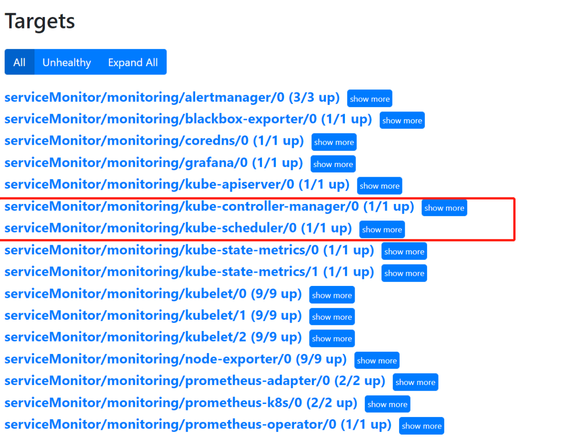
图15.10　查看Targets


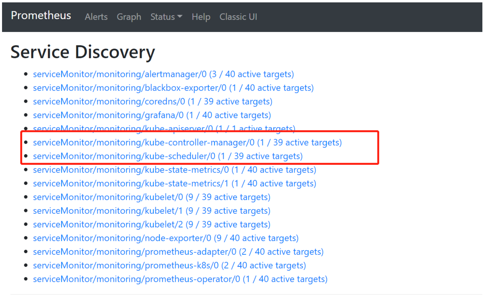
图15.11　查看Service Discovery

!!! example "参考"

    https://p8s.io/docs/operator/install/


此时告警也会消失，Grafana也能查看到Controller Manager的监控数据。Scheduler的排查和Controller Manager一致。

`kubernetesControlPlane-serviceMonitorKubeScheduler.yaml`

```yaml
apiVersion: monitoring.coreos.com/v1
kind: ServiceMonitor
metadata:
  labels:
    app.kubernetes.io/name: kube-scheduler
    app.kubernetes.io/part-of: kube-prometheus
  name: kube-scheduler
  namespace: monitoring
spec:
  endpoints:
  - bearerTokenFile: /var/run/secrets/kubernetes.io/serviceaccount/token
    interval: 30s
    port: https-metrics
    scheme: https
    tlsConfig:
      insecureSkipVerify: true
  jobLabel: app.kubernetes.io/name
  namespaceSelector:
    matchNames:
    - kube-system
  selector:
    matchLabels:
      app.kubernetes.io/name: kube-scheduler

---

apiVersion: v1
kind: Service
metadata:
  namespace: kube-system
  name: kube-scheduler
  labels: # 必须和上面的 ServiceMonitor 下面的 matchLabels 保持一致
    app.kubernetes.io/name: kube-scheduler
spec:
  selector:
    component: kube-scheduler
  ports:
    - name: https-metrics
      port: 10259
      # 需要注意现在版本默认的安全端口是10259
      targetPort: 10259 
```

综上所述，通过ServiceMonitor监控应用时，如果监控没有找到目标主机的排查步骤，排查步骤大致如下：

- 确认ServiceMonitor是否成功创建。
- 确认Prometheus是否生成了相关配置。
- 确认存在ServiceMonitor匹配的Service。
- 确认通过Service能够访问程序的Metrics接口。
- 确认Service的端口和Scheme、ServiceMonitor一致。


### 3.4 云原生应用监控

通过前面的学习，我们对Prometheus相关知识做了一些了解，也理解了云原生和非云原生应用的监控流程，接下来通过两个示例演示应用监控的基本流程。

除了 Kubernetes 集群中的一些资源对象、节点以及组件需要监控，有的时候我们可能还需要根据实际的业务需求去添加自定义的监控项，添加一个自定义监控的步骤也是非常简单的。

第一步建立一个 ServiceMonitor 对象，用于 Prometheus 添加监控项

第二步为 ServiceMonitor 对象关联 metrics 数据接口的一个 Service 对象

第三步确保 Service 对象可以正确获取到 metrics 数据

接下来我们就来为大家演示如何添加 etcd 集群的监控。无论是 Kubernetes 集群外的还是使用 kubeadm 安装在集群内部的 etcd 集群，我们这里都将其视作集群外的独立集群，因为对于二者的使用方法没什么特殊之处。


在安装Prometheus时，并没有对Etcd集群进行监控，Etcd集群是Kubernetes的数据库，掌握着Kubernetes最核心的数据，Etcd的状态和性能直接影响Kubernetes集群的状态，所以对Etcd集群的监控是非常重要的。

接下来通过Etcd的监控学习如何对云原生应用进行监控。

之前讲了，云原生应用会提供一个Metrics接口，可以直接获取到内部的运行信息，比如Etcd的内部数据可以通过2379的/metrics得到，和之前的kubelet类似。不同的是，Etcd对外的接口必须通过HTTPS协议访问，所以在请求时需要加上对应的证书，比如：

```shell
# curl -s --cert /etc/kubernetes/pki/etcd/etcd.pem --key /etc/kubernetes/pki/etcd/etcd-key.pem https://YOUR_ETCD_IP:2379/metrics -k | tail -1
```

证书的位置可以在Etcd配置文件中获得（注意配置文件的位置，不同的集群位置可能不同 ， Kubeadm 安 装 方 式 可 能 会在/etc/kubernetes/manifests/etcd.yml中)：

```shell
# grep -E "key-file|cert-file" /etc/kubernetes/manifests/etcd.yaml
    - --cert-file=/etc/kubernetes/pki/etcd/server.crt
    - --key-file=/etc/kubernetes/pki/etcd/server.key
    - --peer-cert-file=/etc/kubernetes/pki/etcd/peer.crt
    - --peer-key-file=/etc/kubernetes/pki/etcd/peer.key

```

可以看到，此时加上--cert和--key参数才可以访问Etcd的Metrics接口，所以在配置ServiceMonitor时需要加上证书的配置。


**1．创建Etcd ServiceMonitor**

首先，需要配置Etcd的Service和Endpoint：

`kubernetesControlPlane-serviceMonitorEtcd.yaml`

```yaml
apiVersion: monitoring.coreos.com/v1
kind: ServiceMonitor
metadata:
  name: etcd-k8s
  namespace: monitoring
  labels:
    k8s-app: etcd-k8s
spec:
  jobLabel: k8s-app
  endpoints:
    - port: port
      interval: 15s
  selector:
    matchLabels:
      k8s-app: etcd
  namespaceSelector:
    matchNames:
      - kube-system
```

需要注意将YOUR_ETCD_IP改成自己的Etcd主机IP，另外需要注意port的名称为https-metrics，要和后面的ServiceMonitor保持一致。之后创建该资源并查看Service的ClusterIP：

```sh
# kubectl create -f kubernetesControlPlane-serviceMonitorEtcd.yaml
servicemonitor.monitoring.coreos.com/etcd-k8s created
```


**2.创建Etcd Service**

但实际上现在并不能监控到 etcd 集群，因为并没有一个满足 ServiceMonitor 条件的 Service 对象与之关联：

```sh
# kubectl get svc -n kube-system -l k8s-app=etcd
No resources found in kube-system namespace.
```

所以接下来我们需要创建一个满足上面条件的 Service 对象，由于我们把 etcd 当成是集群外部的服务，所以要引入到集群中来我们就需要自定义 Endpoints 对象来创建 Service 对象了：

`etcd-service.yaml`

```yaml
apiVersion: v1
kind: Service
metadata:
  name: etcd-k8s
  namespace: kube-system
  labels:
    k8s-app: etcd
spec:
  type: ClusterIP
  clusterIP: None # 一定要设置 clusterIP:None
  ports:
    - name: port
      port: 2381
---
apiVersion: v1
kind: Endpoints
metadata:
  name: etcd-k8s
  namespace: kube-system
  labels:
    k8s-app: etcd
subsets:
  - addresses:
      - ip: 192.168.1.56 # 指定etcd节点地址，如果是集群则继续向下添加
        nodeName: etc-master
    ports:
      - name: port
        port: 2381
```

```sh
# kubectl create -f etcd-service.yaml
service/etcd-k8s created
endpoints/etcd-k8s created
```

我们这里创建的 Service 没有采用前面通过 label 标签的形式去匹配 Pod 的做法，因为前面我们说过很多时候我们创建的 etcd 集群是独立于集群之外的，这种情况下面我们就需要自定义一个 Endpoints，要注意 `metadata` 区域的内容要和 Service 保持一致，Service 的 clusterIP 设置为 None，新版本的 etcd 将 metrics 接口数据放置到了 2381 端口。直接创建该资源对象即可：

```sh
# kubectl get svc -n kube-system -l k8s-app=etcd
NAME       TYPE        CLUSTER-IP   EXTERNAL-IP   PORT(S)    AGE
etcd-k8s   ClusterIP   None         <none>        2381/TCP   37s
```

创建完成后，隔一会儿去Prometheus的Dashboard中查看targets，便会有etcd的监控项了：

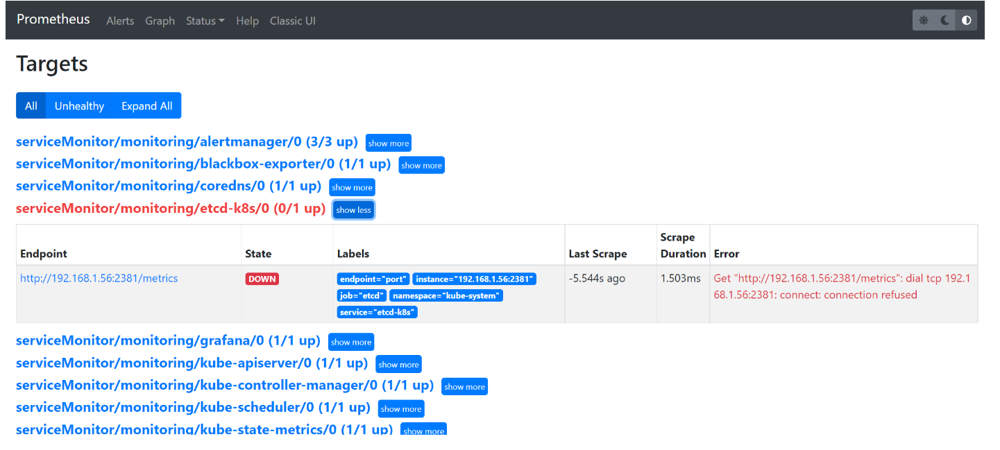

可以看到有一个明显的错误，2381 端口链接被拒绝，这是因为我们这里的 etcd 的 metrics 接口是监听在 `127.0.0.1` 这个 IP 上面的，所以访问会拒绝：

```
--listen-metrics-urls=http://127.0.0.1:2381
```

我们只需要在 `/etc/kubernetes/manifests/`目录下面（静态Pod默认的目录）的 `etcd.yaml` 文件中将上面的`listen-metrics-urls` 更改成节点IP即可：

```
--listen-metrics-urls=http://0.0.0.0:2381
```

当etcd重启生效后，查看etcd这个监控任务就正常了：
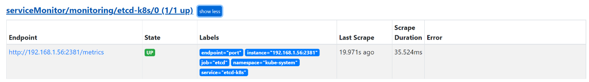


**3．配置Grafana**

依次单击“+”→Import，之后输入Etcd的Grafana Dashboard地址

数据采集到后，可以在 grafana 中导入编号为 `3070` 的 dashboard，就可以获取到 etcd 的监控图表：

之后就可以看到Etcd集群的状态，如图15.16所示。

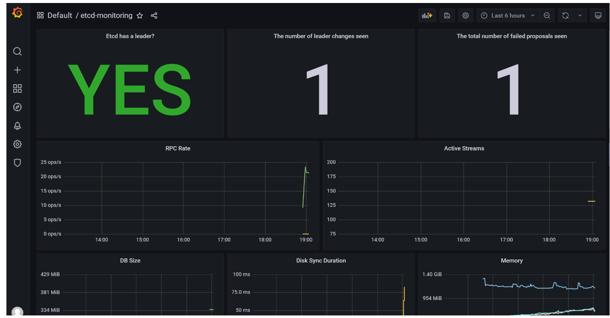

图15.16　查看Etcd监控


!!! example "参考文献"

    https://p8s.io/docs/operator/custom/?h=etc#etcd-%E7%9B%91%E6%8E%A7


### 3.5 非云原生监控Exporter

上一小节针对云原生应用Etcd进行了监控，可以看到符合云原生要素开发的应用，自带的都有一个Metrics接口，可以让监控平台直接采集到监控数据。

而非原生应用（如MySQL、Redis、Kakfa等）没有暴露Metrics接口，所以可以使用对应的Exporter采集数据，并暴露Metrics接口。本小节将使用MySQL作为一个测试用例，演示如何使用Exporter监控非云原生应用。

1．部署测试用例

首先部署MySQL至Kubernetes集群中，如果读者有需要监控的MySQL，可以忽略此步骤，直接配置MySQL的权限即可：

```shell
# kubectl create deploy mysql --image=registry.cn-beijing.aliyuncs.com/dotbalo/mysql:5.7.23
deployment.apps/mysql created
# kubectl set env deploy/mysql MYSQL_ROOT_PASSWORD=mysql
deployment.apps/mysql env updated
# 查看pod是否正常
# kubectl get po -l app=mysql
NAME                     READY   STATUS    RESTARTS   AGE
mysql-69d6f69557-8hdg6   1/1     Running   0          52s
```

创建Service暴露MySQL：

```shell
# kubectl expose deploy mysql --port 3306
service/mysql exposed
# kubectl get svc -l app=mysql
NAME    TYPE        CLUSTER-IP       EXTERNAL-IP   PORT(S)    AGE
mysql   ClusterIP   10.110.161.154   <none>        3306/TCP   24s
```

检查Service是否可用：

```shell
# telnet 10.110.161.154 3306
Trying 10.110.161.154...
Connected to 10.110.161.154.
Escape character is '^]'.
J
5.7.23/adMH4SqV,w+b'y?E8mysql_native_password
```

登录MySQL，创建Exporter所需的用户和权限（如果已经有需要监控的MySQL，直接执行此步骤即可）：

```sh
# kubectl exec -ti mysql-69d6f69557-5vnvg -- bash
root@mysql-69d6f69557-5vnvg:/# mysql -uroot -pmysql

mysql> CREATE USER 'exporter'@'%' IDENTIFIED BY 'exporter' WITH MAX_USER_CONNECTIONS 3;
Query OK, 0 rows affected (0.00 sec)

mysql> GRANT PROCESS, REPLICATION CLIENT, SELECT ON *.* TO 'exporter'@'%';
Query OK, 0 rows affected (0.00 sec)
mysql> quit
Bye
root@mysql-69d6f69557-5vnvg:/# exit
exit
```

配置MySQL Exporter采集MySQL监控数据：

mysql-exporter.yaml

```yaml
---
apiVersion: apps/v1
kind: Deployment
metadata:
  name: mysql-exporter
  namespace: monitoring
spec:
  replicas: 1
  selector:
    matchLabels:
      k8s-app: mysql-exporter
  template:
    metadata:
      labels:
        k8s-app: mysql-exporter
    spec:
      containers:
      - name: mysql-exporter
        image: registry.cn-beijing.aliyuncs.com/dotbalo/mysqld-exporter 
        env:
         - name: DATA_SOURCE_NAME
           value: "root:mysql@(mysql.default:3306)/"
        imagePullPolicy: IfNotPresent
        ports:
        - containerPort: 9104
---
apiVersion: v1
kind: Service
metadata:
  name: mysql-exporter
  namespace: monitoring
  labels:
    k8s-app: mysql-exporter
spec:
  type: ClusterIP
  selector:
    k8s-app: mysql-exporter
  ports:
  - name: api
    port: 9104
    protocol: TCP
```

注 意 DATA_SOURCE_NAME 的 配 置 ， 需要将
`exporter:exporter@(mysql.default:3306)/`改成自己的实际配置，格式为：
`USERNAME:PASSWORD@MYSQL_HOST_ADDRESS:MYSQL_PORT`。

创建Exporter：

```shell
# kubectl create -f mysql-exporter.yaml
deployment.apps/mysql-exporter created
service/mysql-exporter created

# kubectl get -f mysql-exporter.yaml
NAME                             READY   UP-TO-DATE   AVAILABLE   AGE
deployment.apps/mysql-exporter   1/1     1            1           9s

NAME                     TYPE        CLUSTER-IP       EXTERNAL-IP   PORT(S)    AGE
service/mysql-exporter   ClusterIP   10.105.237.248   <none>        9104/TCP   9s

```

通过该Service地址检查是否能正常获取Metrics数据：

```shell
# curl -s 10.105.237.248:9104/metrics | tail -1
promhttp_metric_handler_requests_total{code="503"} 0
```


2．配置ServiceMonitor和Grafana

配置Exporter后，Metrics接口已经有了，剩下的配置其实和云原生监控流程已经一样了。

首先配置ServiceMonitor，然后导入Grafana Dashboard即可。配置ServiceMonitor：

mysql-sm.yaml

```yaml
apiVersion: monitoring.coreos.com/v1
kind: ServiceMonitor
metadata:
  name: mysql-exporter
  namespace: monitoring
  labels:
    k8s-app: mysql-exporter
    namespace: monitoring
spec:
  jobLabel: k8s-app
  endpoints:
  - port: api
    interval: 30s
    scheme: http
  selector:
    matchLabels:
      k8s-app: mysql-exporter
  namespaceSelector:
    matchNames:
    - monitoring
```

需要注意matchLabels和endpoints的配置，要和MySQL的Service一致。
之后创建该ServiceMonitor：

```sh
# kubectl create -f mysql-sm.yaml
servicemonitor.monitoring.coreos.com/mysql-exporter created
```

接下来即可在Prometheus Web UI看到该监控，如图15.17所示。

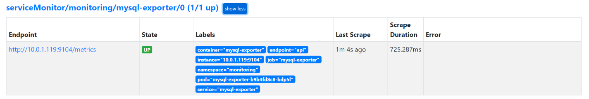

导入Grafana Dashboard, 地址为https://grafana.com/grafana/dashboards/6239，导入步骤和之前类似，在此不再演示。


导入完成后，即可在Grafana看到监控数据，如图15.18所示。


图15.18　查看MySQL监控


## 4.黑盒监控

前面的章节对MySQL或者Etcd的监控都是监控应用本身，也就是程序内部的一些指标，这类监控关注的是原因，一般为出现问题的根本，此类监控称为白盒监控。

还有一类监控关注的是现象，也就是正在发生的告警，比如某个网站突然慢了，或者打不开了。此类告警是站在用户的角度看到的东西，比较关注现象，表示正在发生的问题，这类监控称为黑盒监控。

白盒监控可以通过Exporter采集数据，黑盒监控也可以通过Exporter采集数据，新版本的Prometheus Stack已经默认安装了Blackbox Exporter，可以用其采集某个域名、接口或者TCP连接的状态、是否可用等。

新版Prometheus Stack已经默认安装了Blackbox Exporter，可以通过以下命令查看：

```shell
# kubectl get po -n monitoring -l app.kubernetes.io/name=blackbox-exporter
NAME                                 READY   STATUS    RESTARTS   AGE
blackbox-exporter-6798fb5bb4-nqstp   3/3     Running   0          14h

```

同时也会创建一个Service，可以通过该Service访问Blackbox Exporter并传递一些参数：

```shell
# kubectl get svc -n monitoring -l app.kubernetes.io/name=blackbox-exporter
NAME                TYPE        CLUSTER-IP       EXTERNAL-IP   PORT(S)              AGE
blackbox-exporter   ClusterIP   10.105.208.175   <none>        9115/TCP,19115/TCP   14h
```

比如检测www.baidu.com（使用任何一个公网域名或者公司内的域名探测即可）网站的状态，可以通过如下命令进行检查：

```shell
# curl -s "http://10.105.208.175:19115/probe?target=www.baidu.com&module=http_2xx" |tail -3
# HELP probe_success Displays whether or not the probe was a success
# TYPE probe_success gauge
probe_success 1
```

probe是接口地址，target是检测的目标，module是指使用哪个模块进行探测。

如果集群中没有配置Blackbox Exporter, 可以参考如下进行安装:

https://github.com/prometheus/blackbox_exporter 


## 5.Prometheus静态配置

前面几个小节配置监控目标时，用的都是ServiceMonitor，但是ServiceMonitor可能会有一些限制 。 比如 ， 如果没有安装 Prometheus
Operator，可能就无法使用ServiceMonitor，另外并不是所有的监控都能使用ServiceMonitor进行配置，或者使用ServiceMonitor配置显得过于烦琐。

上一节讲解的黑盒监控使用ServiceMonitor就显得过于复杂，使用传统的配置方式，直接将target传递给Blackbox Exporter即可。虽然本书使用的是Operator安装Prometheus，但是它也是支持静态配置的，可以通过以下步骤开启Prometheus的静态配置。

首先创建一个空文件，然后通过该文件创建一个Secret，这个Secret即可作为Prometheus的静态配置：

```sh
# touch prometheus-additional.yaml
# kubectl create secret generic additional-configs --from-file=prometheus-additional.yaml -n monitoring
secret/additional-configs created
```

创建完Secret后，需要编辑Prometheus的配置（见图15.19）：

```sh
# kubectl edit prometheus -n monitoring k8s
```

```yaml
spec:
  additionalScrapeConfigs:
    key: prometheus-additional.yaml
    name: additional-configs
    optional: true
  alerting:
    alertmanagers:
    - apiVersion: v2
      name: alertmanager-main
      namespace: monitoring
      port: web
  enableFeatures: []
  externalLabels: {}
  image: quay.io/prometheus/prometheus:v2.29.1
  nodeSelector:
    kubernetes.io/os: linux
```

添加上述配置后保存退出，无须重启Prometheus的Pod即可生效。

之后在prometheusadditional.yaml文件内编辑一些静态配置，此处用黑盒监控的配置进行演示：

```yaml
- job_name: "blackbox"
  # 这里的指标路径是 /probe
  metrics_path: /probe
  params:
    # 使用 http 模块
    modelus: [http_2xx]
  static_configs:
    # 检测的目标
    - targets:
        - https://www.baidu.com
        - https://youdianzhishi.com
  relabel_configs:
    - source_labels: [__address__]
      target_label: __param_target
    - source_labels: [__param_target]
      target_label: instance
    - target_label: __address__
      replacement: blackbox-exporter:19115
      
- job_name: 'other-node_exporter'
  static_configs:
  - targets: ['172.18.0.85:9100',"172.18.0.84:9100","172.18.0.83:9100","172.18.0.82:9100"]
  
  
- job_name: 'node-exporter-others'
  static_configs:
    - targets:
      - *.*.*.149:31190
      - *.*.*.150:31190
      - *.*.*.122:31190

- job_name: 'mysql-exporter'
  static_configs:
    - targets:
      - *.*.*.104:9592
      - *.*.*.125:9592
      - *.*.*.128:9592

- job_name: 'nacos-exporter'
  metrics_path: '/nacos/actuator/prometheus'
  static_configs:
    - targets:
      - *.*.*.113:8848
      - *.*.*.114:8848
      - *.*.*.118:8848

- job_name: 'elasticsearch-exporter'
  static_configs:
  - targets:
    - *.*.*.110:9597
    - *.*.*.107:9597
    - *.*.*.117:9597

- job_name: 'zookeeper-exporter'
  static_configs:
  - targets:
    - *.*.*.115:9595
    - *.*.*.121:9595
    - *.*.*.120:9595

- job_name: 'nginx-exporter'
  static_configs:
  - targets:
    - *.*.*.149:9593
    - *.*.*.150:9593
    - *.*.*.122:9593

- job_name: 'redis-exporter'
  static_configs:
  - targets:
    - *.*.*.109:9594

- job_name: 'redis-exporter-targets'
  static_configs:
    - targets:
      - redis://*.*.*.146:7090
      - redis://*.*.*.144:7090
      - redis://*.*.*.133:7091
  metrics_path: /scrape
  relabel_configs:
    - source_labels: [__address__]
      target_label: __param_target
    - source_labels: [__param_target]
      target_label: instance
    - target_label: __address__
      replacement: *.*.*.109:9594
```


- targets：探测的目标，根据实际情况进行更改。
- params：使用哪个模块进行探测。
- replacement：Blackbox Exporter的地址。

可以看到此处的内容和传统配置的内容一致，只需要添加对应的job即可。之后通过该文件更新该Secret：

```sh
# kubectl create secret generic additional-configs --from-file=prometheus-additional.yaml --dry-run=client -o yaml |kubectl replace -f - -n monitoring
secret/additional-configs replaced
```

更新完成后，稍等一分钟即可在Prometheus Web UI看到该配置，如图15.20所示。

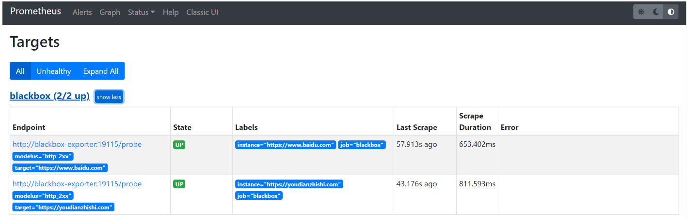

图15.20　查看黑盒监控Target

监控状态为UP后, 导入黑盒监控的模板（https://grafana.com/grafana/dashboards/13659）即可,如图15.21所示。


以上演示了黑盒监控的HTTP模块的使用，其他模块的使用方法类似，可以参考：

> https://github.com/prometheus/blackbox_exporter。


## 6.Prometheus监控Windows(外部)主机

上一节演示了使用Prometheus静态配置监控网站的可用性，接下来再通过一个实例演示静态配置的使用，同时也学习一下Kubernetes集群外部的服务是如何监控的。

使用Prometheus监控Windows主机和Linux主机并无太大区别，都是使用社区的Exporter采集数据，之后暴露一个Metrics接口，可以让Prometheus采集到主机的数据。

其中 

- 监控Linux的Exporter是 https://github.com/prometheus/node_exporter 
- 监控Windows主机的Exporter是 https://github.com/prometheus-community/windows_exporter

首先下载对应的Exporter至Windows主机 （ MSI文件下载地址 ：https://github.com/prometheus-community/windows_exporter/releases），如图15.22所示。

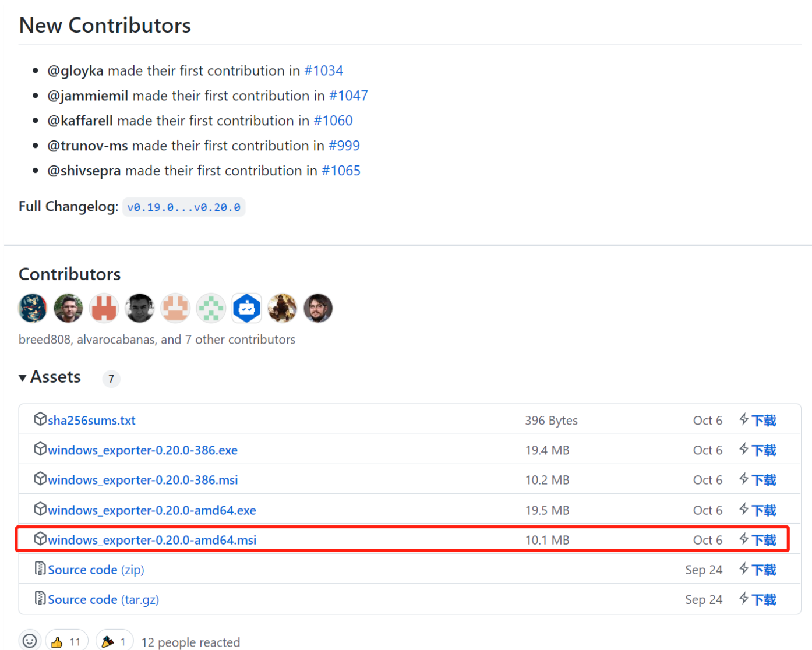

图15.22　下载Windows监控组件


下载完成后，双击打开即可完成安装，之后可以在任务管理器上看到对应的进程，如图15.23所示。

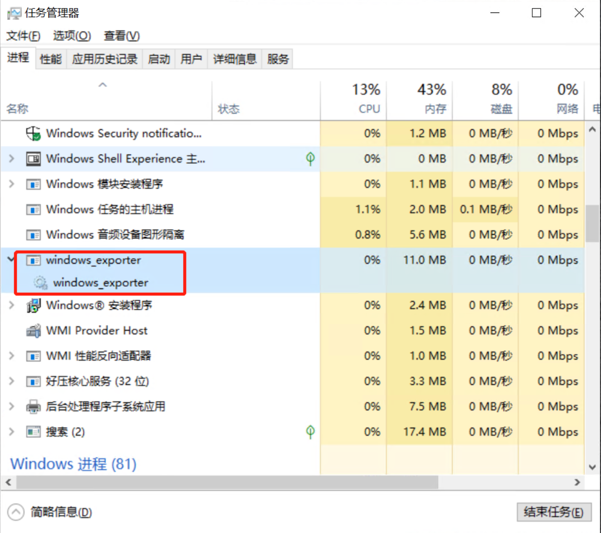


Windows Exporter会暴露一个9182端口，可以通过该端口访问Windows的监控数据。接下来在静态配置文件中添加以下配置：

Targets配置的是监控主机，如果是多台Windows主机，配置多行即可，当然每台主机都需要配置Exporter。之后可以在Prometheus Web UI看到监控数据，如图15.24所示。

```yaml
- job_name: 'WindowsServerMonitor'
  static_configs:
    - targets:
      - "192.168.1.164:9182"
      labels:
        server_type: 'windows'
  relabel_configs:
    - source_labels: [__address__]
      target_label: instance
```

Targets配置的是监控主机，如果是多台Windows主机，配置多行即可，当然每台主机都需要配置Exporter。

之后可以在Prometheus Web UI看到监控数据，如图15.24所示。

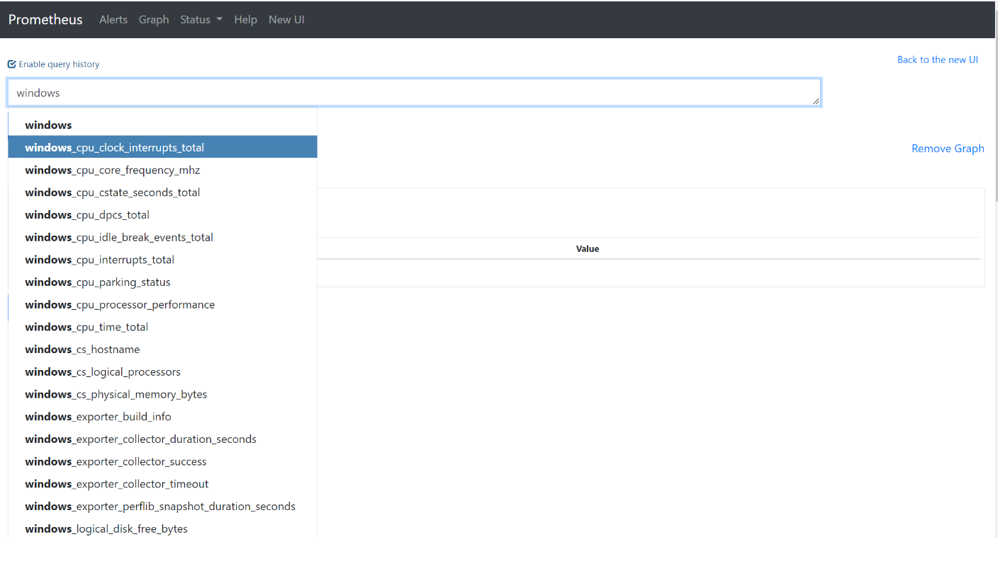


图15.24　查看Windows监控指标

之后导入模板(地 址:https://grafana.com/grafana/dashboards/12566)即可，如图15.25所示。

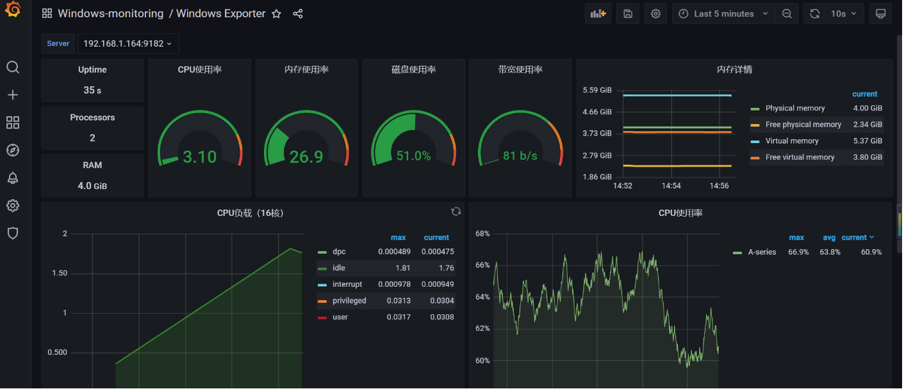


可以看到Prometheus的静态配置大致流程一致，配置内容也类似，所以一些不方便使用ServiceMonitor进行配置的，可以采用静态配置的方式，当然静态配置也可以采用ServiceMonitor方式。


## 7.Prometheus语法PromQL入门

前面学习了云原生应用、非云原生应用、黑盒监控和集群外部主机监控，同时学习了ServiceMonitor和静态配置的使用，掌握这些以后，生产环境的大部分场景都可以进行监控。

但是监控并不是最终的目的，虽然通过Grafana的Dashboard能看到一些监控大屏，但是需要监控的地方太多，并且技术人员不可能随时随地都盯着Dashboard，所以需要对严重的告警进行通知。

接下来就需要用到Prometheus的另一个组件—Alertmanager，主要用来进行告警的通知，可以采用邮箱、钉钉、微信、Slack、Webhook等进行通知。


### 7.1 PromQL语法初体验

在学习告警之前，必须掌握基础的Prometheus数据查询语法 。Prometheus查询语法叫PromQL，就像MySQL的SQL语句。

首先根据查询语法查出来想要的数据，之后根据条件判断即可进行告警。

PromQL Web UI的Graph选项卡提供了简单的用于查询数据的入口，对于PromQL的编写和校验都可以在此位置，如图15.26所示。

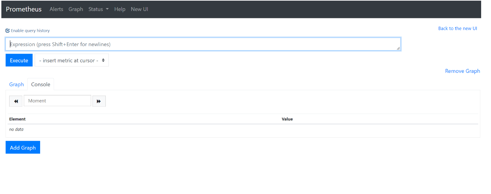
图15.26　选择Graph


我们可以先输入up，然后单击Execute，就能查到监控正常的Target，如图15.27所示。

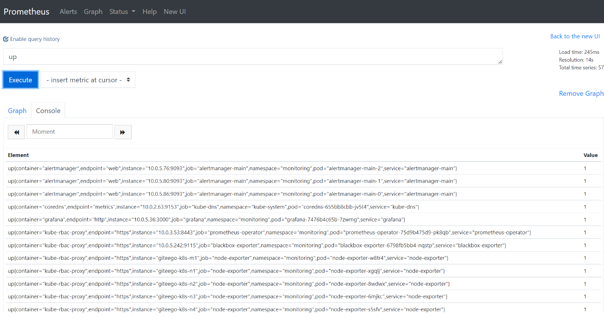

up命令可以查到所有正常监控的目标，如果监控的目标过多，可能会查询出来很多数据。此时可以根据一些条件进行过滤，就像SQL语句的where语法。比如通过标签选择器过滤出job为node-exporter的监控，语法为：up{job="node-exporter"}，如图15.28所示。

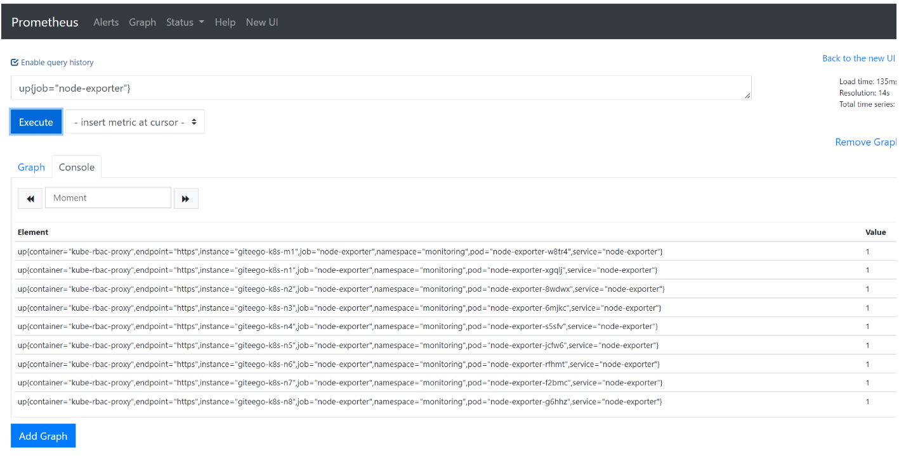
图15.28　查看主机监控

注意此时up{job="node-exporter"}属于绝对匹配，Prom?L也支持如下表达式：

- !=：表示不等于某个值的指标，比如up{job!="node-exporter"}表示job不为node-exporter的指标。
- =\~：表示符合正则表达式的指标，比如up{job=~"node.*"}表示所有以node开头的指标。
- !~：和=~类似，=~表示正则匹配，!~表示正则不匹配，也就是排除一些指标。

如果想要查看主机监控的指标有哪些，可以输入node，会提示所有主机监控的指标，如图15.29所示。
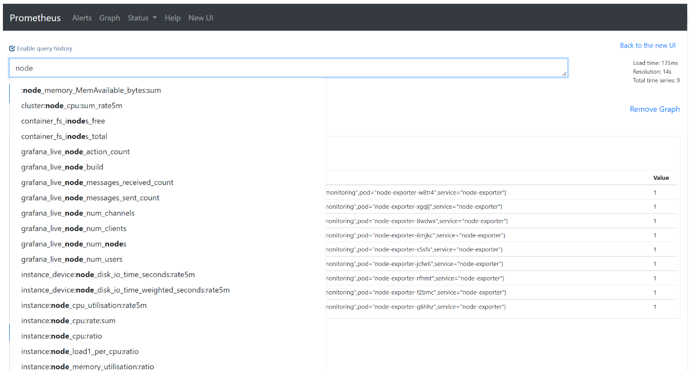
图15.29　查看主机监控指标


假如想要查询Kubernetes集群中每个宿主机的磁盘总量，可以使用node_filesystem_size_bytes，如图15.30所示。

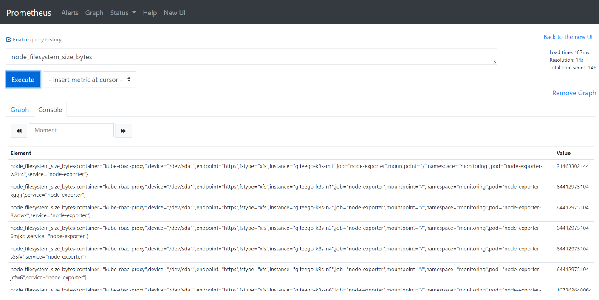
图15.30　查看磁盘空间

可以看到此时查询结果过多，我们可以进一步进行处理，比如只查询根分区的大小，根据前文提到的标签选择器，加上mountpoint匹配规则node_filesystem_size_bytes{mountpoint="/"}即可，如图15.31所示。

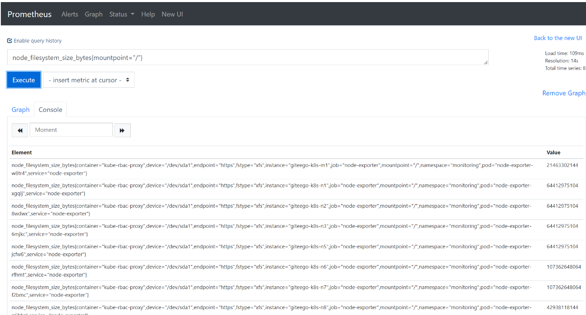
图15.31　查看根分区空间大小


或者查询分区不是/boot，且磁盘是/dev/开头的分区大小（结果不再展示）：

```
node_filesystem_size_bytes{device=~"/dev/.*",mountpoint!="/boot"}
```

上述的PromQL查询出来的数据都是瞬时值，也就是Prometheus采集到的最新的数据，在时序数据库中被称为瞬时向量。因为Prometheus本身是一个时序数据库，所以也可以查询某个指标一段时间内的数据，比如查询主机k8s-master01在最近5分钟可用的磁盘空间变化（见图15.32）：

```
node_filesystem_avail_bytes{instance="giteego-k8s-m1",mountpoint="/",device="/dev/sda1"}[5m]
```

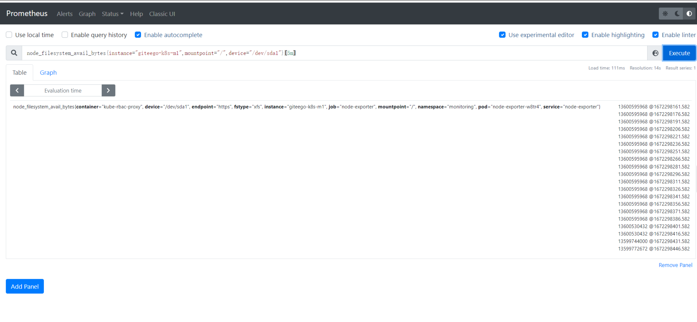
图15.32　查看最近5分钟的数据


可以看到查询的数据有一个时间戳（查询结果@符号后面），这个时间戳记录了数据样本的记录时间。

并且能看到有多条查询结果为这5分钟内的所有数据，这种查询一段时间范围内的数据结果被称为区间向量。目前支持的范
围单位如下：

- s：秒。
- m：分钟。
- h：小时。
- d：天。
- w：周。
- y：年。

除了能查询区间向量和瞬时向量的数据，Prometheus也支持查询几分钟之前的数据或者几分钟之前的一段时间范围内的数据，比如查询10分钟之前磁盘的可用空间，只需要指定offset参数即可：

```
node_filesystem_avail_bytes{instance="giteego-k8s-m1",mountpoint="/",device="/dev/sda1"} offset 10m
```

或者查询10分钟之前，5分钟区间的磁盘可用空间的变化：

```
node_filesystem_avail_bytes{instance="giteego-k8s-m1",mountpoint="/",device="/dev/sda1"}[5m] offset 10m
```

### 7.2 PromQL操作符

上一小节我们通过PromQL的语法查到了主机磁盘的空间数据，查询结果如图15.33所示。

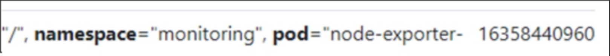
图15.33　查看主机磁盘空间数据

可以看到此时的数据为16358440960，这个结果并不适合直接阅读，因为它返回的数据单位为字节（bytes，其他指标可能是其他单位）。可以通过以下命令将字节转换为GB或者MB：

```
node_filesystem_avail_bytes{instance="giteego-k8s-m1",mountpoint="/",device="/dev/sda1"} / 1024 / 1024 / 1024
```

也可以将1024/1024/1024改为(1024 ^ 3)：

```
node_filesystem_avail_bytes{instance="giteego-k8s-m1",mountpoint="/",device="/dev/sda1"} / (1024 ^3) 
```

查询结果如图15.34所示，此时为12GB左右。

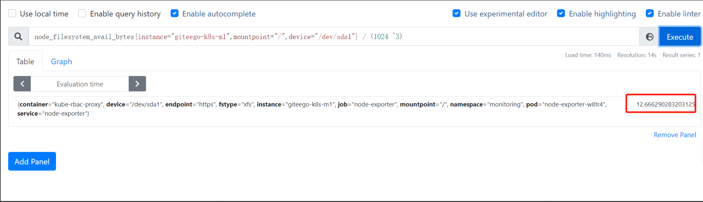
图15.34　查看空间大小


此时可以在宿主机上比对数据是否正确：

```sh
# df -Th|grep /dev/sda1
/dev/sda1      xfs        20G  7.4G   13G  37% /
```

上述使用的“/”为数学运算的“除”，“^”为幂运算，同时也支持如下运算符：

- +：加。
- ‒：减。
- *：乘。
- /：除。
- ^：幂运算。
- %：求余。

通过不同的指标结合不同的表达式可以查询到不同的数据，比如要查询k8s-master01根区分磁盘的可用率，可以通过如下指令进行计算：

```
node_filesystem_avail_bytes{instance="giteego-k8s-m1",mountpoint="/",device="/dev/sda1"}  /node_filesystem_size_bytes{instance="giteego-k8s-m1",mountpoint="/",device="/dev/sda1"}
```

node_filesystem_avail_bytes 为 系 统 可 用 的 磁 盘 空 间 ，node_filesystem_size_bytes为磁盘空间的总大小，所以两者的比值即为磁
盘空间的可用率。当然也可以去掉instance参数，查询所有主机根分区的可用率（见图15.35）：

```
node_filesystem_avail_bytes{mountpoint="/"} /node_filesystem_size_bytes{mountpoint="/"}
```

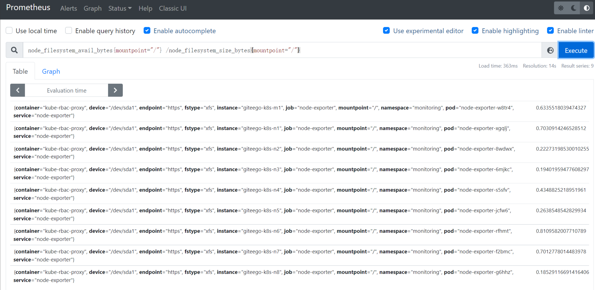
图15.35　查看磁盘可用率


也可以将结果乘以100直接得到百分比：

```
node_filesystem_avail_bytes{mountpoint="/"} /node_filesystem_size_bytes{mountpoint="/"} * 100
```


通过上述操作符的学习，我们可以查询到主机磁盘的使用信息，读者可以根据上述语句尝试查询其他指标信息，比如CPU、内存的使用率等，如图15.36所示。

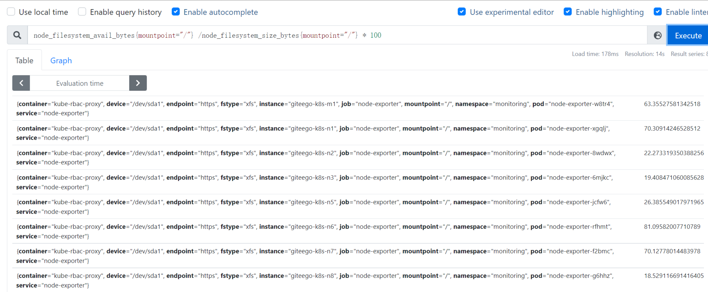


图15.36　查看磁盘可用百分比

虽然可以通过上述语句查询到一些指标，但是这些指标可能并非我们最终想要的。

比如想要找到集群中根分区空间可用率大于60%的主机，此时可以将查询语句添加一个判断条件，得到自己想要的结果，比如：

```
node_filesystem_avail_bytes{mountpoint="/"} /node_filesystem_size_bytes{mountpoint="/"} * 100 >60
```

结果如图15.37所示。

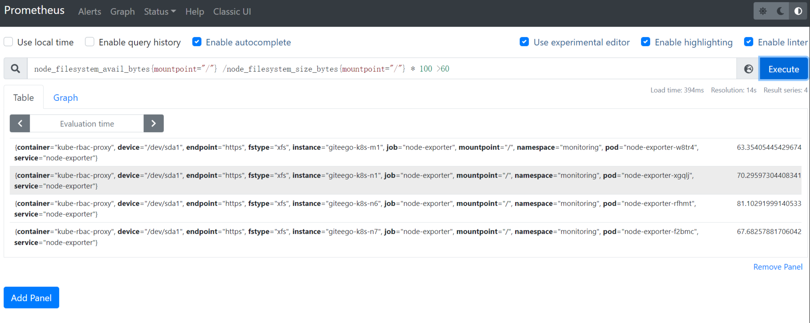
图15.37　查看磁盘可用率大于60%的主机


此时得到的结果为监控目标主机磁盘可用率大于60%的主机，如果将大于60改为小于20，就是查询所有磁盘可用率小于20%的主机，此时是不是就应该产生告警？所以说将PromQL的语法稍加改造即为我们想要的告警条件。

```
node_filesystem_avail_bytes{mountpoint="/"} /node_filesystem_size_bytes{mountpoint="/"} * 100 <20
```

除了以上判断语法外，PromQL也支持如下判断：

- ==：相等。
- !=：不相等。
- ：大于。
- <：小于。
- =：大于等于。
- <=：小于等于。

上述语法只是做了一个简单的判断，比如只过滤了磁盘可用率大于60%的指标，如果想要过滤其他范围也是支持的，比如磁盘可用率大于30%小于等于60%的主机：

```
30 < node_filesystem_avail_bytes{mountpoint="/"} /node_filesystem_size_bytes{mountpoint="/"} * 100 <=60
```

在语句的前面加上“30<”，后面加上“<=”60。也可以用and进行联合查询：

```
(node_filesystem_avail_bytes{mountpoint="/"} /node_filesystem_size_bytes{mountpoint="/"}) * 100 > 30 and (node_filesystem_avail_bytes{mountpoint="/"} /node_filesystem_size_bytes{mountpoint="/"}) * 100 <= 60
```

除了and外，也支持or和unless：

- and：并且。
- or：或者。
- unless：排除。

由上可知，and是必须两个条件都符合，or只需要符合其中一个即可，读者可以自行练习。

而unless是排除某个指标，比如查询主机磁盘剩余空间，并且排除掉shm和tmpfs的磁盘：

```
node_filesystem_free_bytes unless node_filesystem_free_bytes{device=~"shm|tmpfs"}
```

当然，这个语法也可以直接写为：

```
node_filesystem_free_bytes{device!~"shm|tmpfs"}
```


### 7.3 PromQL常用函数

上一小节使用PromQL查询了一些指标，接下来通过PromQL一些常用的函数对数据进一步处理。比如使用sum函数统计当前监控目标所有主机根分区剩余的空间（见图15.38）：

```
sum(node_filesystem_free_bytes{mountpoint="/"}) / 1024^3
```

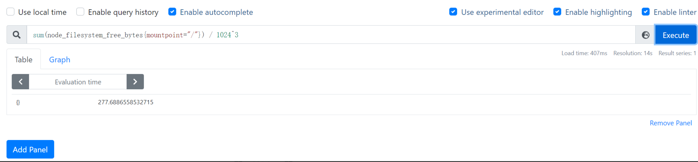
图15.38　sum统计


也可以用同样方式计算所有的请求总量：

```
sum(http_requests_total)
```

sum(http_request_total)是对所有的请求进行汇总，如果想要统计更加细粒度的指标，可以加上对应的匹配条件，比如想要统计所有状态码为200的请求。

接下来通过http_request_total学习细粒度的统计，首先看一下http_request_total的数据类型是怎样的 。 

可以直接查询http_request_total的数据（见图15.39）：

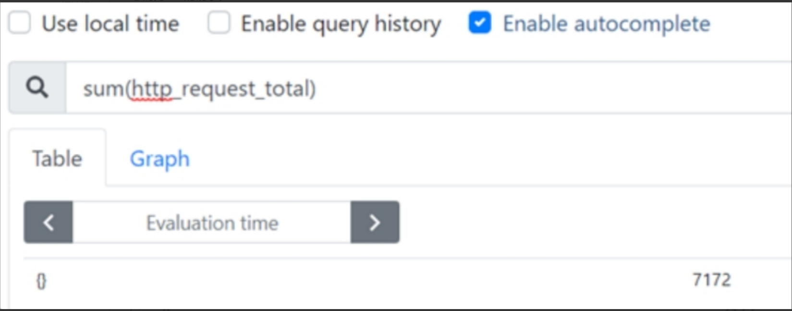
图15.39　sum统计请求数


上面只展示了一条数据，可以看到有handler、statuscode和method，也就是该条数据可以代表访问根路径状态为200且请求方式为get的统计，数量为10。

由该条数据结合sum函数，可以根据statuscode字段统计请求数据（见图15.40）：

```
sum(http_request_total) by (statuscode)
```

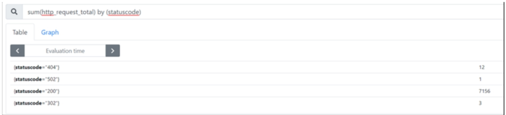
图15.40　根据字段进行统计


可以看到状态码为404的请求次数是12，状态码为200的请求次数是7156。同时也可以根据statuscode和handler两个指标进一步统计（见图15.41）：

```
sum(http_request_total) by (statuscode, handler)
```


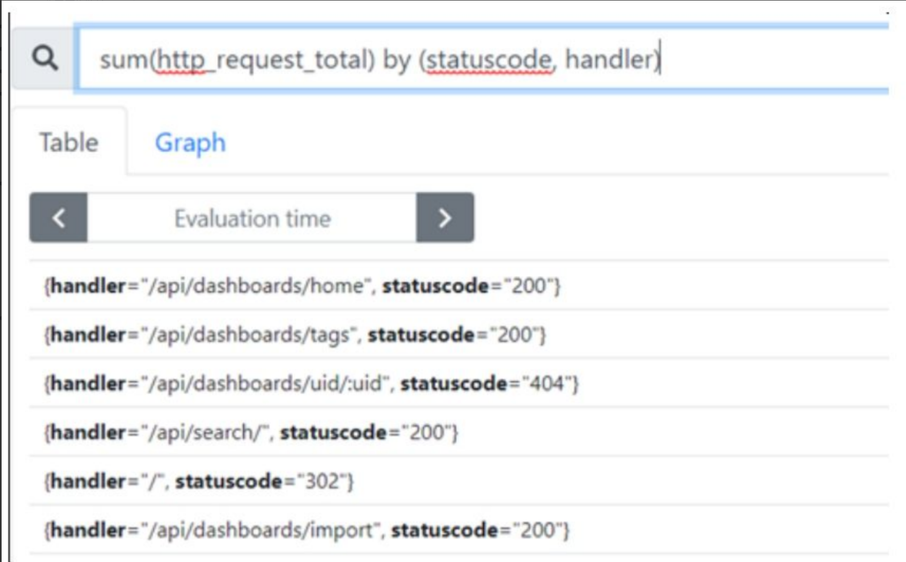
图15.41　根据多个字段统计


上述语句可以统计出访问某个路径且状态码为某个值的统计结果。

此时我们可以继续使用topk函数，找到统计结果中次数最多的几个结果。比如找到排名前5的数据（为节省篇幅，结果不再展示）：

```
topk(5, sum(http_request_total) by (statuscode, handler))
```

PromQL开箱即用的函数有很多，比如取最后3个数据：

```
grafana(3, sum(http_request_total) by (statuscode, handler))
```

找出统计结果中最小的数据：

```
min(node_filesystem_avail_bytes{mountpoint="/"})
```

最大的数据：

```
max(node_filesystem_avail_bytes{mountpoint="/"})
```

平均值：

```
avg(node_filesystem_avail_bytes{mountpoint="/"})
```

四舍五入，向上取最接近的整数，比如2.79→3：

```
ceil(node_filesystem_files_free{mountpoint="/"} / 1024 / 1024)
```

向下取整数，比如2.79→2：

```
floor(node_filesystem_files_free{mountpoint="/"} / 1024 / 1024)
```

对结果进行正向排序：

```
sort(sum(http_request_total) by (handler, statuscode))
```

对结果进行逆向排序：

```
sort_desc(sum(http_request_total) by (handler, statuscode))
```

predict_linear函数可以用于预测分析和预测性告警，比如可以根据一天的数据预测4个小时后磁盘分区的空间会不会小于0：

```
predict_linear(node_filesystem_files_free{mountpoint="/"}[1d],4*3600) < 0
```

除了上述函数，还有几个比较重要的函数，比如increase、rate、irate。

其中increase用于计算在一段时间范围内数据的增长，rate和irate用于计算增长率。比如查询某个请求在1小时内增长了多少：

```
increase(http_request_total{handler="/api/datasources/proxy/:id/*",method="get",namespace="monitoring",service="grafana",statuscode="200"}[1h])
```

将1小时增长的数量除以该时间即为增长率：

```
increase(http_request_total{handler="/api/datasources/proxy/:id/*",method="get",namespace="monitoring",service="grafana",statuscode="200"}[1h]) / 3600
```

当然，increase也可以用于磁盘、CPU、内存等指标，读者可以发挥一下自己的想象。

相对于increase，rate可以直接计算出某个指标在给定时间范围内的增长率，比如还是计算1小时的增长率，可以用rate函数进行计算：

```
rate(http_request_total{handler="/api/datasources/proxy/:id/*",method="get",namespace="monitoring",service="grafana",statuscode="200"}[1h])
```

在使用rate和increase时，难免会遇到一个问题，就是常说的“长尾效应”，也就是某个指标一直处于一个数值，这个增长率即为0，此时会出现误判。

比如某个主机的磁盘空间已经在昨天达到了100%，此时查询1小时的增长率，由于没有变化，因此无法计算在这个时间窗口的平均增长率，就意味着无法反映此问题。


PromQL针对“长尾效应”提供了一个更加灵敏的函数：

irate，同样用于计算区间向量的增长速率，但是irate计算的是瞬时增长率，即irate是通过
区间向量中最后两个样本数据来计算区间向量的增长率的，这种方式可以适当避免一些指标的“长尾效应”。

虽然irate较rate提供了更高的灵敏度，但是如果需要分析长期趋势，或者在配置告警规则时，irate过高的灵敏度会造成干扰，针对长期趋势分析和告警规则，更推荐使用rate函数。

实际应用环境中如果需要了解更多关于PromQL函数的内容，读者可以从官网https://prometheus.io/docs/prometheus/2.4/querying/functions/中继续学习。


## 8.Alertmanager告警入门

前面介绍了一些比较常用的Prometheus查询语法，同时也学习了告警语法的编写方法。

本节我们学习Prometheus的告警组件Alertmanager，看一下如何使用一些常用的媒介发送告警通知，同时也会学习Alertmanager的路由
规则，将告警进行分组。


### 8.1 Alertmanager配置文件解析

首先看一个简单的Alertmanager配置示例：

```yaml
## Alertmanager 配置文件
global:
  resolve_timeout: 5m
  # smtp配置
  smtp_from: "prom-alert@example.com"
  smtp_smarthost: 'email-smtp.us-west-2.amazonaws.com:465'
  smtp_auth_username: "user"
  smtp_auth_password: "pass"
  smtp_require_tls: true
  
# email、企业微信的模板配置存放位置，钉钉的模板会单独讲如果配置。
templates:
  - '/data/alertmanager/templates/*.tmpl'
# 路由分组
route:
  receiver: Default
  group_by:
  - namespace
  - job
  - alertname
  routes:
  - receiver: Watchdog
    match:
      alertname: Watchdog
  - receiver: Critical
    match:
      severity: critical
  group_wait: 30s
  group_interval: 5m
  repeat_interval: 10m
  
# 抑制器配置
inhibit_rules:
  - source_match: # 源标签警报触发时抑制含有目标标签的警报，在当前警报匹配 status: 'High'
      severity: critical
    target_match_re:
      severity: warning|info
    equal:
    - namespace
    - alertname
  - source_match:
  	  severity: warning
    target_match_re:
      severity: info
    equal:
    - namespace
    - alertname
      
# 接收器指定发送人以及发送渠道
receivers:
# ops分组的定义
- name: ops
  email_configs:
  - to: '9935226@qq.com,10000@qq.com'
    send_resolved: true
    headers: 
      subject: "[operations] 报警邮件"
      from: "警报中心"
      to: "小煜狼皇" 
  # 钉钉配置
  webhook_configs:
  - url: http://localhost:8070/dingtalk/ops/send
    # 企业微信配置
  wechat_configs:
  - corp_id: 'ww5421dksajhdasjkhj'
    api_url: 'https://qyapi.weixin.qq.com/cgi-bin/'
    send_resolved: true
    to_party: '2'
    agent_id: '1000002'
    api_secret: 'Tm1kkEE3RGqVhv5hO-khdakjsdkjsahjkdksahjkdsahkj'

# web
- name: web
  email_configs:
  - to: '9935226@qq.com'
    send_resolved: true
    headers: { Subject: "[web] 报警邮件"} # 接收邮件的标题
  webhook_configs:
  - url: http://localhost:8070/dingtalk/web/send
  - url: http://localhost:8070/dingtalk/ops/send
# db
- name: db
  email_configs:
  - to: '9935226@qq.com'
    send_resolved: true
    headers: { Subject: "[db] 报警邮件"} # 接收邮件的标题
  webhook_configs:
  - url: http://localhost:8070/dingtalk/db/send
  - url: http://localhost:8070/dingtalk/ops/send
# hadoop
- name: hadoop
  email_configs:
  - to: '9935226@qq.com'
    send_resolved: true
    headers: { Subject: "[hadoop] 报警邮件"} # 接收邮件的标题
  webhook_configs:
  - url: http://localhost:8070/dingtalk/hadoop/send
  - url: http://localhost:8070/dingtalk/ops/send
```

从配置文件可以看出，Alertmanager的配置主要分为5大块：

- Global：全局配置，主要进行一些通用的配置，比如邮件通知的账号、密码、SMTP服务器、微信告警等。Global块配置下的配置选项在本配置文件内的所有配置项下可见，但是文件内其他位置的子配置可以覆盖Global配置。

- Templates：用于放置自定义模板的位置。
- Route：告警路由配置，用于告警信息的分组路由，可以将不同分组的告警发送给不同的收件人。比如将数据库告警发送给DBA，服务器告警发送给OPS。
- Inhibit_rules：告警抑制，主要用于减少告警的次数，防止“告警轰炸”。比如某个宿主机宕机，可能会引起容器重建、漂移、服务
  不可用等一系列问题，如果每个异常均有告警，会一次性发送很多告警，造成告警轰炸，并且也会干扰定位问题的思路，所以可以使
  用告警抑制，屏蔽由宿主机宕机引来的其他问题，只发送宿主机宕机的消息即可。
- Receivers：告警收件人配置，每个receiver都有一个名字，经过route分组并且路由后需要指定一个receiver，就是在此位置配置
  的。

了解完Alertmanager主要的配置块后，接下来对Alertmanager比较重要的Route单独讲解，其他配置会在实践中进行补充。

### 8.2 Alertmanager路由规则

前文提到过Route是告警的路由配置，它可以让告警根据分组发送给对应的人或者小组，这一块的配置是Alertmanager比较复杂且经常变更的配置，所以本小节将讲解一下Alertmanager的路由配置。

从上述配置文件中，截取Route配置：

```yaml
# 路由分组
route:
  receiver: Default
  group_by:
  - namespace
  - job
  - alertname
  routes:
  - receiver: Watchdog
    match:
      alertname: Watchdog
  - receiver: Critical
    match:
      severity: critical
  group_wait: 30s
  group_interval: 5m
  repeat_interval: 10m
```

从配置文件可以看出，路由配置块的顶级配置由route开始，它是整个路由的入口，称作根路由。

每一条告警进来后，都先进入route，之后根据告警自身的标签和route.group_by配置的字段进行分组。比如可以根据job、
cluster或者其他自定义的标签名称进行分组，分组后进入子路由（通过route.routes配置子路由），进一步进行更加细粒度的划分，比如job名称包含mysql的发送给DBA组。

除了group_by和routes外，Route还有以下常用的配置：

- receiver：告警的通知目标，需要和receivers配置中的name进行匹配。需要注意的是，route.routes下也可以有receiver配置，优先级高于route.receiver配置的默认接收人，当告警没有匹配到子路由时,会使用route.receiver进行通知,比如上述配置中的Default。

- group_by ： 分组配置,值类型为列表。比如配置成['job','severity']，代表告警信息包含job和severity标签的会进行分组，且标签的key和value都相同才会被分到一组。

- continue：决定匹配到第一个路由后，是否继续后续匹配。默认为false，即匹配到第一个子节点后停止继续匹配。

- match：一对一匹配规则，比如match配置的为job: mysql，那么具有job=mysql的告警会进入该路由。

- match_re：和match类似，只不过match_re是正则匹配。

- matchers：这是Alertmanager 0.22版本新添加的一个配置项，用于替换match和match_re，如果读者用0.22以上版本的Alertmanager，可以尝试使用该参数。Matchers设计理念参考了PromQL和OpenMetrics，可以直接写成如下格式：

  - 匹配foo等于bar且dings不等于bums

    ```
    matchers:
      - foo = bar
      - dings != bums
    ```

  - 匹配foo等于bar和baz，且dings不等于bums：

    ```
    matchers：[ "foo = bar,baz", "dings != bums" ]
    ```

    

  - 匹配foo等于bar且dings不等于bums的另一种写法，和PromQL类似：

    ```
    matchers：[ '{foo="bar", dings!="bums"}' ]
    ```


- group_wait：告警通知等待，值类型为字符串。若一组新的告警产生，则会等group_wait后再发送通知，该功能主要用于当告警在很短时间内接连产生时，在group_wait内合并为单一的告警后再发送，防止告警过多，默认值为30s。

- group_interval：同一组告警通知后，如果有新的告警添加到该组中，再次发送告警通知的时间，默认值为5ms。
- repeat_interval：如果一条告警通知已成功发送，且在间隔repeat_interval后，该告警仍然未被设置为resolved，则会再次发
  送该告警通知，默认值为4h。

以上即为Alertmanager常用的路由配置，可以看到Alertmanager的路由和匹配规则非常灵活，通过不同的路由嵌套和匹配规则可以达到不同的通知效果。

对于Alertmanager的其他配置，会在实践中进行补充。接下来学习如何将告警通过不同的媒介进行通知。


### 8.3 Alertmanager邮件通知

告警邮件通知是企业内最常用的一种通知方式，Alertmanager原生支持邮件告警方式，其配置方式相对简单。首先进入在安装小节（本书15.2节）clone的代码目录，找到Alertmanager的配置文件（其他安装方式的位置可能不同，需要自行找到配置文件的位置，配置文件的内容是一致的）：

```sh
[root@centos7-base kube-prometheus]# cd manifests/
[root@centos7-base manifests]# ls alertmanager-secret.yaml
alertmanager-secret.yaml
```

使用Operator形式安装的Prometheus和Alertmanager，配置都会存储在Kubernetes的ConfigMap和Secret中。

Alertmanager的配置文件是通过Secret进行存储的，其原始文件为alertmanagersecret.yaml，内容大致如下：

```yaml
cat alertmanager-secret.yaml
apiVersion: v1
kind: Secret
metadata:
  labels:
    alertmanager: main
    app.kubernetes.io/component: alert-router
    app.kubernetes.io/name: alertmanager
    app.kubernetes.io/part-of: kube-prometheus
    app.kubernetes.io/version: 0.22.2
  name: alertmanager-main
  namespace: monitoring
stringData:
  alertmanager.yaml: |-
    "global":
      "resolve_timeout": "5m"
......
```

前文提到过，一般通用配置会放置在global配置中，进行邮件通知的SMTP配置也是放在global下。

接下来通过163邮箱配置邮件通知，首先在163邮箱平台将SMTP功能打开（本书不做演示），之后在alertmanager-
secret.yaml文件的global下添加如下配置：

```yaml
  alertmanager.yaml: |-
    "global":
      resolve_timeout: "5m"
      # smtp配置
      smtp_from: "1879324764@qq.com"
      smtp_smarthost: 'smtp.qq.com:25'
      smtp_hello: "smtp.qq.com"
      smtp_auth_username: "1879324764@qq.com"
      smtp_auth_password: "ucpkvebqnkysecgh"
      smtp_require_tls: false
```

之后将名称为Default的receiver配置更改为邮件通知,修改alertmanager-secret.yaml文件的receivers配置如下：

```yaml
	"receivers":
	- "name": "Default"
	  "email_configs":
	  - to: "notification@163.com"
	  	send_resolved: true
	- "name": "Watchdog"
	- "name": "Critical"
```

- email_configs：代表使用邮件通知。
- to：收件人，此处为notification@163.com，可以配置多个，用逗号隔开。
- send_resolved：如果告警被解决，是否发送解决通知


至此，即完成了告警的邮件通知。接下来分析一下路由规则（默认分组只有namespace，在此添加job和alertname，当然不添加也可以）：

```yaml
# 路由分组
route:
  group_wait: 30s
  group_interval: 5m
  repeat_interval: 10m
  receiver: Default
  "group_by":
  - "namespace"
  - "job"
  - "alertname"
  routes:
  - receiver: Watchdog
    match:
      alertname: Watchdog
  - receiver: Critical
    match:
      severity: critical
```

该告警规则对namespace标签进行分组（group_by字段），没有匹配到子路由的告警默认发送给名为Default的receiver（receiver字段）。

如果匹配到alertname=Watchdog的告警，则将通知发送给Watchdog，如果匹配到severity=critical的告警，则将通知发送给Critical。


我们可以通过Alertmanager提供的Web UI查看分组信息，和Prometheus一致，将Alertmanager的Service更改为NodePort（见图15.42）：

```sh
# kubectl edit svc -n monitoring alertmanager-main
```

```yaml
  ports:
  - name: web
    nodePort: 32234
    port: 9093
    protocol: TCP
    targetPort: web
  selector:
    alertmanager: main
    app: alertmanager
    app.kubernetes.io/component: alert-router
    app.kubernetes.io/name: alertmanager
    app.kubernetes.io/part-of: kube-prometheus
  sessionAffinity: ClientIP
  sessionAffinityConfig:
    clientIP:
      timeoutSeconds: 10800
  type: NodePort
```

查看监听的端口号：

```sh
# kubectl get svc -n monitoring alertmanager-main
NAME                TYPE       CLUSTER-IP    EXTERNAL-IP   PORT(S)          AGE
alertmanager-main   NodePort   10.99.53.46   <none>        9093:32234/TCP   21h

```

将更改好的Alertmanager配置加载到Alertmanager：

```sh
# kubectl replace -f alertmanager-secret.yaml
secret/alertmanager-main replaced
```

稍等几分钟，即可在Alertmanager的Web界面看到更改的配置(Status），如图15.43所示。

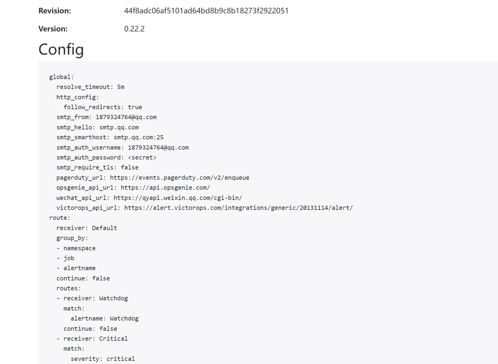
图15.43　查看Alertmanager配置


也可以查看分组信息，如图15.44所示。
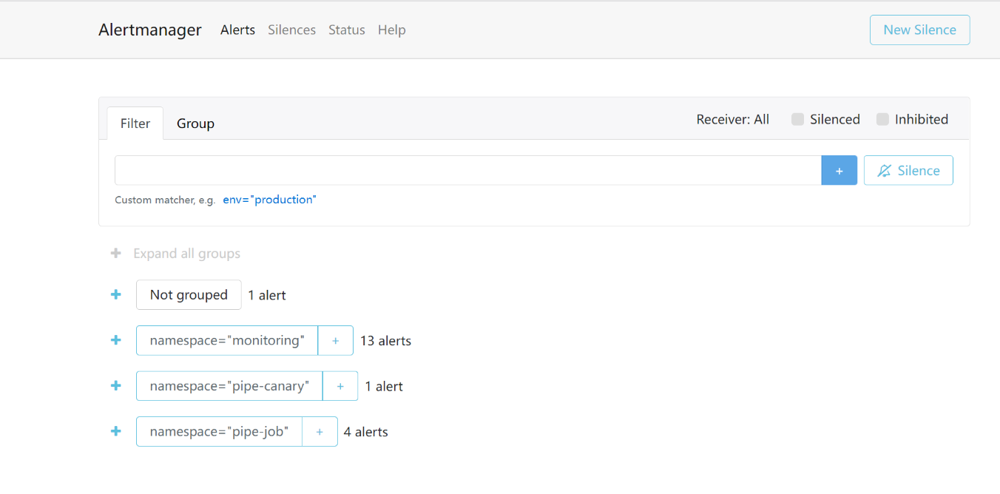
图15.44　查看告警分组


在安装Prometheus后，如果没有做任何更改，可能会在Prometheus页面看到如下告警：

- KubeSchedulerDown和KubeControllerManagerDown可以参考15.3.3节的ServiceMonitor进行解决。
- Watchdog：并非是一个异常的告警，而是Prometheus集群的状态监控，它表示Prometheus集群的状态是正常的，可以将此告警关闭。
- CPU?hrottlingHigh：该告警反映的是最近5分钟超过25%的CPU执行周期受到限制的容器，一般是limit设置得低或者未设置引起的。可以将此告警关闭，或者合理配置容器的resources参数。
- NodeClockNotSynchronising：该告警是由于主机和时间服务器无法连接导致的，读者可能并没有此告警，该告警可以直接关闭，也可以通过配置NTP服务器来解决。

接下来单击任意一个告警，可以查看到该条告警信息的告警语法，如图15.45和图15.46所示。

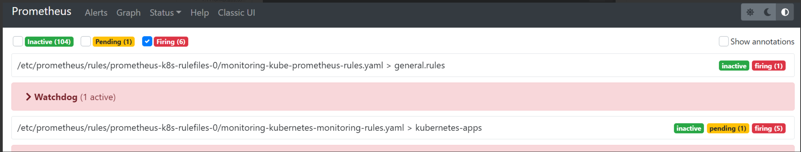
图15.45　查看告警


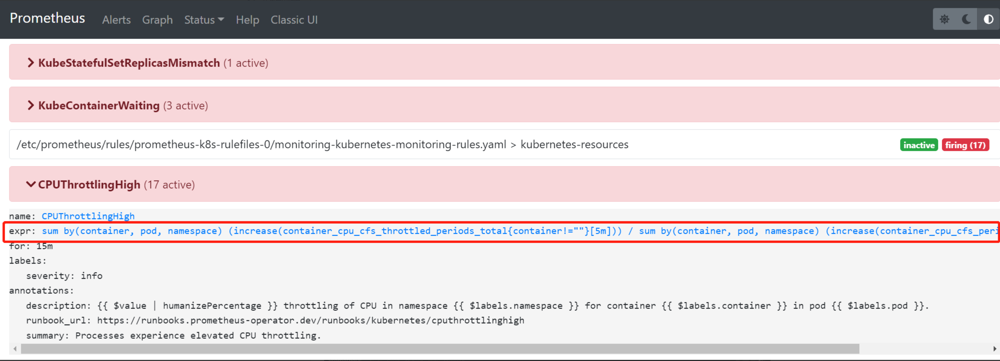
图15.46　查看告警语法


之后单击expr的语法，可以进入查询页面，如图15.47所示。
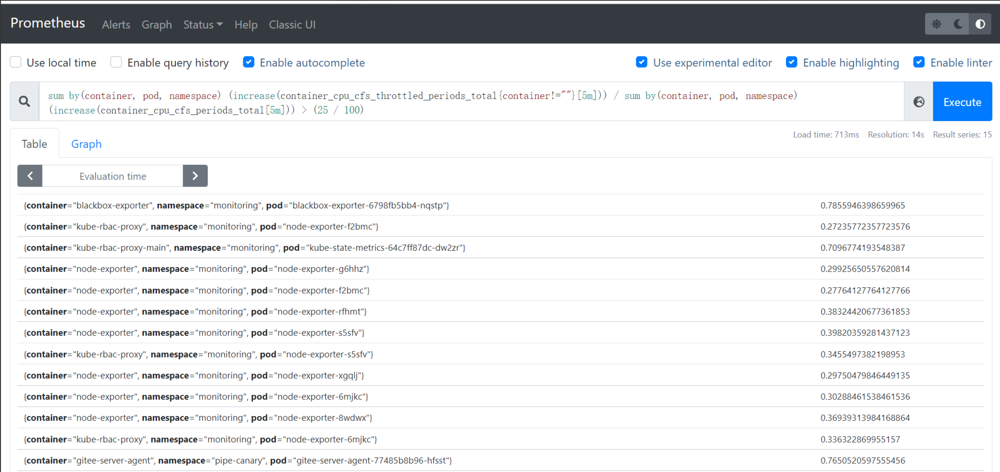
图15.47　查看expr语法


此时可以看到每个metric的标签，如果查看每个已经告警的详细语法，可以看到Watchdog具有alertname="Watchdog"标签，两个Kube的告警（如有）具有severity="critical"标签，这两条告警均被子路由匹配，分别将告警发送给了Watchdog和Critical，由于两者并没有配置实际的媒介，因此暂时无法收到该告警。

而CPUThrottlingHigh和NodeClockNotSynchronising没有匹配到任何子路由，所以将告警信息发送到了默认的receiver，也就是Default，此时Default receiver配置的邮箱会收到两者的告警信息，如图15.48和图15.49所示。

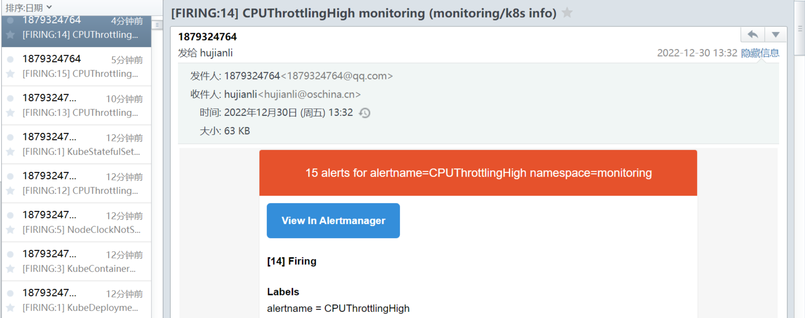
图15.48　查看邮件告警


通过以上步骤即可实现告警的邮件通知，在实际使用时，可以根据不同的分组将告警发送给不同的收件人。


### 8.4 Alertmanager企业微信通知

上一小节已经实现了使用邮件进行告警的通知，本小节演示使用企业微信进行告警。

首先在企业微信官网（https://work.weixin.qq.com/）注册一个企业(任何人都可以注册，注册过程不再演示），如果读者所在的公司已经有相关企业微信，可以无须注册，只需要有创建通讯录和创建应用的权限即可。


**1．企业微信配置**

注册完成后进行登录，登录后单击“我的企业”，如图15.50所示。

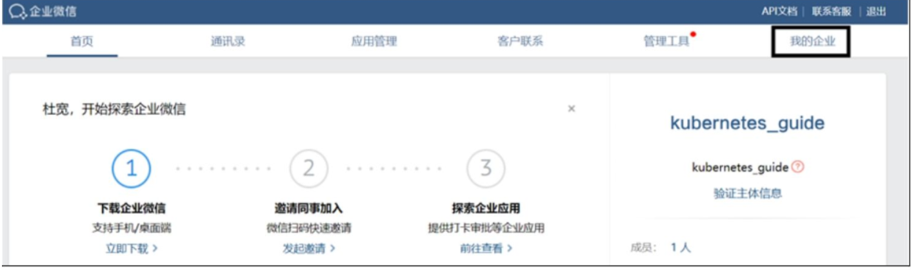
图15.50　查看我的企业


在页面的最下面找到企业ID（对应Alertmanager的corp_id字段）并记录，稍后会用到，如图15.51所示。


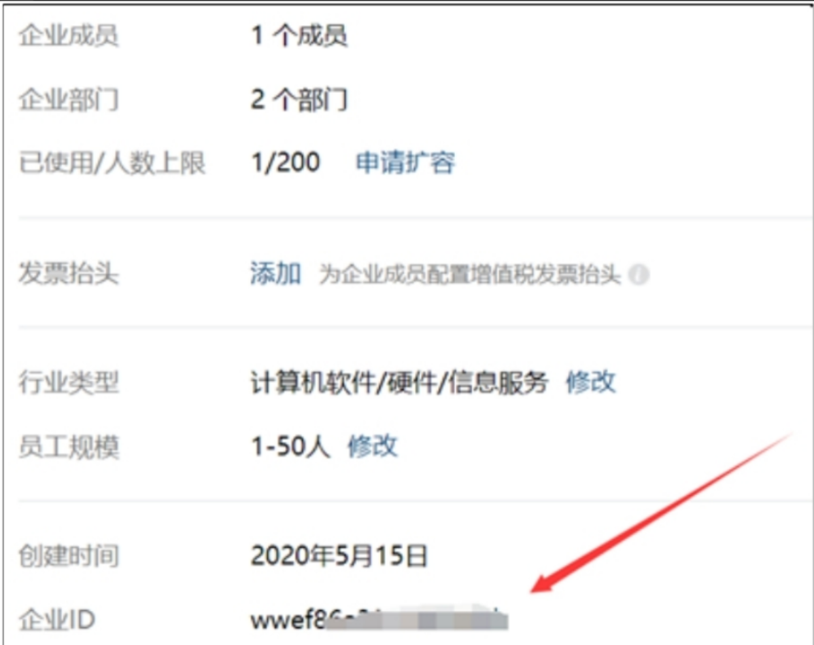
图15.51　查看企业ID


之后创建一个部门，用于接收告警通知，如图15.52所示。
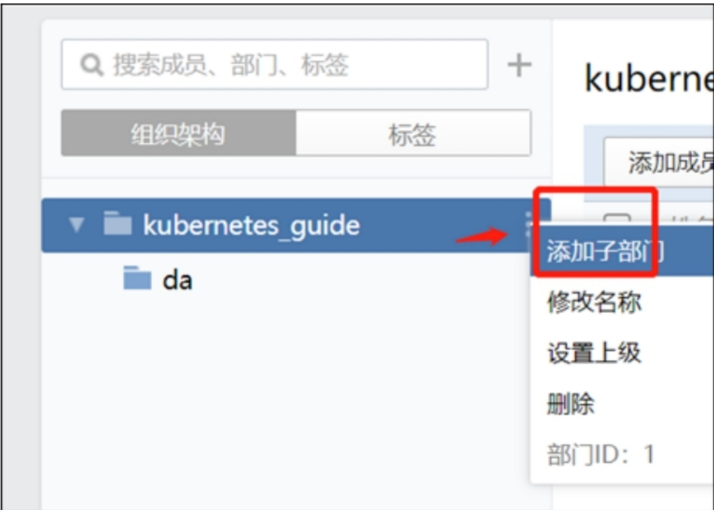
图15.52　添加子部门


输入Prom告警，之后单击“确定”按钮，如图15.53所示。
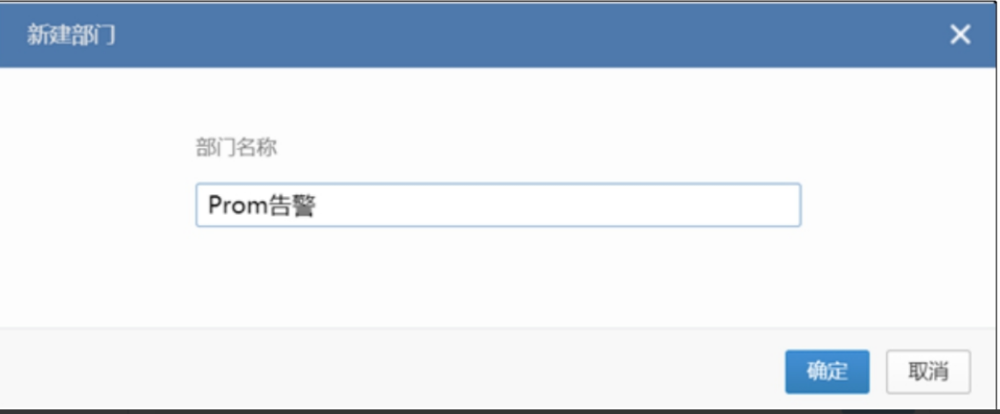
图15.53　配置部门名称


之后在Prom告警子部门添加相关的成员即可，如图15.54所示，在此不再演示。
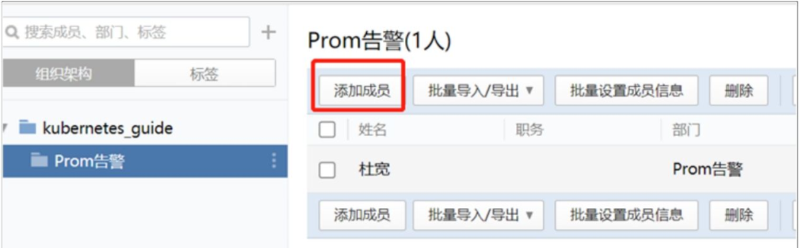
图15.54　添加成员


查看该部门ID（对应Alertmanager的to_party字段）并记录，如图15.55所示。
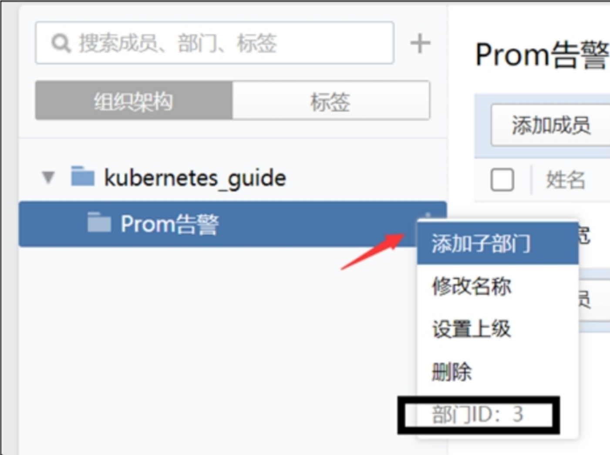
图15.55　查看部门ID


之后创建机器人应用，首先单击应用管理→创建应用，如图15.56所示。
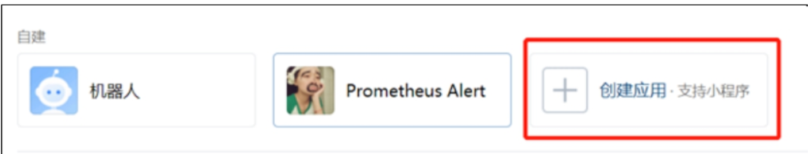
图15.56　添加告警应用


选择一个logo，输入应用名称并选择可见范围，如图15.57和图15.58所示。

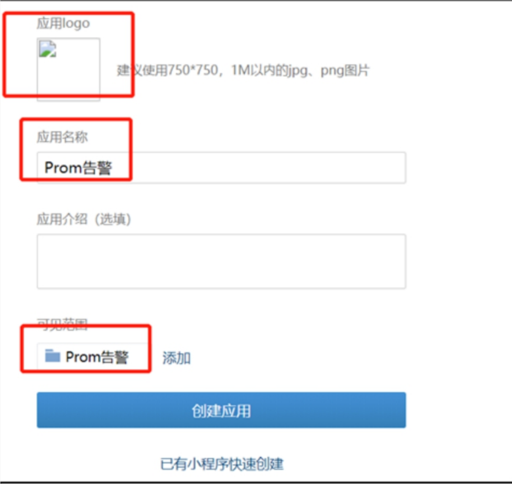
图15.57　配置应用可见权限

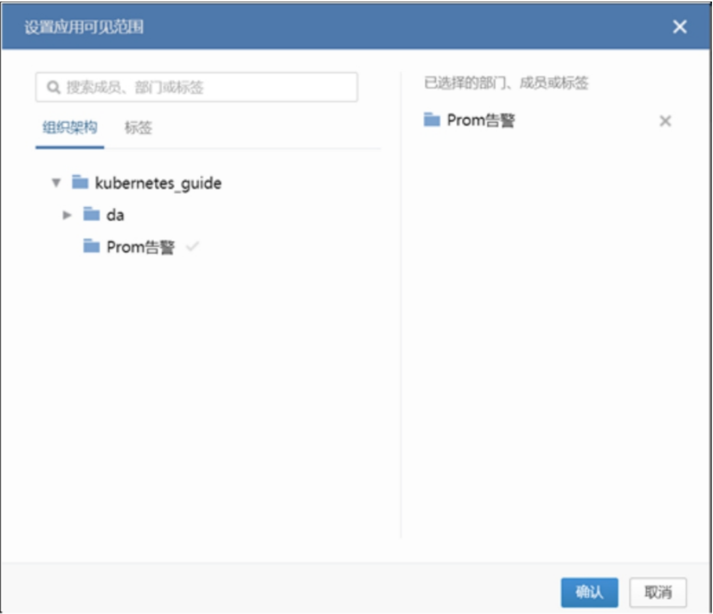
图15.58　配置应用可见范围


创建完成后，查看AgentId和Secret（对应Alertmanager的api_secret字段）并记录，如图15.59所示。


单击Secret后的“查看”，此时会将Secret发送至企业微信，单击“前往查看”并记录即可，如图15.60所示。

图15.59　查看AgentId和Secret


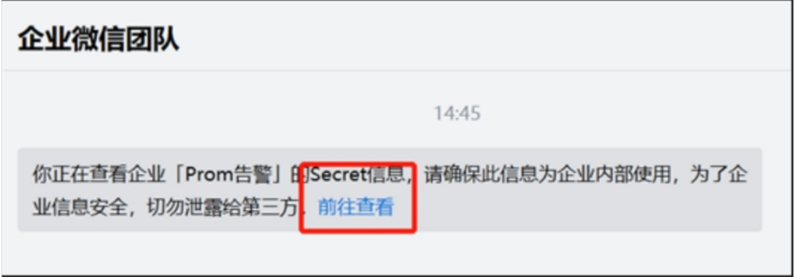
图15.60　查看Secret详情


**2．Alertmanager配置**

修改Alertmanager配置文件，添加企业微信告警。首先修改global，添加一些通用配置，wechat_api_url是固定配置，corp_id为企业ID：

```yaml
    "global":
      resolve_timeout: "5m"
	  wechat_api_url: "https://qyapi.weixin.qq.com/cgi-bin/"
	  wechat api corp id: "wwef86a30xxxxxxxxxxxx"
```

receivers添加微信通知：

```yaml
	"receivers":
	- "name": wechat-ops
	  wechat_configs:
	  - send_resolved: true
	    to_party: 3
	    to_user: "@all"
	    agent_id: 1000006
	    api_secret: "3bB350Sxxxxxxxxxxxxxxxxxxxxxxxxxxxxxx"
	- "name": "Default"
	  "email_configs":
	  - to: "notification@163.com"
	  	send_resolved: true
	- "name": "Watchdog"
	- "name": "Critical"
```

此处配置的receiver名字为wechat-ops，可根据实际情况划分不同的部门。此时配置的to_user为@all，代表发送给所有人，也可以只发送给部门的某一个人，只需要将此处改为USER_ID即可， 
如图15.61所示。


图15.61　用户ID

更改路由配置，将Watchdog的告警发送给该部门（也可以根据自己的实际情况将其他告警发送给该部门）：

```yaml
route:
  group_wait: 30s
  group_interval: 5m
  repeat_interval: 10m
  receiver: Default
  "group_by":
  - "namespace"
  - "job"
  - "alertname"
  routes:
  - "match":
    "alertname": "Watchdog"
    "receiver": "wechat-ops"
    "repeat_interval": "10m"
```

之后更新Alertmanager的配置：

```sh
# kubectl replace -f alertmanager-secret.yaml
secret/alertmanager-main replaced
```

等待几分钟后，可以在Alertmanager Web UI看到新配置，并且企业微信可以收到Watchdog的告警，如图15.62所示。

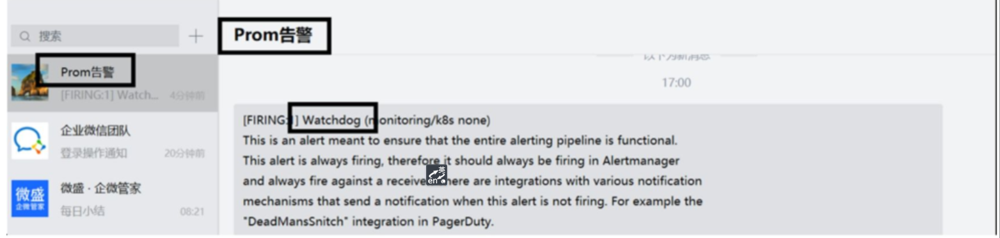
图15.62　查看微信告警


### 8.5 自定义告警模板

上一小节使用企业微信进行了告警通知，相对于邮箱通知，企业微信的告警通知并不是很容易阅读，此时可以通过Alertmanager的模板功能配置一些自定义模板。

首先修改alertmanager-secret.yaml添加自定义模板（注意wechat.tmpl和alertmanager.yaml需要对齐，模板的内容也是通过go-template编写的）：

```yaml
        app.kubernetes.io/part-of: kube-prometheus
        app.kubernetes.io/version: 0.21.0
      name: alertmanager-main
      namespace: monitoring
	stringData:
	  wechat.tmpl: |-
	    {{ define "wechat.default.message" }}
	    ... 
	    {{- end }}
	  alertmanager.yaml: |-
	    "global":
	      "resolve_timeout": "5m"
```

在templates字段添加模板位置：

```yaml
templates:
- '/etc/alertmanager/config/*.tmpl'
"inhibit_rules":
```

配置wechat-ops receiver使用该模板：

```yaml
	"receivers":
	- "name": wechat-ops
	  wechat_configs:
	  - send_resolved: true
	    to_party: 3
		...
		message: '{{ template "wechat.default.message" . }}'
```

---

!!! Warning "注意"

    {{  template  "wechat.default.message"  .  }} 配 置 的wechat.default.message 是 模 板 文 件 define 定 义 的 名 称 ： {{ define
    "wechat.default.message" }}，并非文件名称。


将配置更新至Alertmanager：

```sh
# kubectl replace -f alertmanager-secret.yaml
secret/alertmanager-main replaced
```

更新完成后，可以在Secret中查看该配置：

```shell
# kubectl describe secrets alertmanager-main -n monitoring
Name:         alertmanager-main
Namespace:    monitoring
Labels:       alertmanager=main
              app.kubernetes.io/component=alert-router
              app.kubernetes.io/name=alertmanager
              app.kubernetes.io/part-of=kube-prometheus
              app.kubernetes.io/version=0.22.2
Annotations:  <none>

Type:  Opaque

Data
====
alertmanager.yaml:  1438 bytes
wechat.tmpl:	 1823 bytes
```

之后再次收到告警，即为自定义告警模板，如图15.63所示。

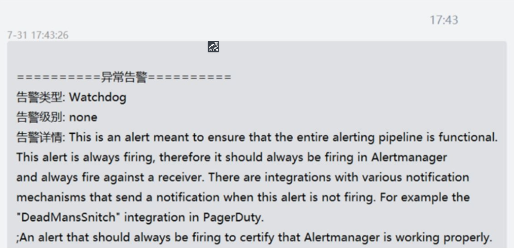

图15.63　查看微信告警


---

!!! tip "提示"

    新版的kube-prometheus提供了Alertmanager 配置的自定义资源AlertmanagerConfig，上述配置均可以通过AlertmanagerConfig进行配
    置，但是由于AlertmanagerConfig还不够成熟，并且并不是所有的公司都将Prometheus技术栈部署至Kubernetes，
    因此本书还是以传统的配置文件进行讲解，
    有兴趣的读者可以参考 https://github.com/prometheus-operator/prometheus-operator/blob/master/Documentation/design.md#alertmanagerconfig 进行学习。


## 9.Prometheus告警实战

前面的章节基本上对Prometheus和Alertmanager常用的配置进行了全面的学习，并且学习了PromQL语法，实现了常用媒介的告警通知。接下来我们介绍如何使用PromQL自定义告警策略。


### 9.1 PrometheusRule

在安装Prometheus后，默认配置了很多告警策略，那么这些告警配置是如何加载到Prometheus的呢？

在传统架构中，通过直接修改Prometheus的配置文件即可加载相应的告警策略，但是在Prometheus Operator中，无须再直接修改Prometheus的配置，通过自定义的资源PrometheusRule即可配置告警策略。可以通过如下命令查看默认配置的告警策略：

```sh
# kubectl get prometheusrule -n monitoring
NAME                              AGE
alertmanager-main-rules           44h
kube-prometheus-rules             44h
kube-state-metrics-rules          44h
kubernetes-monitoring-rules       44h
node-exporter-rules               44h
prometheus-k8s-prometheus-rules   44h
prometheus-operator-rules         44h
```

也可以通过-oyaml查看某个rules的详细配置：

```sh
# kubectl get prometheusrule node-exporter-rules -n monitoring -o yaml
apiVersion: monitoring.coreos.com/v1
kind: PrometheusRule
.... 	
spec:
  groups:
  - name: node-exporter
    rules:
    - alert: NodeFilesystemSpaceFillingUp
      annotations:
        description: Filesystem on {{ $labels.device }} at {{ $labels.instance }}
          has only {{ printf "%.2f" $value }}% available space left and is filling
          up.
        runbook_url: https://runbooks.prometheus-operator.dev/runbooks/node/nodefilesystemspacefillingup
        summary: Filesystem is predicted to run out of space within the next 24 hours.
      expr: |
        (
          node_filesystem_avail_bytes{job="node-exporter",fstype!=""} / node_filesystem_size_bytes{job="node-exporter",fstype!=""} * 100 < 40
        and
          predict_linear(node_filesystem_avail_bytes{job="node-exporter",fstype!=""}[6h], 24*60*60) < 0
        and
          node_filesystem_readonly{job="node-exporter",fstype!=""} == 0
        )
      for: 1h
      labels:
        severity: warning
```

groups下的配置即为告警策略,如果读者学习过传统配置的Prometheus，其实可以看出并无区别，只是Operator是通过kind为
PrometheusRule进行单独管理的。

接下来进行每个配置的解析。

- alert：告警策略的名称。
- annotations：告警注释信息，一般写为告警信息。
- expr：告警表达式。
- for：评估等待时间，告警持续多久才会发送告警数据。
- labels：告警的标签，用于告警的路由。

了解了PrometheusRule写法规则后，可以自定义一个告警策略。

实际使用时可以按照监控的目标划分PrometheusRule，比如之前配置了黑盒监控，那么可以创建一个名为blackbox的PrometheusRule。


### 9.2 告警通用配置步骤

假设需要对域名访问延迟进行监控，访问延迟大于1秒进行告警（生产环境可以按需调节，为了实现告警测试，可以将该值设置得小一些），此时可以创建一个PrometheusRule，代码如下：


