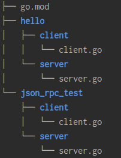
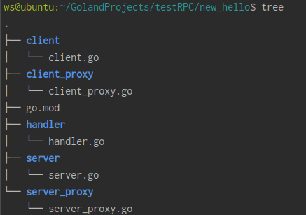

# 使用RPC


=== "Python"

    py框架 jsonrpclib-pelix

    > 注意: 这种方式只适用于客户端与服务端程序均为python
    
    1. 安装
    ```shell
    pip install jsonrpclib-pelix
    ```

    2. 服务端
    ```python
    from jsonrpclib.SimpleJSONRPCServer import SimpleJSONRPCServer
    server = SimpleJSONRPCServer(('localhost', 8081))
    server.register_function(lambda x,y: x+y, 'add')
    server.serve_forever()
    ```
    
    3. 客户端
    ```python
    import jsonrpclib
    
    server = jsonrpclib.ServerProxy('http://localhost:8081')
    print(server.add(5,6))
    ```

=== "Go"

    {: .zoom}


    1 客户端和服务端都是Go

    基于tcp实现, 只有当客户端和服务端都是Go程序时才能使用
    golang写RPC程序，必须符合4个基本条件，不然RPC用不了

    ● 结构体字段首字母要大写，可以别人调用

    ● 函数名必须首字母大写

    ● 函数第一参数是接收参数，第二个参数是返回给客户端的参数，必须是指针类型

    ● 函数还必须有一个返回值error
    
    (1) server.go
    ```go
    package main
    
    import (
        "net"
        "net/rpc"
    )
    
    type HelloService struct{}
    
    func (s *HelloService) Hello(request string, reply *string) error {
        *reply = "hello," + request
        return nil
    }
    
    func main() {
        // 实例化一个server
        listener, _ := net.Listen("tcp", ":12345")
        
        // 注册处理逻辑handler
        _ = rpc.RegisterName("HelloService", &HelloService{})
        
        // 启动服务
        for {
            conn, _ := listener.Accept()
            go rpc.ServeConn(conn)
        }
    }
    ```
    (2) client.go
    ```go
    package main
    
    import (
        "fmt"
        "net/rpc"
    )
    
    func main() {
        // 建立连接
        client, err := rpc.Dial("tcp", ":12345")
        if err != nil {
            panic("连接失败")
        }
        var reply *string = new(string)
        err = client.Call("HelloService.Hello", "bobby", reply)
        if err != nil {
            panic("调用失败")
        }
        fmt.Println(*reply)
    }
    ```

    2 服务端是Go, 客户端任意语言(基于json)

    基于tcp实现
    适用于服务端是go, 客户端可以是其它语言的程序

    (1) server.go 
    ```go
    package main
    
    import (
        "net"
        "net/rpc"
        "net/rpc/jsonrpc"
    )
    
    type HelloService struct{}
    
    func (s *HelloService) Hello(request string, reply *string) error {
        *reply = "hello," + request
        return nil
    }
    
    func main() {
        // 实例化一个server
        listener, _ := net.Listen("tcp", ":6666")
        // 注册处理逻辑handler
        _ = rpc.RegisterName("HelloService", &HelloService{})
        // 启动服务
        for {
            conn, _ := listener.Accept()
            go rpc.ServeCodec(jsonrpc.NewServerCodec(conn))
        }
    }
    ```
    (2) client.go
    ```go
    package main
    
    import (
        "fmt"
        "net"
        "net/rpc"
        "net/rpc/jsonrpc"
    )
    

    func main() {
        // 建立连接
        conn, err := net.Dial("tcp", ":12345")
        if err != nil {
            panic("连接失败")
        }
        var reply *string = new(string)
        client := rpc.NewClientWithCodec(jsonrpc.NewClientCodec(conn))
        err = client.Call("HelloService.Hello", "bobby", reply)
        if err != nil {
            panic("调用失败")
        }
        fmt.Println(*reply)
    }
    ```

    (3) client.py

    ```python
    import json
    from socket import *
    
    tcp_socket = socket(AF_INET, SOCK_STREAM)
    tcp_socket.connect(("localhost", 6666))
    request = {
        "id": 0,
        "params": ["bobby"],
        "method": "HelloService.Hello"
    }
    tcp_socket.send(json.dumps(request).encode())
    rsp = tcp_socket.recv(4096).decode()
    rsp = json.loads(rsp)
    print(rsp)
    ```

    3 封装代理

    {: .zoom}


    (1) handler.go

    ```go
    package handler

    const HelloServiceName = "handler/HelloService"
    
    type NewHelloService struct {}
    
    func (s *NewHelloService) Hello(request string, reply *string) error {
        // 返回值是通过修改reply的值
        *reply = "hello," + request
        return nil
    }
    ```


    (2) server_proxy.go
    ```
    package server_proxy
    
    import (
        "net/rpc"
        "new_hello/handler"
    )
    
    type HelloServicer interface {
        Hello(request string, reply *string) error
    }
    
    func RegisterHelloService(srv HelloServicer) error {
        return rpc.RegisterName(handler.HelloServiceName, srv)
    }
    ```


    (3) server.go
    ```
    package main
    
    import (
        "net"
        "net/rpc"
        "new_hello/handler"
        "new_hello/server_proxy"
    )
    
    func main() {
        listener, _ := net.Listen("tcp", ":1234")
        _ = server_proxy.RegisterHelloService(&handler.NewHelloService{})
        for {
            conn, _ := listener.Accept()
            go rpc.ServeConn(conn)
        }
    }
    ```


    (4) client_proxy.go
    ```
    package client_proxy
    
    import (
        "net/rpc"
        "new_hello/handler"
    )
    
    type HelloServiceStub struct {
        *rpc.Client
    }
    
    func NewHelloServiceClient(protocol, address string) HelloServiceStub {
        conn, err := rpc.Dial(protocol, address)
        if err != nil {
            panic("connect error")
        }
        return HelloServiceStub{conn}
    }
    
    func (c *HelloServiceStub) Hello(request string, reply *string) error {
        err := c.Call(handler.HelloServiceName+".Hello", request, reply)
        return err
    }
    ```


    (5) client.go
    ```go
    package main
    
    import (
        "new_hello/client_proxy"
        "fmt"
    )
    
    func main() {
        client := client_proxy.NewHelloServiceClient("tcp", ":1234")
        var reply string
        err := client.Hello("bobby", &reply)
        if err != nil {
            panic("调用失败")
        }
        fmt.Println(reply)
    }
    ```